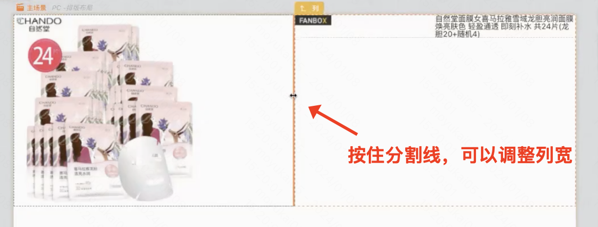

掌握了基本操作使用后，本课程我们来介绍另一类非常重要的组件：布局、弹窗、逻辑编排组件。

### 知识点

#### 1、使用布局、图片、文字等组件搭建一个商品详情页面：
>   
>   完整的搭建教学过程请看：[【搭建视频】](https://meeting.tencent.com/user-center/shared-record-info?id=37eecd8a-7c10-4b5c-ba9c-23f6520092b8&from=3&is-single=true)   
>   搭建的案例示例：[【搭建案例】](https://my.mybricks.world/mybricks-app-pcspa/index.html?id=512204034093125)
>

**最终成品概览**
    
  
**关键步骤**
1. 【新增并初始化布局】拖入布局组件，并调节为1行2列；
        
2. 【调整布局列宽】聚焦到布局组件上的列分割线，可以左右拖动调节列宽；
        
3. 【调节布局模式】选中布局，可以在右侧编辑器中调节布局模式；（在这里，对布局容器中的图片配置为垂直、水平居中）
        
4. 【文本组件配置颜色】选中文本组件，可以在右侧编辑器中配置文本颜色；
        
5. 【文本组件加外边距】选中文本组件给文本组件加上外边距；
        

#### 2、多场景及弹窗：
>
>    完整的搭建教学过程请看：[【搭建视频】](https://meeting.tencent.com/v2/cloud-record/share?id=fed65038-98f4-42fa-ad28-0d9f1dbe0393&from=3&is-single=true)   
>    搭建的案例示例：[【搭建案例】](https://my.mybricks.world/mybricks-app-pcspa/index.html?id=512216052539461)
>
**最终成品概览**
   

**关键步骤**
1. 【新增表格操作项】为表格列开启自定义插槽，然后拖入工具条组件
     
     
2. 【点击后对话框获取表格当前项数据】
        

#### 3、逻辑组件的使用（以JS计算组件为例）
>
>    完整的搭建教学过程请看：[【搭建视频】](https://meeting.tencent.com/v2/cloud-record/share?id=065eecb7-7942-41bf-ac3f-4456c3f6b603&from=3&is-single=true)   
>    搭建的案例示例：[【搭建案例】](https://my.mybricks.world/mybricks-app-pcspa/index.html?id=512216395075653)
>

**最终成品概览**

**关键步骤**