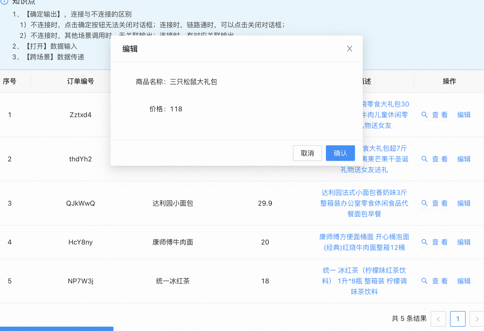

### 练习题
**需求描述：搭建一个带操作项和弹窗的数据表格**

**搭建效果图:**

**具体要求如下：**
- 加载一个基本的数据表格，包含6列（序号、订单编号、商品名称、价格、描述、操作）
  - 操作项中有两个文字链接按钮：查看、编辑
    - 点击查看按钮，弹窗，弹窗中展示商品详情
    - 点击编辑按钮，弹窗，弹窗中展示商品详情（在此教程中，暂时保持和查看一样的逻辑）
- 商品详情弹窗包含了以下字段，且布局上要求和下图一致：
  - 商品名称
  - 商品状态
     

**【搭建提示】在数据传递时需要通过JS做数据转换。**

### 练习题答案
搭建过程：[搭建视频](https://meeting.tencent.com/v2/cloud-record/share?id=fed65038-98f4-42fa-ad28-0d9f1dbe0393&from=3&is-single=true)   
最终搭建示例：[搭建案例](https://my.mybricks.world/mybricks-app-pcspa/index.html?id=512216052539461)