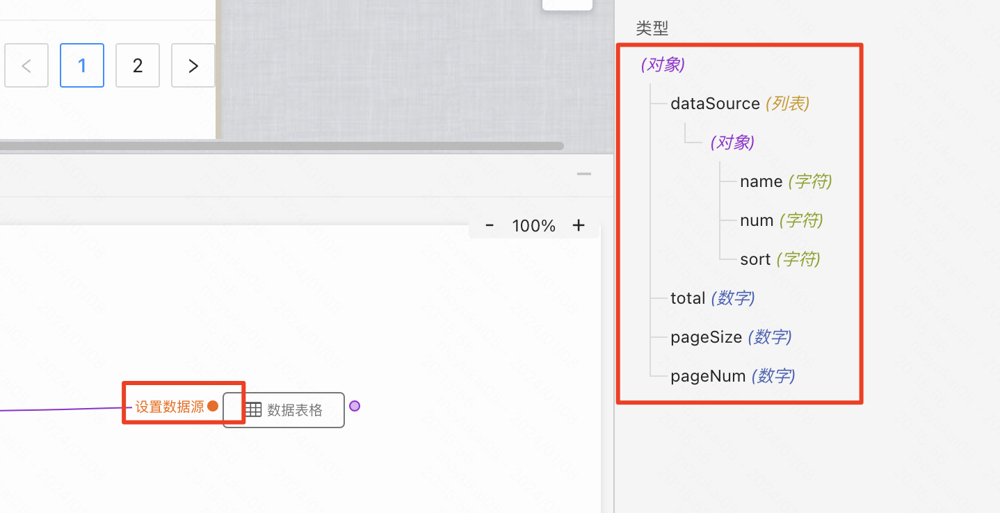

## 知识点

### 1、连接器插件连接服务接口:
> 
> 完整的搭建教学过程请看：[【观看视频】](https://meeting.tencent.com/user-center/shared-record-info?id=cd3fc64b-5600-433e-8d46-7adf7c3a5855&is_webview=1&from=6&app_lang=zh-cn&app_version=3.21.20.443&app_sdk_id=0300000000&app_publish_channel=TencentInside&os_version=11.2.3&os_name=Mac&c_district=0&app_instance_id=2&click_source_for_middle_login=2)    
> 搭建的案例示例：[【搭建案例】](https://my.mybricks.world/mybricks-app-pcspa/index.html?id=512178078408773)

#### 成品概览

#### 关键步骤
1. 【创建接口】点击页面左侧连接器插件，然后点击新增接口，创建一个接口
    >  mock接口地址：https://yapi.pro/mock/219887/getItemList   

   
2. 【服务接口组件，选择刚刚创建的接口】点击交互面板中的服务接口组件，然后在右侧编辑器中选择刚刚创建的接口
   

### 2、数据表格组件的基本使用，数据初始化、数据分页:
>
> 完整的搭建教学过程请看：[【观看视频】](https://meeting.tencent.com/user-center/shared-record-info?id=b0d180b9-1e92-4f3d-8676-ada4bb0deaf6&is_webview=1&from=6&app_lang=zh-cn&app_version=3.21.20.443&app_sdk_id=0300000000&app_publish_channel=TencentInside&os_version=11.2.3&os_name=Mac&c_district=0&app_instance_id=2&click_source_for_middle_login=2)    
> 搭建的案例示例：[【搭建案例】](https://my.mybricks.world/mybricks-app-pcspa/index.html?id=512182041538629)
> 

#### 成品概览

#### 关键步骤
1. 【查看表格数据源要求】点击数据表格逻辑块左侧的数据输入点，查看数据源要求；根据数据结构要求对表格赋值数据。
   

### 3、数据表格列中显示标签、链接、图片等:
>
> 完整的搭建教学过程请看：[【观看视频】](https://meeting.tencent.com/user-center/shared-record-info?id=c4a921f7-71fe-4ff9-9b64-17670a5c46f0&is_webview=1&from=6&app_lang=zh-cn&app_version=3.21.20.443&app_sdk_id=0300000000&app_publish_channel=TencentInside&os_version=11.2.3&os_name=Mac&c_district=0&app_instance_id=2&click_source_for_middle_login=2)    
> 搭建的案例示例：[【搭建案例】](https://my.mybricks.world/mybricks-app-pcspa/index.html?id=512190072467525)

#### 成品概览

#### 关键步骤
1. 【开启自定义插槽】选中要展示标签的列，然后在右侧编辑器中开启自定义插槽，接着往里面拖入图片组件、标签组件等等
   

### 4、通过列插槽，实现编辑、删除行数据:
>
> 完整的搭建教学过程请看：[【观看视频】](https://meeting.tencent.com/user-center/shared-record-info?id=8ba2d229-221a-4c2f-b8c5-0ff4b9c9500f&is_webview=1&from=6&app_lang=zh-cn&app_version=3.21.20.443&app_sdk_id=0300000000&app_publish_channel=TencentInside&os_version=11.2.3&os_name=Mac&c_district=0&app_instance_id=2&click_source_for_middle_login=2)    
> 搭建的案例示例：[【搭建案例】](https://my.mybricks.world/mybricks-app-pcspa/index.html?id=512193749069893)
> 

#### 成品概览

#### 关键步骤
1. 【增加一列操作列】给表格新增一列，开启自定义插槽，然后往里面拖入工具条组件
    

2. 【点击按钮后获取当前行数据】给按钮新增一个点击事件，然后在下方交互面板中，使用逻辑连线获取当前行数据；拿到数据后，可以传递给对话框组件，也可以传递给其他组件。
   

