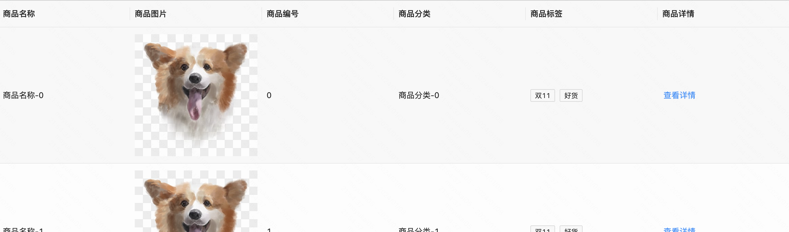
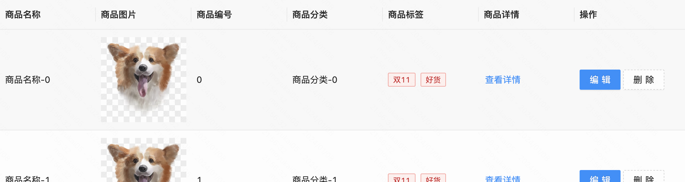

:::tip
本章节需要的mock接口如下：   
获取商品列表：https://yapi.pro/mock/219887/getItemList   
删除商品：https://yapi.pro/mock/219887/removeItemById   
更新商品：https://yapi.pro/mock/219887/updateItemById
:::
## 练习题一
### 需求描述
搭建商品列表，通过服务接口组件初始化数据、分页展示，商品图片列中展示商品图片；    
体验地址：https://my.mybricks.world/mfs/app/pcpage/prod/512190072467525.html   

### 参考答案

搭建过程：[【观看视频】](https://meeting.tencent.com/user-center/shared-record-info?id=b0d180b9-1e92-4f3d-8676-ada4bb0deaf6&is_webview=1&from=6&app_lang=zh-cn&app_version=3.21.20.443&app_sdk_id=0300000000&app_publish_channel=TencentInside&os_version=11.2.3&os_name=Mac&c_district=0&app_instance_id=2&click_source_for_middle_login=2)

最终搭建示例：[【搭建案例】](https://my.mybricks.world/mybricks-app-pcspa/index.html?id=512190072467525)

## 练习题二
### 需求描述
操作列中实现删除功能，点击时提示是否删除，确认后调用服务接口、更新表格数据；   
体验地址：https://my.mybricks.world/mfs/app/pcpage/prod/512193749069893.html   

### 参考答案
搭建过程：[【观看视频】](https://meeting.tencent.com/user-center/shared-record-info?id=7d1292b9-0888-4f8b-8eaf-71d8350b011d&is_webview=1&from=6&app_lang=zh-cn&app_version=3.21.20.443&app_sdk_id=0300000000&app_publish_channel=TencentInside&os_version=11.2.3&os_name=Mac&c_district=0&app_instance_id=2&click_source_for_middle_login=2)

最终搭建示例：[【搭建案例】](https://my.mybricks.world/mybricks-app-pcspa/index.html?id=512193749069893)

## 练习题三
### 需求描述
操作列中实现编辑功能，点击时弹出商品信息表单编辑，完成后调用服务接口、更新表格数据；

体验地址：https://my.mybricks.world/mfs/app/pcpage/prod/512193749069893.html   

### 参考答案
搭建过程：[【观看视频】](https://meeting.tencent.com/user-center/shared-record-info?id=46794539-c910-4f88-92dc-8d21641f2658&from=3)

最终搭建示例：[【搭建案例】](https://my.mybricks.world/mybricks-app-pcspa/index.html?id=512193749069893)

