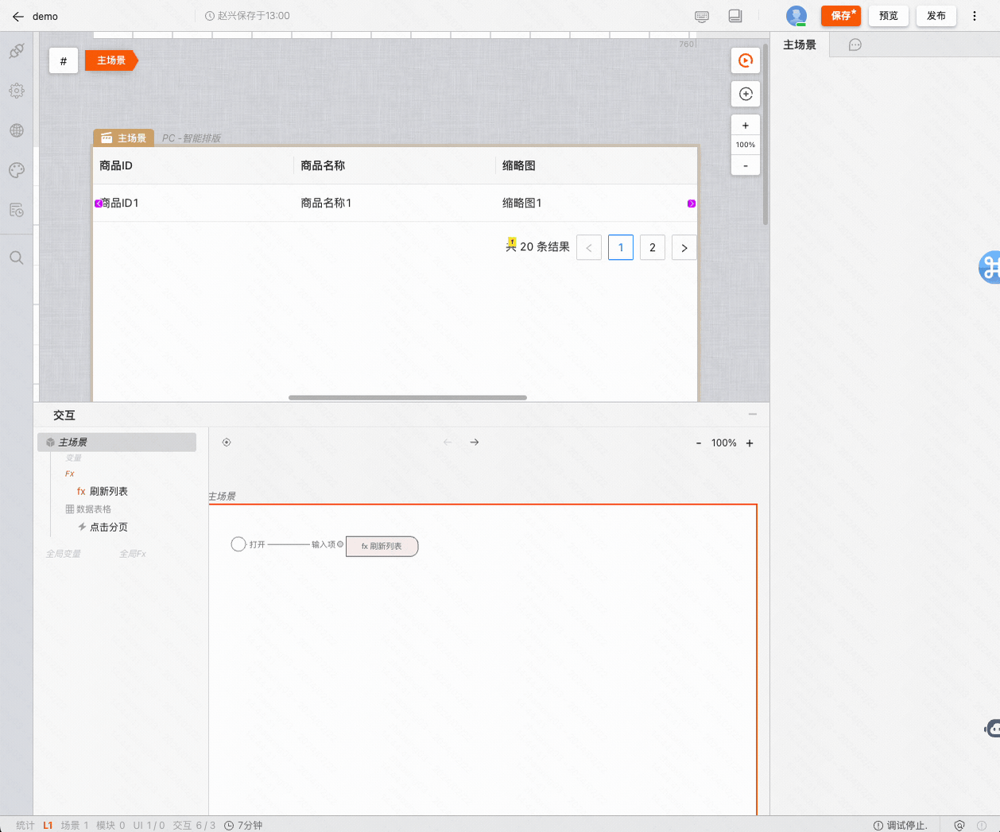

# 案例：增删改查列表页

## 目录

- [课程概述](#课程概述)
- [搭建流程](#搭建流程)
  - [表格数据获取与赋值](#表格数据获取与赋值)
  - [表格列定制展示](#表格列定制展示)
  - [添加新增数据弹窗](#添加新增数据弹窗)
  - [添加查询表单](#添加查询表单)
  - [添加编辑与删除操作](#添加编辑与删除操作)
- [附件](#附件)

---

## 课程概述

在本教程中，我们将使用 **「PC 页面」应用** 来搭建一个CRUD（创建、读取、更新、删除）列表页。在 **[附录](#附录)** 中提供了本次搭建需要用到的服务接口、JS代码、图片素材等。

---

## 搭建流程

创建好一张 PC 页面后，推荐将页面布局切换为「智能布局」，可以更方便的进行组件的位置摆放。


### 表格数据获取与赋值

通过「添加列」来为数据表格增加列数，并可以聚焦具体的列，进行列名、字段等配置。

另外可以通过数据表格的配置项来开启分页功能。


接下来我们需要通过网络请求获取数据，并且把数据赋值给数据表格，这里的操作主要有三步。

**第一步：通过「连接器 > 创建接口 > 普通接口」来添加 HTTP 请求的信息。**


**第二步：在「主场景打开时」添加服务接口，选择「分页查询」的接口请求。**


**第三步：在接口请求成功后把数据给到「数据表格的设置数据源」**


接下来我们需要在接口请求时携带分页的参数信息，并且为分页切换时配置事件。


:::tip
使用 Fx 进行逻辑封装 
:::

在上面的操作中，「主场景打开时」和「点击分页时」搭建的逻辑是一样的，我们可以通过 Fx 进行封装复用。整理后的效果为这样。




### 表格列定制展示

在完成了基本的接口数据展示后，我们经常会遇到某些数据列的展示形式是比较个性化的，比如缩略图应该展示为图片。这里我们可以通过「插槽」来进行 UI 上的扩展。


在设置了自定义列后，我们需要对列内的数据进行赋值，这里涉及到数据的格式转换可以使用「JS计算」来编写代码。


### 添加新增数据弹窗

列表的展示基本已经完成，接下来我们为页面增加一个「新建数据」的弹窗。


### 添加查询表单

### 添加编辑与删除操作


## 附件

在本教程中，我们提供了必备的服务接口、JS代码和图片素材，以便您可以更加顺利地完成页面的搭建。

### 服务接口

以下是您在本次搭建中将会用到的服务接口列表：

#### 1. 分页查询商品列表

- **接口地址**: 
```
https://my.mybricks.world/api/system/domain/run/525587243094085/u_0Azfo
```
- **请求方法**: `GET`
- **入参**:
  - `title` (类型: `string`，描述: `模糊搜索商品标题`)
  - `pageNum` (类型: `number`，描述: `当前页码，从 1 开始`)
  - `pageSize` (类型: `number`，描述: `每页显示条数`)
- **出参**: 详见运行时


#### 2. 添加商品

- **接口地址**: 
```
https://my.mybricks.world/api/system/domain/run/525587243094085/u_6kfWY
```
- **请求方法**: `POST`
- **入参**:
  - `title` (类型: `string`，描述: `商品名称`)
  - `thumbnail` (类型: `array`，描述: `缩略图`)
- **出参**: 详见运行时


#### 3. 编辑商品

- **接口地址**: 
```
https://my.mybricks.world/api/system/domain/run/525587243094085/u_hYIiF
```

- **请求方法**: `POST`
- **入参**:
  - `id` (类型: `number`，描述: `商品ID`)
  - `title` (类型: `string`，描述: `项目名称`)
  - `thumbnail` (类型: `array`，描述: `缩略图`)
- **出参**: 详见运行时


#### 4. 删除商品

- **接口地址**: 
```
https://my.mybricks.world/api/system/domain/run/525587243094085/u_zoNIh
```

- **请求方法**: `POST`
- **入参**:
  - `id` (类型: `number`，描述: `商品ID`)
- **出参**: 详见运行时


#### 5. 上传图片

- **接口地址**: 
```
https://my.mybricks.world/paas/api/oss/uploadFile
```

- **请求方法**: `POST`
- **入参**:
  - `file` (类型: `file`，描述: `需要上传的图片文件`)
- **出参**: 详见运行时


### JS代码

以下是一些案例中用到的 JS 代码示例：

- **对象合并**

```js
({ outputs, inputs }: IO) => {
  const [inputValue0, inputValue1] = inputs;
  const [output0] = outputs;
  
  output0({
    ...inputValue0,
    ...inputValue1
  });
}
```

- **输出数字 「1」**

```
({ outputs, inputs }: IO) => {
  const [ inputValue0 ] = inputs;
  const [ output0 ] = outputs;
  output0(1);
}
```
- **提取对象字段**

```
({ outputs, inputs }: IO) => {
  const [ inputValue0 ] = inputs;
  const [ output0 ] = outputs;
  output0(inputValue0?.[0]?.data?.url);
}
```

### 图片素材

我们同样为您准备了一些默认的图片素材，您可以在新建商品时使用。

- cleanfit外套男2024春季新款小香风美式vibe痞帅宽松翻领衬衣夹克 


- Mmoptop春秋美式高街直筒休闲裤男宽松垂感拖地西裤子男工装阔腿
