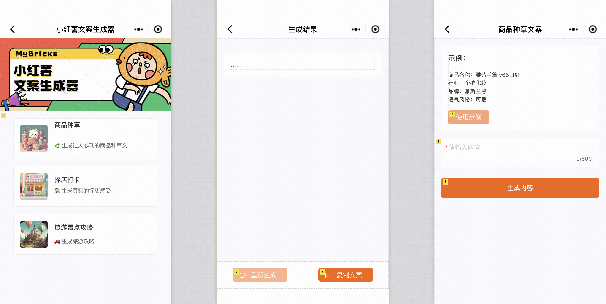

本课程将从 0 开始，通过制作微信小程序「小红薯文案生成器」来帮助您快速掌握 MyBricks App Builder 的使用以及微信小程序的可视化搭建。

<figure>页面拆解</figure>

<iframe style="position: absolute; width: 100%; height: 100%; left: 0; top: 0;" src="//player.bilibili.com/player.html?aid=369157673&bvid=BV12Z4y1J7XZ&cid=1415748132&p=0&autoplay=0" frameborder="no" scrolling="no"></iframe>

<figure>本地调试模式</figure>

<iframe style="position: absolute; width: 100%; height: 100%; left: 0; top: 0;" src="//player.bilibili.com/player.html?aid=454228833&bvid=BV1k5411y7qd&cid=1415749993&p=0&autoplay=0" scrolling="no" frameborder="no" framespacing="0" allowfullscreen="true"> </iframe>

<figure>真机测试效果</figure>
