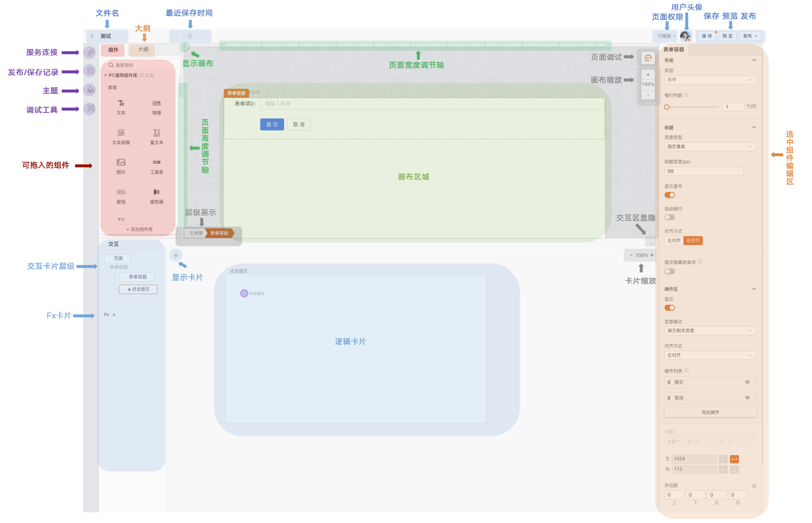

**Mybricks 设计器功能结构**

这里将整张页面结构，从左至右，从上往下作出以下划分：

1.  左侧：插件及操作区

1.1 插件

1.1.1 服务连接

1.1.2 发布/保存记录

1.1.3 主题

1.1.4 调试工具

1.2 操作区

1.2.1 组件面板

1.2.2 大纲面板

2.  上侧：发布及其他信息记录
3.  中间：画布及附加功能

3.1 画布

3.2 附加功能

4.  下侧：交互区

4.1 逻辑卡片层级

4.2 逻辑卡片及 Fx

4.3 附加功能

5.  右侧：选中组件编辑区

5.1 组件 API 设置

5.2 页面编辑区

5.3 卡片编辑区
