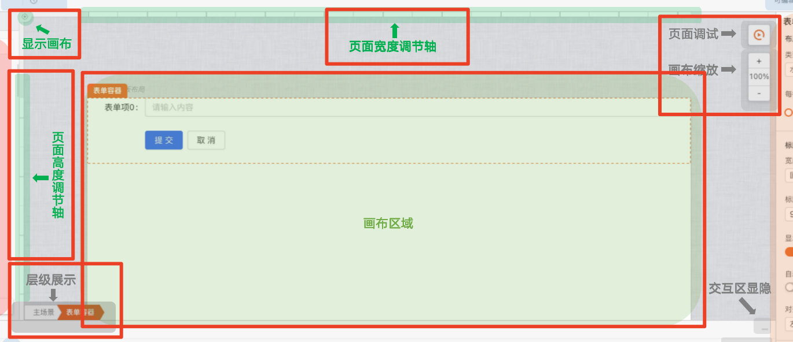
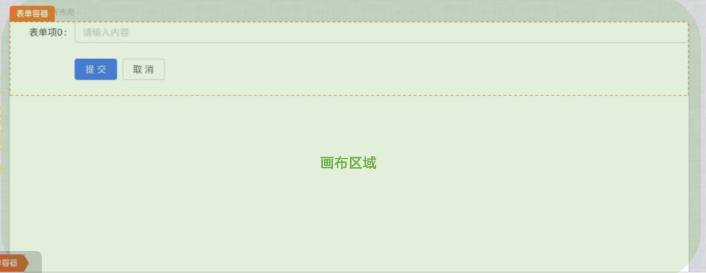
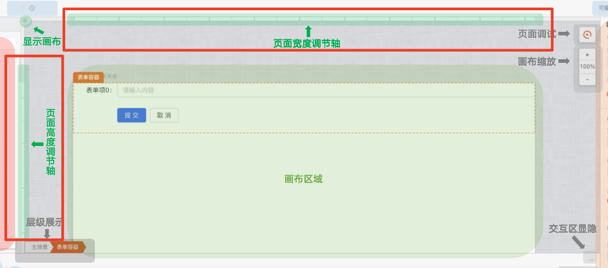
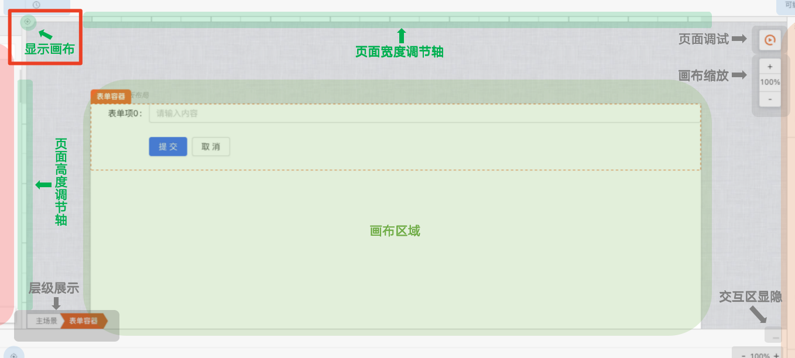
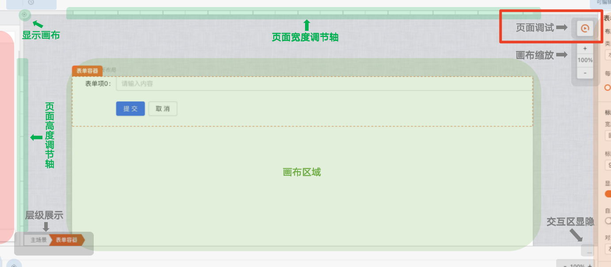
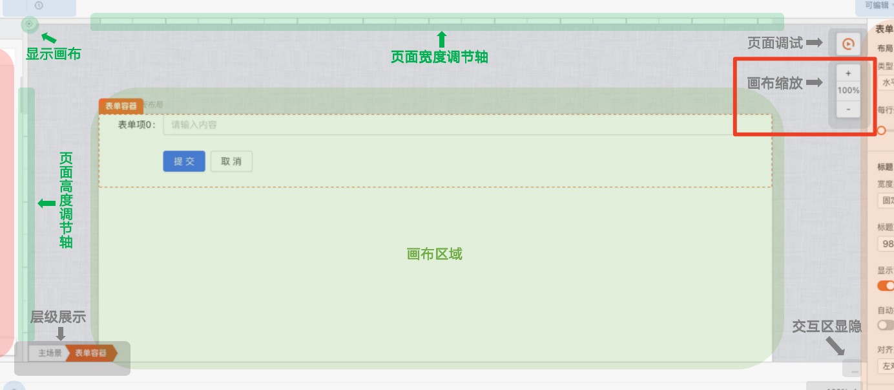
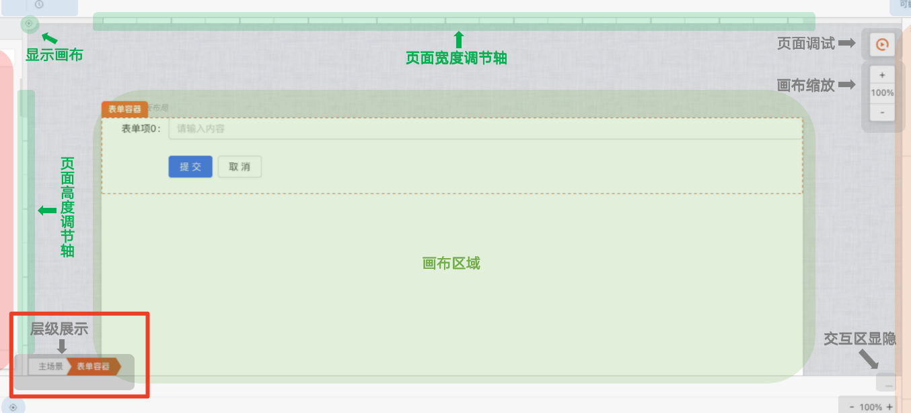
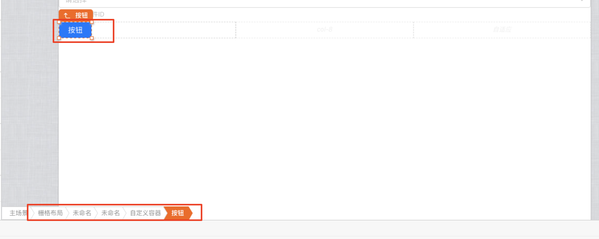

 **02 - 画布及附加功能** 

用户在搭建页面过程中，在此区域进行操作较多，拖入不同的组件，利用布局组件使得组件排列等。其实对应的在其区域也涉及到一些附加功能。如下图所示，是画布的整个区域。

# 3.3.1 画布

用户搭建的区域即是画布，用户可以点击或者拖动组件至画布，并进行相应布局操作。同时在画布区域聚焦不同组件或者画布其余区域可以切换不同左侧编辑区。

# 3.3.2 附加功能

在开发过程中涉及到很多针对画布的附加功能。

### 1\. 页面宽高调节

当页面内容由于宽高不够折叠隐藏了，这里可以通过宽高轴进行调整，使内容展示。比如对话框中表单表单项过多，超过页面高度，无法编辑表单内容，这时便可以调整页面宽度后，继续编辑。

### 2\. 显示画布

当画布不在可视区域后，可以点击显示画布按钮，将画布重新显示在可视范围内。

### 3\. 页面调试

这里的类似于播放键的按钮，就是页面调试按钮。可以点击后对页面进行调试，查看页面UI和交互是否符合预期。

### 4\. 画布缩放

点击画布缩放按钮的“+”可以放大画布，“-”可以缩小画布。

 **5\. 层级展示** 

点击层级展示条的某个部分，在画布里可以聚焦到对应的组件。

应用场景，比如使用组件在多个容器内嵌套，可以快速聚焦到对应层级的组件，方便编辑。不用在画布中点击聚焦。

