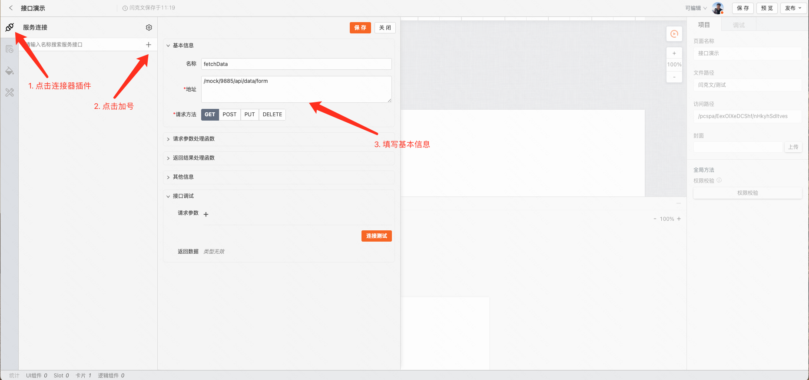
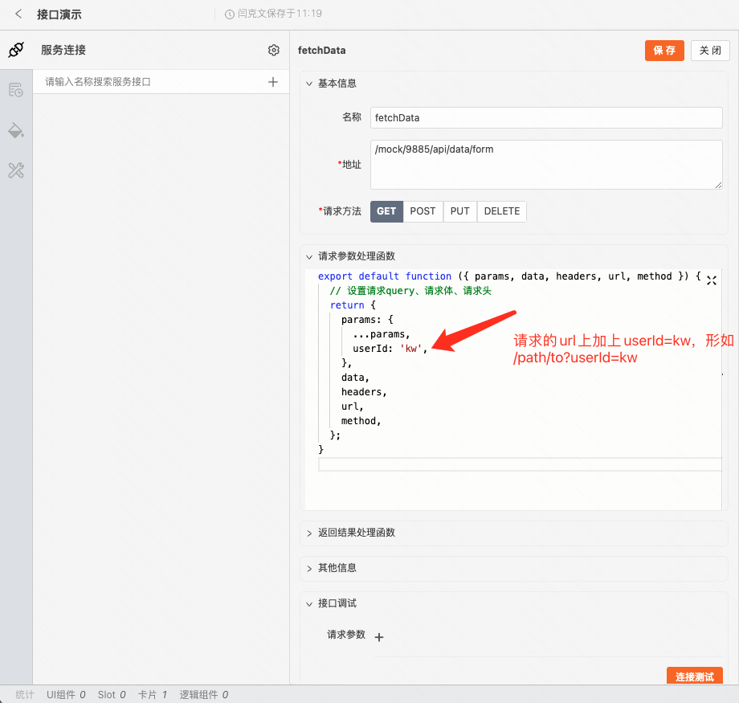
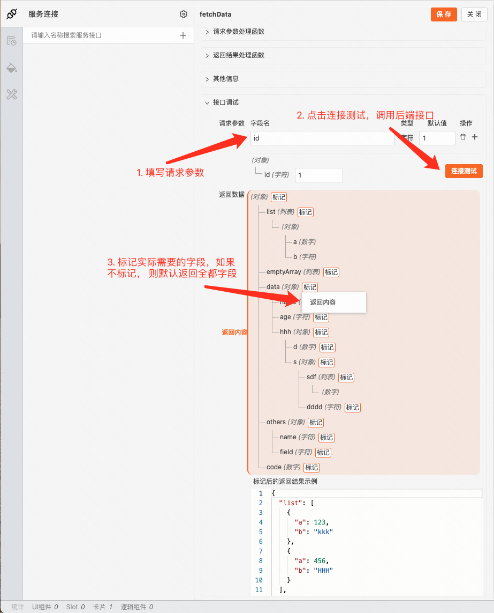
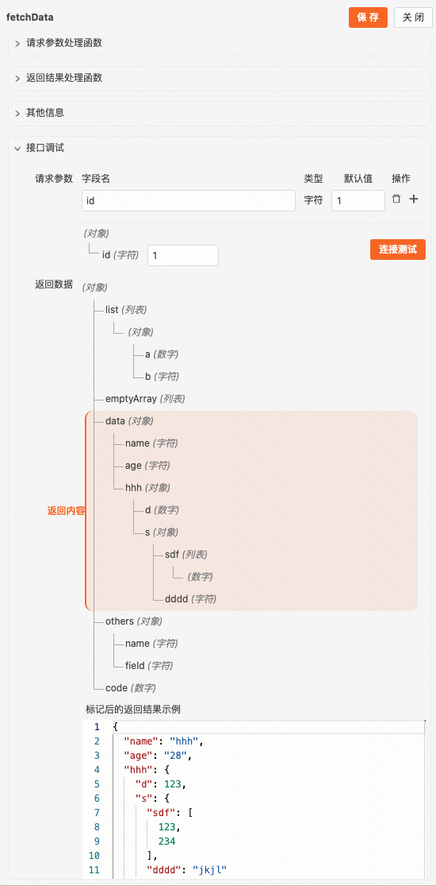
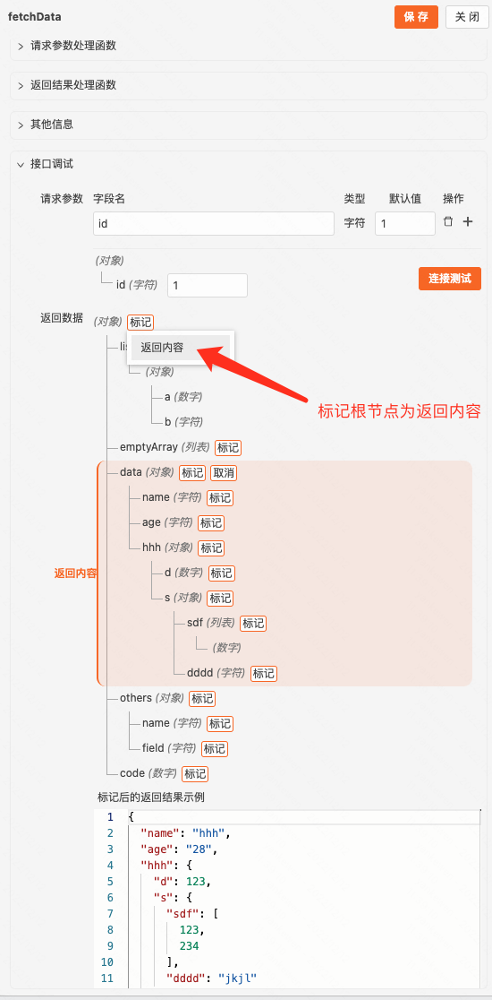
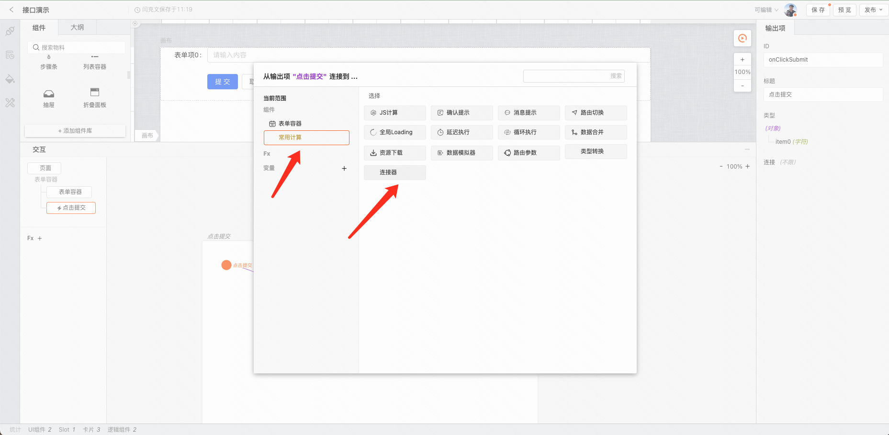
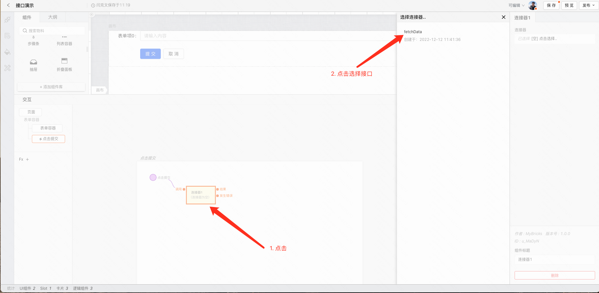
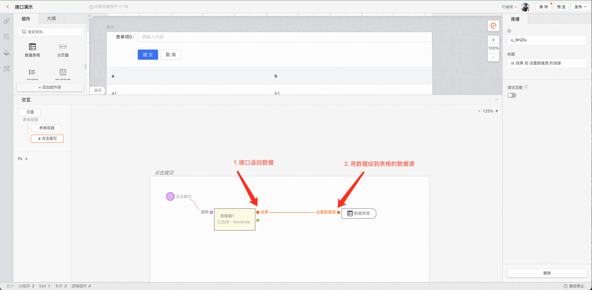
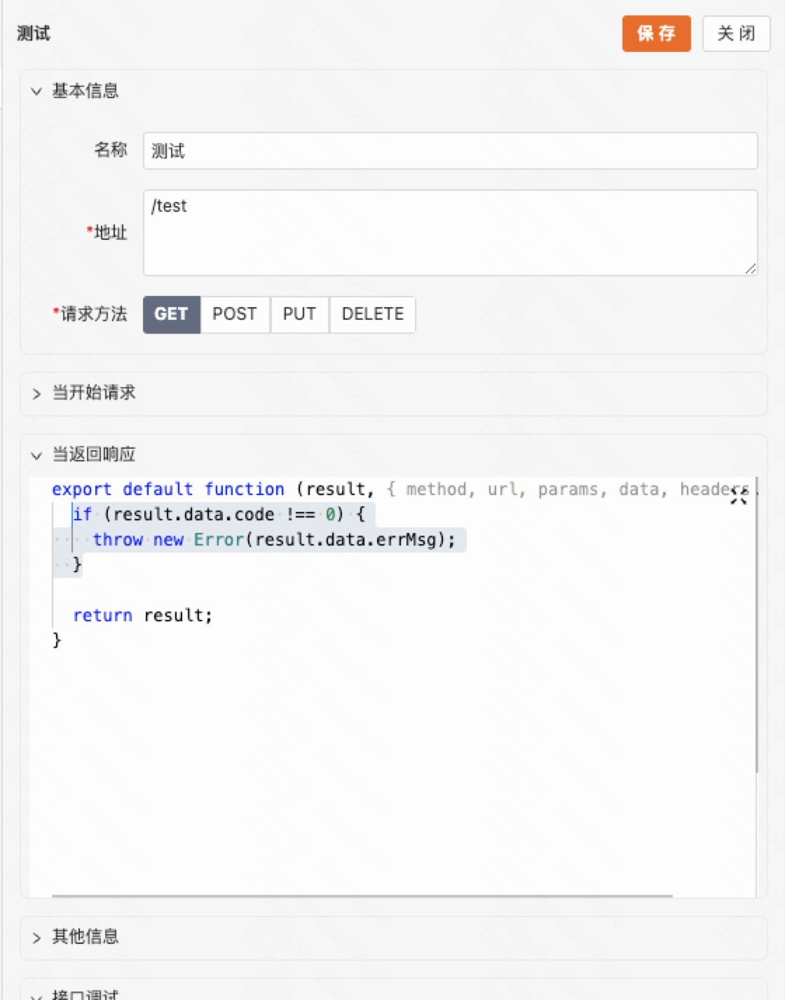
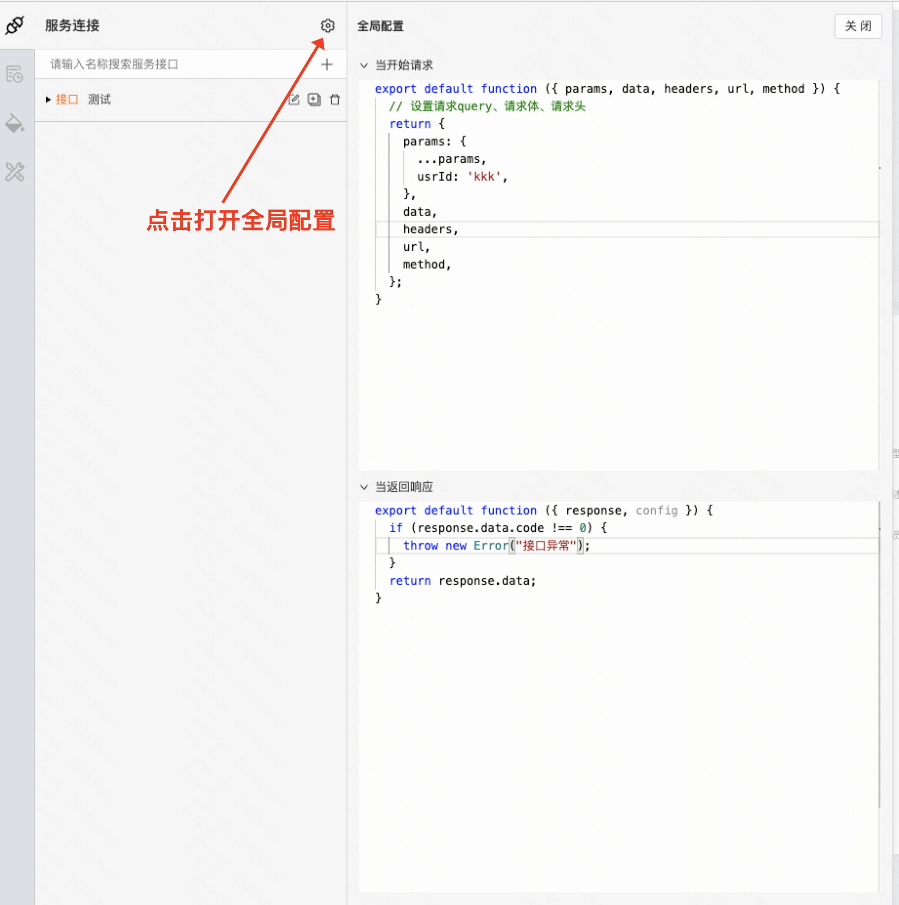

## 创建 HTTP 接口

**从左侧边栏打开「连接器」插件** > **点击「+」，添加接口** > **填写接口信息**

**必填项**
请求方法、请求路径

**可选项**
请求参数处理

**接口调试（重要）**

**使用方法**

**注意事项**

**调用接口时如果请求参数变更，** **后端接口返回的数据结构不一致** **，会导致结果异常**

**比如勾选的是 data，实际调用时后端接口返回的是 { result: {}, code: 0 }，则会获取不到任何数据**

## 使用 HTTP 接口

连接服务接口

选择创建的接口

## 使用接口返回的数据

**使用后端返回的真实数据**

## 服务接口的输入/输出

输入
“调用”：支持传入对象类型数据，会自动识别为接口调用的参数。GET 请求将以问号传参的方式拼接在接口地址中；其他类型请求为 request payload 形式。
输出

“结果”：默认返回状态码非 4xx 或 5xx 时触发，输出数据为接口定义中处理的返回结果
“错误”：默认在返回状态码为 4xx 或 5xx 时触发；当需要根据返回结果自定义触发条件时，可以使用 throw new Error 方法。如图

## 全局配置

**请求参数处理：此处的改动会影响所有接口发起请求的入参，适用与对请求的参数做统一处理，比如在 query 上都要带上 id**
**返回结果处理：此处的改动会影响所有接口的返回结果，适用于对返回结果做统一的数据结构处理**

