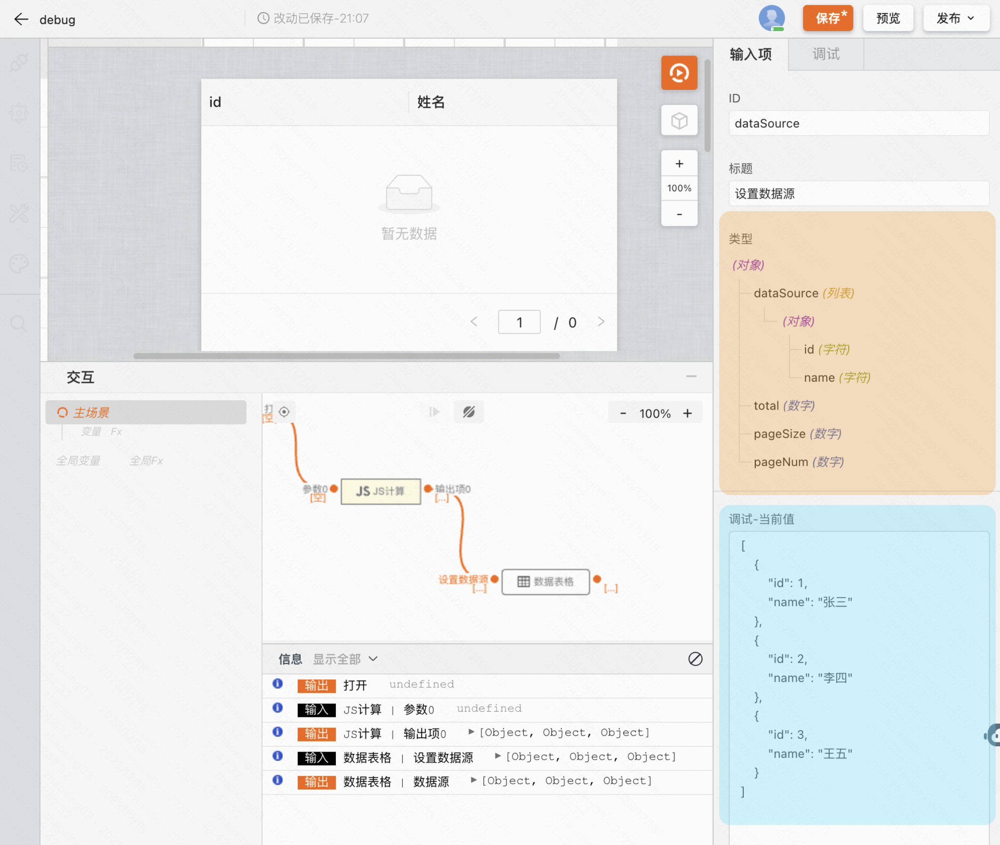

本章将介绍在设计器中调试问题的基本工作流程。

## 第 1 步：重现 bug

找到一系列能够一致地重现 bug 的操作始终是调试的第一步。

1.  在新标签页中[打开此演示](https://my.mybricks.world/mybricks-pc-page/index.html?id=511158381592645)。
2.  在  **Number 1**  文本框中输入 5。
3.  在  **Number 2**  文本框中输入 1。
4.  点击  **Add Number 1 and Number 2** （添加编号 1 和编号 2）。按钮下方的标签显示“5 + 1 = 51”。结果应为 6。这就是您要修复的 bug。



在本例中，5 + 1 的结果是 51。应该是 6。

## 第 2 步：熟悉「交互」面板界面

在点击调试后，我们可以通过「交互」面板中提供的日志等信息进行问题排查。

1. 


2.  
3.  点击 **来源** 标签页。
4.  

 **Sources**  面板界面包含 3 个部分：


1.   **文件导航器** 窗格。此处列出了网页请求的每个文件。
2.   **代码编辑器** 窗格。在 **文件导航器** 窗格中选择文件后，此处会显示该文件的内容。
3.   **JavaScript 调试** 窗格。用于检查网页 JavaScript 的各种工具。如果开发者工具窗口较宽，此窗格会显示在  **Code Editor**  窗格的右侧。

## 第 3 步：使用断点暂停代码

调试这类问题的常用方法是在代码中插入大量 console.log() 语句，以便在脚本执行时检查值。例如：

```Plain Text
function updateLabel() {
  var addend1 = getNumber1();
  console.log('addend1:', addend1);
  var addend2 = getNumber2();
  console.log('addend2:', addend2);
  var sum = addend1 + addend2;
  console.log('sum:', sum);
  label.textContent = addend1 + ' + ' + addend2 + ' = ' + sum;
}

```

console.log() 方法可以完成工作，但 **断点** 可以更快地完成工作。通过断点，您可以在代码执行过程中暂停代码，并在该时刻检查所有值。与 console.log() 方法相比，断点具有一些优势：

-   使用 console.log() 时，您需要手动打开源代码，找到相关代码，插入 console.log() 语句，然后重新加载页面，才能在控制台中查看这些消息。使用断点，您甚至无需了解代码的结构即可暂停相关的代码。
-   在 console.log() 语句中，您需要明确指定要检查的每个值。使用断点，开发者工具会及时显示所有变量的值。有时，有些变量在您不知情的情况下会影响您的代码。

简而言之，与 console.log() 方法相比，断点可以帮助您更快地查找和修复 bug。

如果您退一步想一想应用的工作原理，可以有据地猜测，系统会在与  **Add Number 1 and Number 2**  按钮关联的 click 事件监听器中计算不正确的总和 (5 + 1 = 51)。因此，您可能需要在 click 监听器执行前后暂停代码。 **事件监听器断点** 可让您实现以下目的：

1.  在  **JavaScript 调试** 窗格中，点击 **事件监听器断点** 以展开该部分。开发者工具会显示一系列可展开的事件类别，例如  **Animation**  和  **Clipboard** 。
2.  点击 **鼠标** 事件类别旁边的 **展开**  。 开发者工具会显示鼠标事件列表，例如  **click**  和  **mousedown** 。每个事件旁都有一个复选框。
3.  选中  **click**  复选框。开发者工具现已设置为在执行任何 click 事件监听器时自动暂停。
4.  
5.  返回演示，再次点击  **Add Number 1 and Number 2** （添加编号 1 和编号 2）。开发者工具会暂停演示，并在  **Sources**  面板中突出显示一行代码。在以下代码行上，开发者工具应暂停：
6.  ```Plain Text
    function onClick() {
    
    ```
    
7.  如果您是在其他代码行暂停，请按  **Resume Script Execution**  图标 ，直到暂停位置正确。
8.   **注意** ：如果您在其他代码行暂停，可使用浏览器扩展程序在您访问的每个网页上注册  **click**  事件监听器。在该扩展程序的  **click**  监听器中，您已暂停。如果您使用无痕模式进行[无痕浏览](https://support.google.com/chrome/answer/95464?hl=zh-cn)（这会停用所有扩展程序），您可以看到每次都在正确的代码行暂停。

 **事件监听器断点** 只是开发者工具中提供的众多断点类型之一。您需要记住所有不同的类型，因为每种类型最终都可以帮助您尽快调试不同的场景。如需了解每种类型的使用时机和使用方式，请参阅[使用断点暂停代码](https://developer.chrome.com/docs/devtools/javascript/breakpoints?hl=zh-cn)。

## 第 4 步：单步调试代码

导致 bug 的一种常见原因是脚本执行顺序有误。您可以通过单步调试代码一次一行地检查代码执行情况，并弄清楚代码的执行顺序与预期不同。立即试用：

1.  在开发者工具的  **Sources**  面板中，点击  **Step into next function call**  图标 ，以一次一行的形式逐步执行 onClick() 函数。开发者工具会突出显示下面这行代码：
2.  ```Plain Text
    if (inputsAreEmpty()) {
    
    ```
    

4.  点击  **Step over next function call**  图标 。 开发者工具会执行 inputsAreEmpty()，而不会进入它。请注意开发者工具如何跳过几行代码。这是因为 inputsAreEmpty() 的求值结果为 false，所以 if 语句的代码块未执行。

这就是单步调试代码的基本思路。如果看一下 get-started.js 中的代码，就会发现 bug 可能位于 updateLabel() 函数的某处。您可以使用其他类型的断点在更靠近 bug 可能位置的位置暂停代码，而不是单步调试代码。

## 第 5 步：设置代码行断点

代码行断点是最常见的断点类型。如果您想在执行到某一行代码时暂停，请使用代码行断点：

1.  请查看 updateLabel() 中的最后一行代码：
2.  ```Plain Text
    label.textContent = addend1 + ' + ' + addend2 + ' = ' + sum;
    
    ```
    

4.  在代码左侧，您可以看到这行代码的行号，即  **32** 。点击  **32** 。开发者工具会在  **32**  上方显示一个蓝色图标。这意味着这行代码上有一个代码行断点。现在，开发者工具始终会在执行这行代码之前暂停。
5.  点击 **继续执行脚本**  。脚本会继续执行，直到第 32 行。在第 29、30 和 31 行，开发者工具以内嵌方式[显示](https://developer.chrome.com/docs/devtools/javascript/reference?hl=zh-cn#inline-eval) addend1、addend2 和 sum 的值。


在此示例中，开发者工具在第 32 行代码行断点处暂停。

## 第 6 步：检查变量值

addend1、addend2 和 sum 的值看起来很可疑。它们是用英文引号引起来的，这意味着它们是字符串。这是一个很好的假设，可以解释错误的原因。现在可以收集更多信息了。开发者工具提供了许多用于检查变量值的工具。

### 方法 1：Scope 窗格

在某行代码上暂停时， **Scope**  窗格会显示当前定义的局部和全局变量，以及每个变量的值。其中还会显示闭包变量（如果适用）。双击变量值即可对其进行修改。如果未在任何代码行暂停，则  **Scope**  窗格为空。


### 方法 2：监视表达式

 **监视表达式** 标签页可让您监控变量的值随时间的变化。顾名思义，监视表达式不仅限于变量。您可以将任何有效的 JavaScript 表达式存储在监视表达式中。立即试用：

1.  点击 **观看** 标签页。
2.  点击 **添加表达式**  。
3.  输入 typeof sum。
4.  按 Enter 键。开发者工具会显示 typeof sum: "string"。冒号右侧的值是监视表达式的结果。


上面的屏幕截图显示了创建 typeof sum 监视表达式后的  **Watch Expression**  窗格（右下角）。如果开发者工具窗口较大， **Watch Expression**  窗格位于右侧，在  **Event Listener Breakpoints**  窗格的上方。

就像猜测一样，sum 的求值结果本应是数字，而实际结果却是字符串。现在，您已确认这是导致 bug 的原因。

### 方法 3：控制台

除了查看 console.log() 消息之外，您还可以使用控制台对任意 JavaScript 语句求值。在调试方面，您可以使用控制台测试 bug 的潜在解决方法。立即试用：

1.  如果您尚未打开控制台抽屉式导航栏，请按 Esc 将其打开。它会在开发者工具窗口底部打开。
2.  在控制台中，输入 parseInt(addend1) + parseInt(addend2)。此语句之所以有效，是因为您暂停了 addend1 和 addend2 在范围内的代码行。
3.  按 Enter 键。开发者工具会评估语句并输出 6，这是您希望演示生成的结果。


上面的屏幕截图显示了评估 parseInt(addend1) + parseInt(addend2) 后的  **Console**  抽屉式导航栏。

## 第 7 步：应用解决方案

您已找到该 bug 的修复方案。接下来就是尝试通过修改代码并重新运行演示来尝试修复。您无需离开开发者工具即可应用修复。您可以直接在开发者工具界面中修改 JavaScript 代码。立即试用：

1.  点击 **继续执行脚本**  。
2.  在 **代码编辑器** 中，将第 31 行 var sum = addend1 + addend2 替换为 var sum = parseInt(addend1) + parseInt(addend2)。
3.  按 Command + S (Mac) 或 Ctrl + S（Windows、Linux）以保存更改。
4.  点击  **停用断点**  。 其颜色会变为蓝色，表示处于活动状态。完成此设置后，开发者工具会忽略您已设置的任何断点。
5.  尝试使用不同的值测试演示。演示现在会正确计算。

 **注意** ：此工作流只会修复在浏览器中运行的代码。它不会为访问您的网页的所有用户修正代码。为此，您需要修正服务器上的代码。不过，您可以[在开发者工具中修改文件，并通过工作区将文件保存到来源中](https://developer.chrome.com/docs/devtools/workspaces?hl=zh-cn)。 **要点** ：从 Chrome 105 版开始，您可以[实时修改已暂停的函数](https://developer.chrome.com/docs/devtools/javascript/reference?hl=zh-cn#live-edit)。

## 后续步骤

恭喜！您现在已经知道如何在调试 JavaScript 时充分利用 Chrome 开发者工具。您在本教程中学到的工具和方法可以为您节省大量时间。

本教程仅介绍了两种设置断点的方法。开发者工具还提供了许多其他方式，包括：

-   仅在满足您指定的条件时触发的条件断点。
-   发生已捕获或未捕获异常时的断点。
-   当请求的网址与您提供的子字符串匹配时触发的 XHR 断点。

如需了解每种类型的适用情形和使用方式，请参阅[使用断点暂停代码](https://developer.chrome.com/docs/devtools/javascript/breakpoints?hl=zh-cn)。

有几个代码单步执行控件未在本教程中加以说明。如需了解详情，请参阅[单步调试代码](https://developer.chrome.com/docs/devtools/javascript/reference?hl=zh-cn#stepping)。