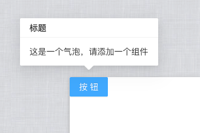
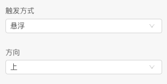
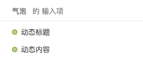
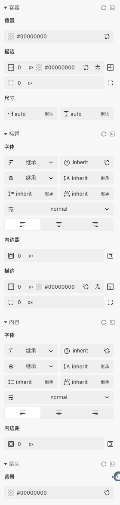

> 应用场景 1：一些需要气泡提示的情形

Demo 地址：[【气泡】基本使用](https://my.mybricks.world/mybricks-pc-page/index.html?id=514694316970053)

## 基本操作

### 标题和内容

标题和内容都可以静态配置或者动态传入

### 触发方式和出现位置

## 逻辑编排

### 动态配置标题和内容

## 样式

### 默认样式

