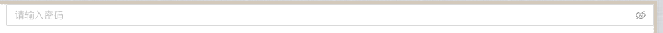
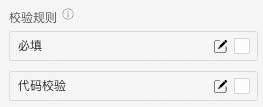
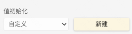
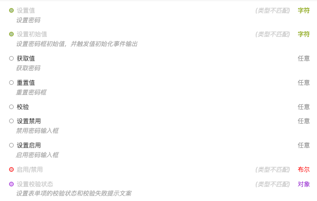

> 应用场景\
> 填写密码\
> 场景1：单独使用\
> 场景2：在表单容器中，作为表单项使用\

Demo地址：[【密码框】基本使用](https://my.mybricks.world/mybricks-pc-page/index.html?id=514738229473349)

## 基本操作

### 密码框

#### 提示内容

说明：值为空时的提示文字

#### 禁用状态

#### 数据校验

说明：

1. 配置的校验规则，需要在表单容器中使用才能生效
2. 点击右侧的勾选框，启用该项校验规则
3. 点击右侧的“编辑”按钮，弹出校验规则的配置项

## 逻辑编排

### 值初始化事件

输出时机：

1. 给密码框“ **设置初始值** ”输入项设置数据
2. 给密码框所在表单容器的“ **设置表单数据** ”输入项设置数据

输出内容：

密码框的当前值

### 值更新事件

输出时机：

1. 给密码框的“ **设置值** ”输入项设置数据
2. 给密码框所在表单容器的“ **设置表单数据(触发值变化)** ”输入项设置数据
3. 用户操作密码框的增删改操作时

输出内容：

密码框的当前值

说明：

可以用于实现监听联动

### 其他

## 样式

### 边框

支持配置默认,Hover,Focus(聚焦),禁用

