 **手机号输入框** 

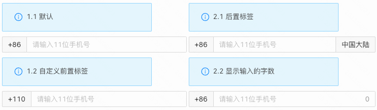

  

> **概述**\
> 输入框，支持前置、后置标签，同时内置手机号合法校验。\

> **应用场景**\
> 场景1：注册表单中，手机号的填写\
Demo地址：[【手机号输入框】基本使用](https://my.mybricks.world/mybricks-app-pcspa/index.html?id=470800851554373)

## 基本操作
### 手机号输入框
#### 提示内容

说明：值为空时的提示文字
#### 前置标签

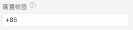

说明：显示在输入框前的说明标签
#### 后置标签

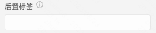

说明：显示在输入框后的说明标签
#### 校验失败提示内容

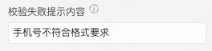

说明：校验失败时，显示在输入框下方的提示文案。在表单容器中使用，失焦时触发校验。
#### 显示清除图标

说明：开启时，手机号输入框有输入后，右侧显示清除图标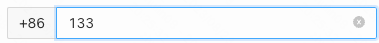
#### 显示字数

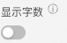

说明：开启时，手机号输入框有输入后，右侧显示字数
#### 默认是否禁用

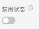
#### 数据校验

说明：

1.  配置的校验规则，需要在表单容器中使用才能生效
2.  点击右侧的勾选框，启用该项校验规则
3.  点击右侧的“编辑”按钮，弹出校验规则的配置项

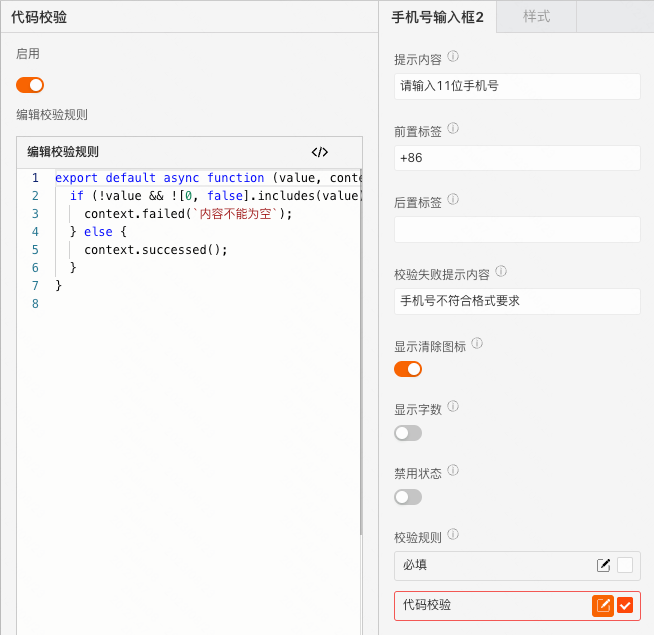
## 逻辑编排
#### 值初始化事件

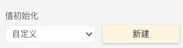

输出时机：

1.  给手机号输入框的“ **设置初始值** ”输入项设置数据
2.  给手机号输入框所在表单容器的“ **设置表单数据** ”输入项设置数据

输出内容：

手机号输入框的当前值
#### 值更新事件

输出时机：

1.  给手机号输入框的“ **设置值** ”输入项设置数据
2.  给手机号输入框所在表单容器的“ **设置表单数据(触发值变化)** ”输入项设置数据
3.  用户操作手机号输入框的增删改操作时

输出内容：

手机号输入框的当前值

说明：

可以用于实现监听联动
#### 失焦事件

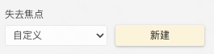

输出时机：

手机号输入框失去焦点时

输出内容：

手机号输入框的当前值
#### 按下回车

  
  

输出时机：

在手机号输入框中，按下键盘的回车键

输出内容：

手机号输入框的当前值
## 样式
#### 基础样式
##### 边框样式

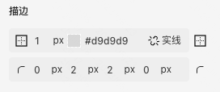
#### 作为表单项的样式

