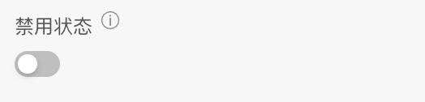
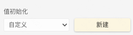

 **文本域** 

> 应用场景

> 场景1：单独使用

> 场景2：在表单容器中，作为表单项使用

> Demo地址：[【文本域】基本使用](https://my.mybricks.world/mybricks-app-pcspa/index.html?id=470849996513349)

# 基本操作

## 文本域

### 提示内容

说明：值为空时的提示文字

### 显示清除图标

说明：开启后，可以点击图标清除内容

### 行数限制

说明：展示的文本域，最大和最小行数

### 禁用状态

### 显示数字

说明：开启后，组件下方，显示文本字数

### 内容最大长度

  

说明：默认为-1，表示不限制输入内容的长度，输入其余数字表示可以限制最大的内容长度

  

### 数据校验

说明：配置数字输入框的校验规则，需要在表单容器中使用才能生效

# 逻辑编排

### 值初始化事件

输出时机：

1.  给文本域的“ **设置初始值** ”输入项设置数据
2.  给文本域所在表单容器的“ **设置表单数据** ”输入项设置数据

输出内容：

文本域的当前值

  

### 值更新事件

输出时机：

1.  给文本域的“ **设置值** ”输入项设置数据
2.  给文本域所在表单容器的“ **设置表单数据(触发值变化)** ”输入项设置数据
3.  用户操作文本域进行输入或者删除操作时

输出内容：

文本域的当前值

说明：

可以用于实现监听联动

  

### 失去焦点事件

输出时机：

1.  用户操作文本域失去焦点操作时

输出内容：

文本域失去焦点时的当前值

说明：

可以用于实现监听联动

# 样式

### 基础样式

#### 边框样式

