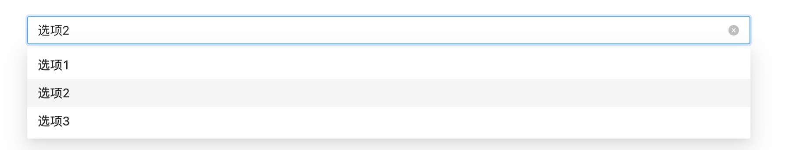
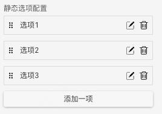
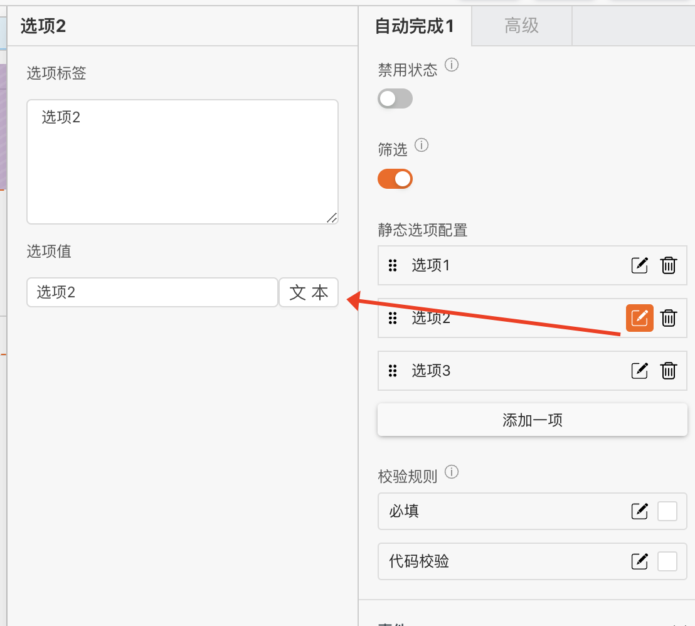
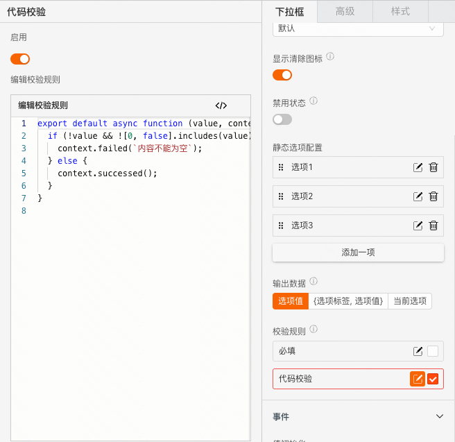
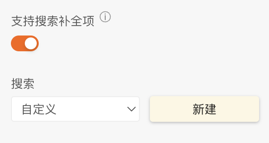
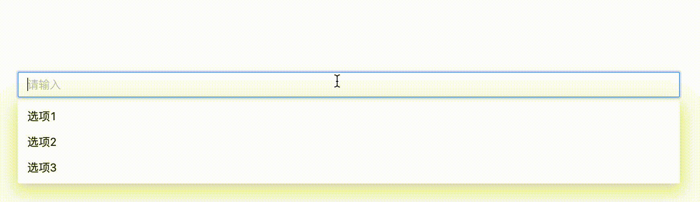
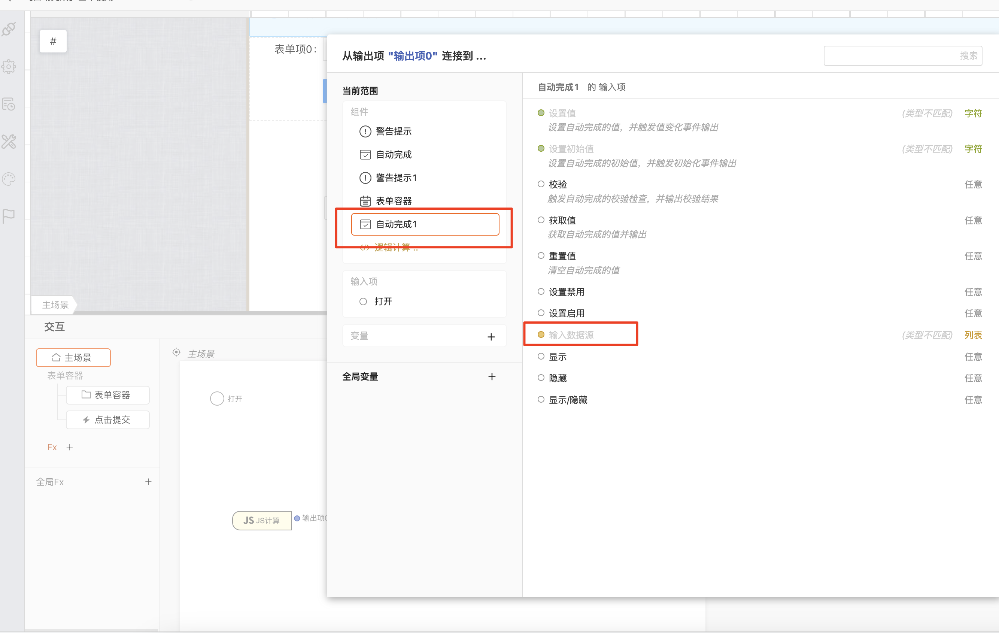
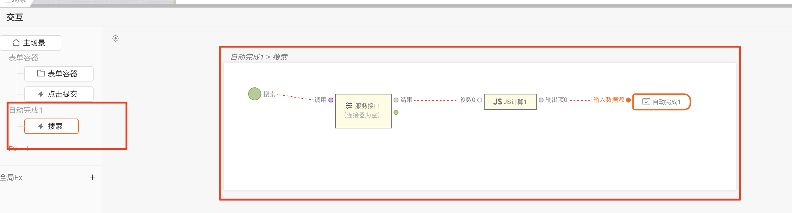

 **自动完成** 

> 应用场景

> 既能自定义输入内容又能选择选项

> 场景1：单独使用

> 场景2：在表单容器中，作为表单项使用

> Demo地址：[【自动完成】基本使用](https://my.mybricks.world/mybricks-app-pcspa/index.html?id=470856326099013)

# 基本操作

## 自动完成

### 提示内容

说明：值为空时的提示文字

  

### 显示清除图标

说明：开启后，下拉框有选中项后，右侧显示清除图标

  

### 禁用状态

  

### 筛选

说明：开启后，可以根据输入内容对选项进行筛选

### 静态选项配置

说明：

1.  点击“添加一项”，下拉框增加一个选项
2.  选项右侧的两个按钮分别为“编辑”和“删除”，点击“编辑”按钮，弹出选项的配置项

3.  选项左侧的图标为拖拽手柄，可以点击拖拽修改选项的相对位置

  

### 数据校验

说明：

1.  配置的校验规则，需要在表单容器中使用才能生效
2.  点击右侧的勾选框，启用该项校验规则
3.  点击右侧的“编辑”按钮，弹出校验规则的配置项

## 高级

### 支持搜索补全项

说明：开启时，根据用户输入项内容自定义选项值，“新建”搜索逻辑卡片，远程获取数据源进行设置

# 逻辑编排

### 值初始化事件

输出时机：

1.  给自动完成的“ **设置初始值** ”输入项设置数据
2.  给自动完成所在表单容器的“ **设置表单数据** ”输入项设置数据

输出内容：

自动完成的当前值

  

### 值更新事件

输出时机：

1.  给自动完成的“ **设置值** ”输入项设置数据
2.  给自动完成所在表单容器的“ **设置表单数据(触发值变化)** ”输入项设置数据
3.  用户操作自动完成的增删改操作时

输出内容：

自动完成的当前值

说明：

可以用于实现监听联动

  

### 失焦事件

输出时机：

自动完成失去焦点时

输出内容：

自动完成的当前值

  

### 设置选项数据源

  

### 搜索事件

输出时机：

自动完成值发生变化时

输出内容：

自动完成的当前值

使用：

1.  点击新建，创建搜索的逻辑卡片
2.  进行逻辑编排

  

# 样式