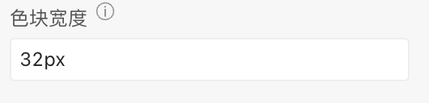
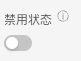
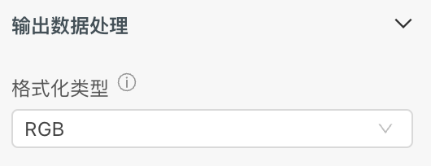

> **应用场景**\
选择颜色\
场景1：单独使用\
场景2：在表单容器中，作为表单项使用

Demo地址：[【颜色选择框】基本使用](https://my.mybricks.world/mybricks-pc-page/index.html?id=472934494220357)

----
## 基本操作
### 颜色选择框
#### 默认颜色

说明：颜色选择框，默认的颜色（#000000）
#### 色块宽度

说明：设置色块宽度
#### 禁用状态

#### 输出数据处理

格式化类型，RGB和HEX

#### 数据校验

说明：

1.  配置的校验规则，需要在表单容器中使用才能生效
2.  点击右侧的勾选框，启用该项校验规则
3.  点击右侧的“编辑”按钮，弹出校验规则的配置项

## 逻辑编排
#### 值初始化事件

输出时机：

1.  给颜色选择框“ **设置初始值** ”输入项设置数据
2.  给颜色选择框框所在表单容器的“ **设置表单数据** ”输入项设置数据

输出内容：

颜色选择框的当前值
#### 值更新事件

输出时机：

1.  给颜色选择框的“ **设置值** ”输入项设置数据
2.  给颜色选择框所在表单容器的“ **设置表单数据(触发值变化)** ”输入项设置数据
3.  用户操作颜色选择框的增删改操作时

输出内容：

颜色选择框的当前值

说明：

可以用于实现监听联动
## 样式