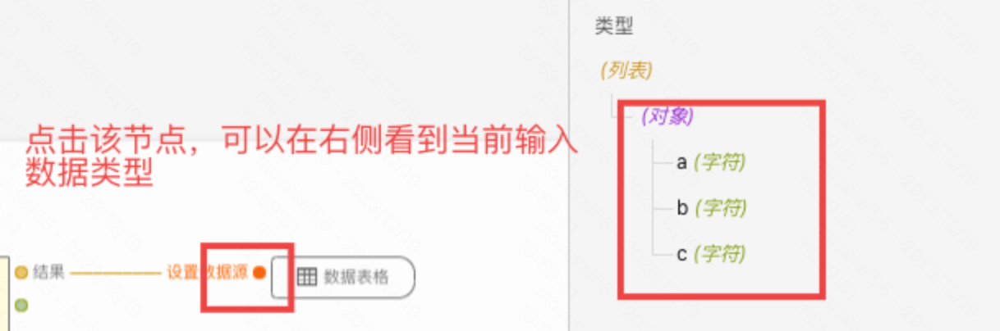
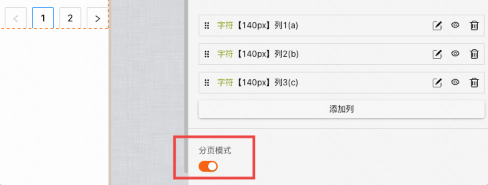
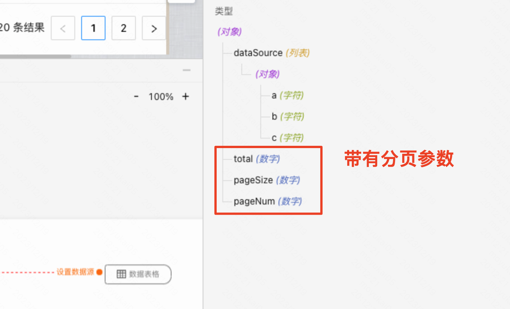
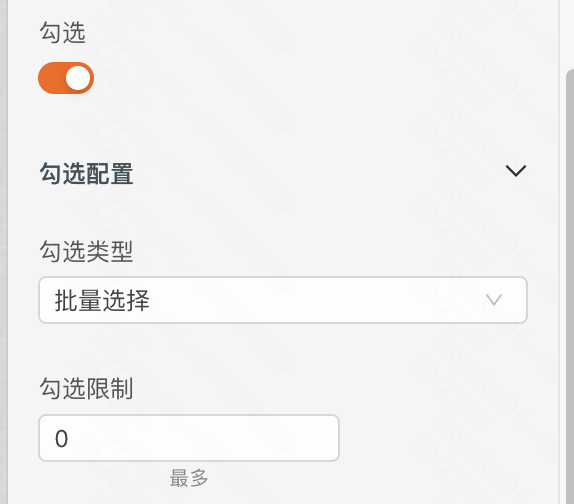
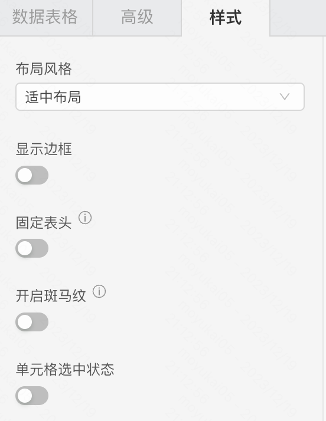
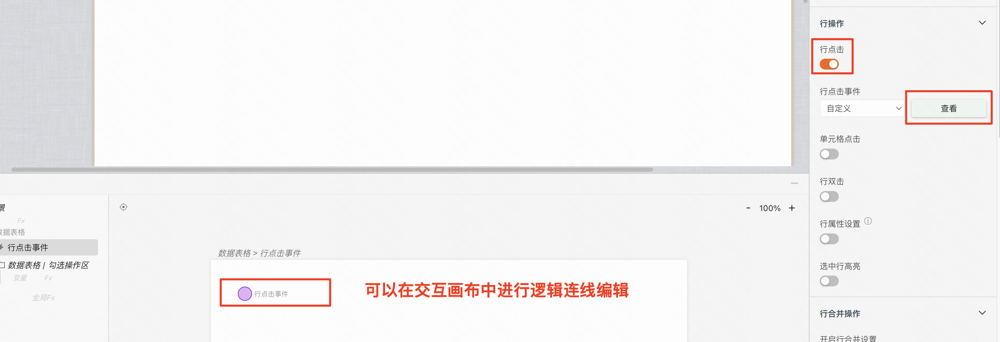
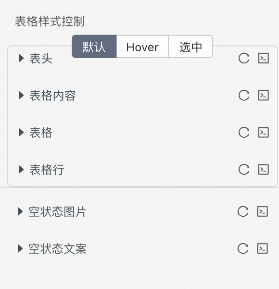
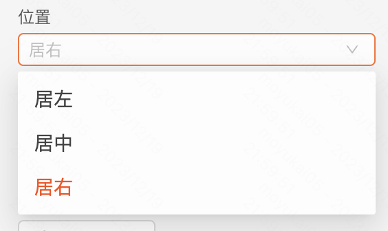
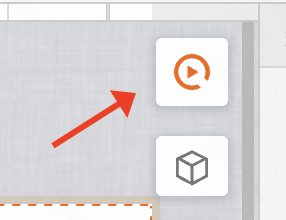

---
tags:
  - UI组件
---

> 应用场景  
> 1、展示和组织数据，有大量结构化数据需要展示  
> 2、 当需要对数据进行排序、搜索、过滤、分页展示等复杂操作  
## 属性
### 数据属性
- 数据源：表格展示的数据。数据源可以由 **js计算** 或者 **服务接口** 获取得到。

- 数据类型：由以上数据源推导得出，无需单独设置。

- 初始加载：通过JS计算或者服务接口获取数据源时，即完成初始加载。
- 分页：是否展示分页组件。
    > 1、打开分页开关  
    > 2、添加分页事件和获取逻辑  
    > 3、逻辑编排获取接口数据并赋值到表格中  
    > 4、传给数据表格的数据类型不是数组，是一个带分页信息的对象  

    
    
    
    
### 选择属性
- 单选/多选：如果支持多选，可以配置多选数。
  - 

### 样式属性
- 布局风格
  - 默认布局
  - 适中布局
  - 紧凑布局
- 显示边框：显示表格外部以及内部的所有框线
- 固定表头：设置表头固定，只滚动数据行。必须同时设置 每一列的宽度
- 开启斑马纹

### 表格列
通过设置表格列属性，可自定义表格每列的功能
- 列名：可以手动输入，定义表格显示的列名
- 字段：数据项中对应的字段名，如createdTime
- 类型
  - 普通文字
  - 自定义插槽：作用域插槽可以实现自定义表格单元格内的元素，比如按钮、工具条、带样式的文本等等
  - 分组
- 格式转换：对表格数据进行格式化，如枚举映射、时间戳转化等
- 表格列填充剩余宽度：没有固定宽度，填充剩余宽度
- 表格列指定宽度：填入固定的像素值宽度
- 内容省略展示：内容超出宽度后文本是否自动省略、不换行、以省略号接吻
- 提示配置：显示提示，鼠标悬浮在单元格上时，是否显示提示信息

## 事件
表格行点击、单元格点击、行双击、行属性设置、选中行高亮
> 事件的触发，需要开启开关后，点击查看按钮，到对应的交互逻辑面板中进行编辑

## 样式
- 单元格选中状态
- 表格样式：可以针对 **hover** 和 **非hover** 态进行分别修改「见下图」
  - 表头：可对字体、描边、背景进行修改（可统一修改，也可选中某一列表头进行修改）
  - 表格内容：可对字体、描边、背景进行修改
  - 表格：可对字体、描边、背景进行修改
  - 表格行：可对描边、背景、不透明度进行修改
- 空状态样式
  - 空状态图片：可对尺寸、描边、背景进行修改
  - 空状态文案：可对字体进行修改
- 分页样式
  - 分页器可以调整为：居左、居中、居右（前提是将底部勾选操作区显示按钮关闭）「见下图」

<!-- ## 示例
### 需求场景

### 功能要求

### 操作步骤 -->

## 使用说明
点击画布右上角调试按钮，即可预览数据表格运行时的呈现效果。

