---
tags:
  - UI组件
---
## 案例一：表格展示固定数据
### 场景介绍
> 1、展示和组织数据，有大量结构化数据需要展示
> 
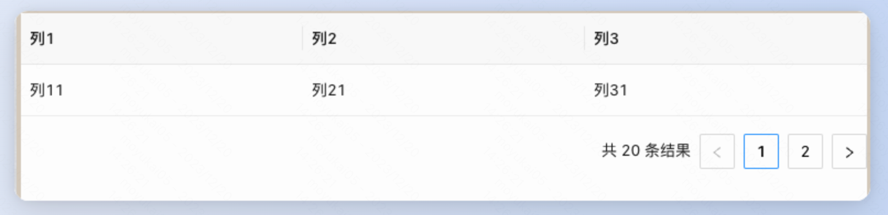
### 操作步骤
1、从右侧组件面板拖入 数据表格 组件

2、选中画布中的数据表格，从交互面板 主场景 打开起点，拉出一条js计算逻辑（如下图），定义好表格的数据结构
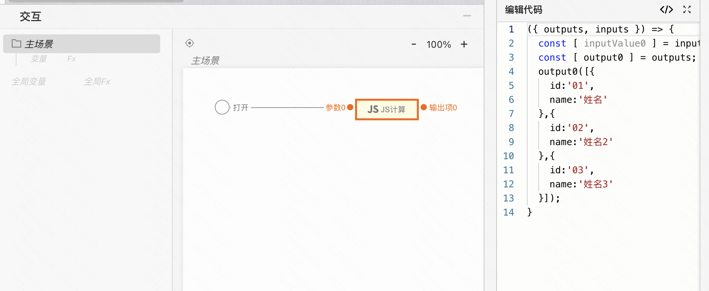

3、从js计算右侧输出侧，拉出一条线，放手后可以看到逻辑面板，然后选择UI组件中的数据表格，设置表格的数据源（如下图）
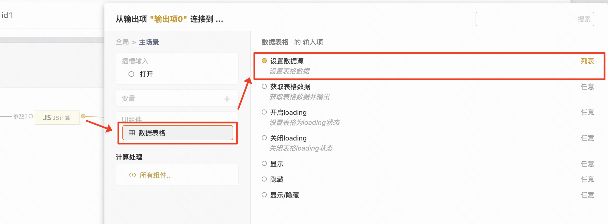

4、点击画布右上角预览按钮，查看效果  

### 效果展示
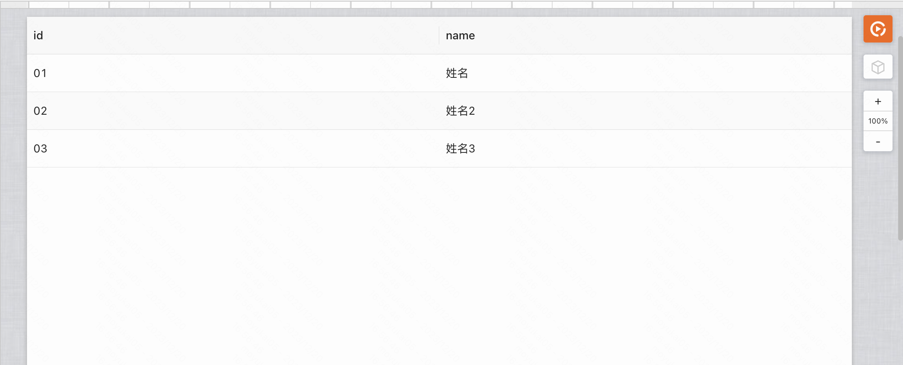

## 案例二：如何开启分页
### ① 前端分页模式
#### 场景介绍
服务端一次性返回全部的数据，由前端来做分页处理。
#### 操作步骤
> 这里以案例一中的静态数据表格为基础，进行修改

1、选中画布中的表格组件，然后在右侧数据表格属性面板中，打开分页模式开关
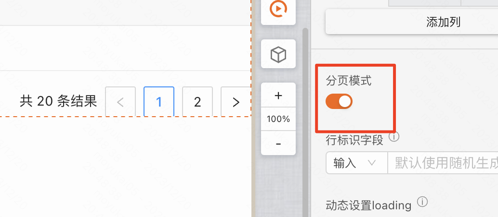

2、选中到表格中的分页器区域，然后在右侧编辑项的高级tab中，打开前端分页开关
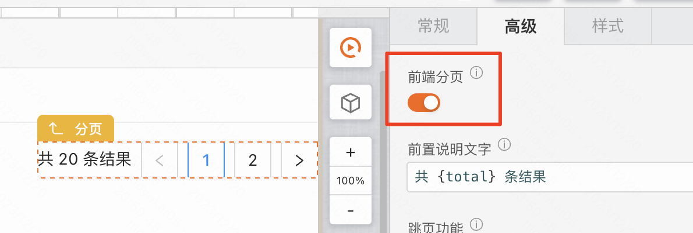
#### 效果展示

### ② 后端分页模式
#### 场景介绍
服务端根据前端传入的分页参数，返回对应的数据。
#### 操作步骤
1、打开分页模式开关，关闭前端分页开关，然后点击聚焦到数据表格中的分页器区域，然后在右侧编辑项的事件一栏，新建点击分页自定义逻辑（点击新建）  
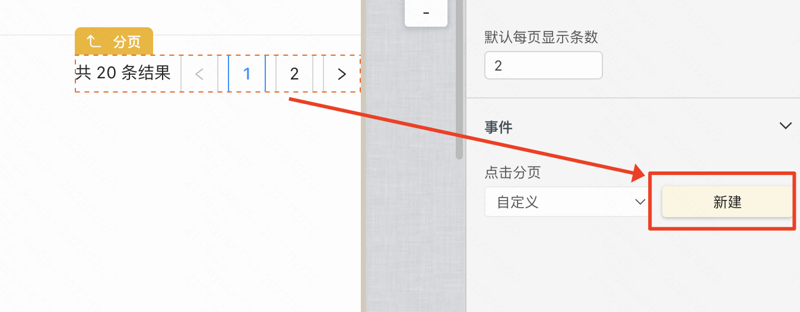

> 此时每次点击分页，都会自动携带分页参数，触发这个分页逻辑；我们需要在这个分页逻辑中，调用服务接口，获取对应页面数的数据，然后赋值给表格的数据源。

2、从点击分页开始点，拉出一条线，放开鼠标，可以看到逻辑面板，此时点击 计算处理 中的「所有组件」 选项；然后，在右侧打开的逻辑组件库中，选择 「服务接口」 逻辑组件
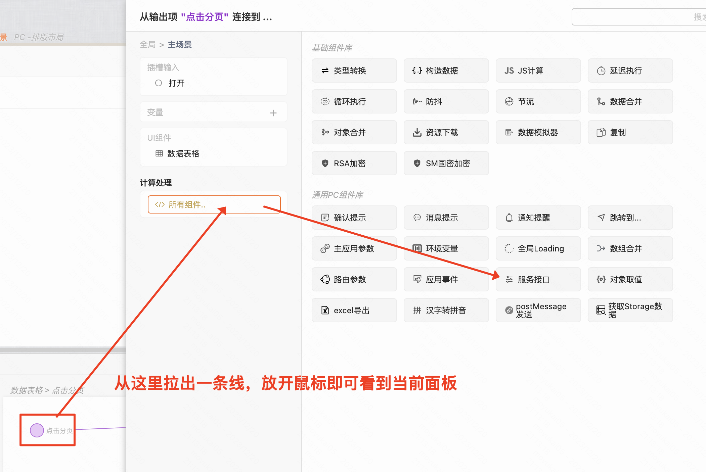

3、在领域模型中，新建一个接口，在这个接口中，使用分页查询数据逻辑组件；然后再分页查询数据组件中，选择查询的数据库和配置好筛选条件
> 如果用领域模型作为服务端数据源，则需要在领域模型搭建逻辑的时候，选择“分页查询数据”逻辑组件，并且将分页参数传入到这个逻辑组件中，分页逻辑才可以生效。

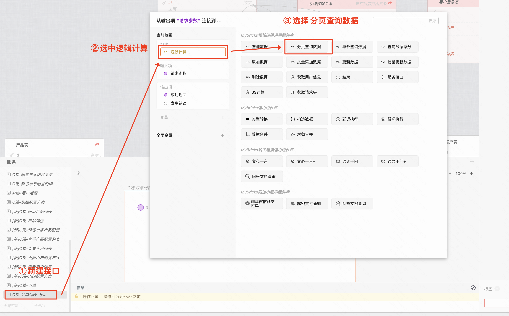

4、分页查询组件的输入 **一定要连入两条线**（分页参数、参数），最后将结果连线到成功返回上,然后发布当前领域模型
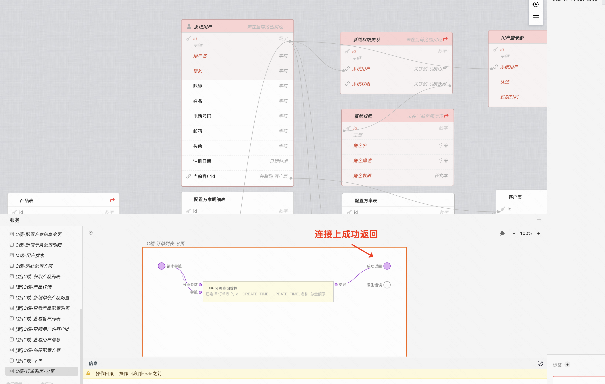

5、在左侧服务链接中，添加领域接口,选中刚刚发布的领域模型，然后点击确定进行添加
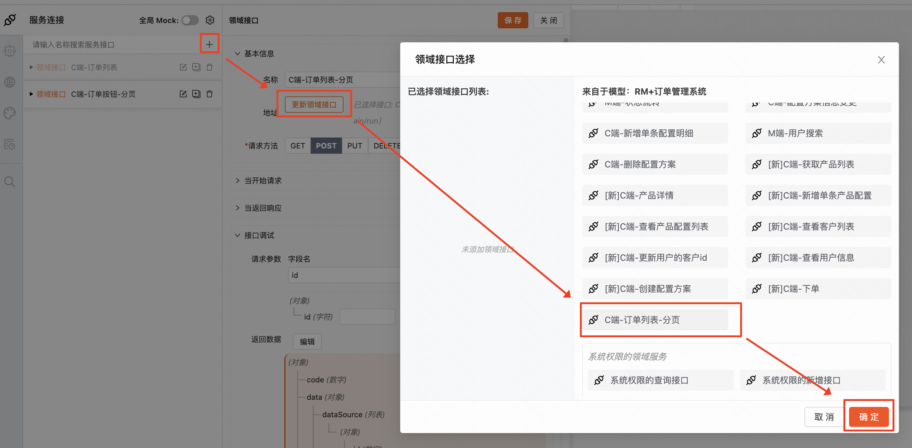

6、点击选中刚刚拖入的服务接口组件，然后在右侧编辑项中，选择一个服务接口
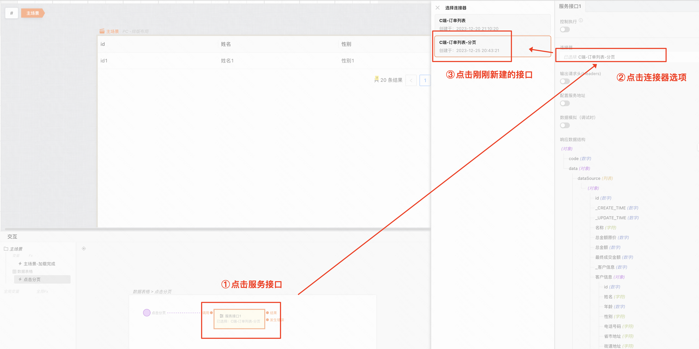

7、格式化服务接口返回的数据，然后连入到数据表格中
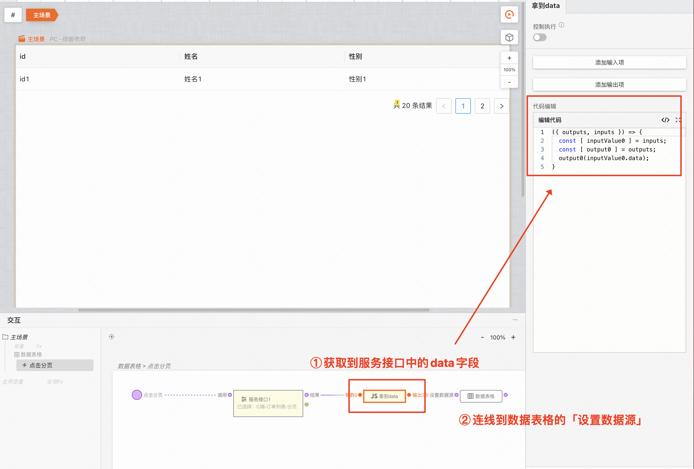

8、现在还差最后一步：表格加载时，需要自动触发一次分页逻辑，从而获取第一页的数据，然后赋值给表格的数据源
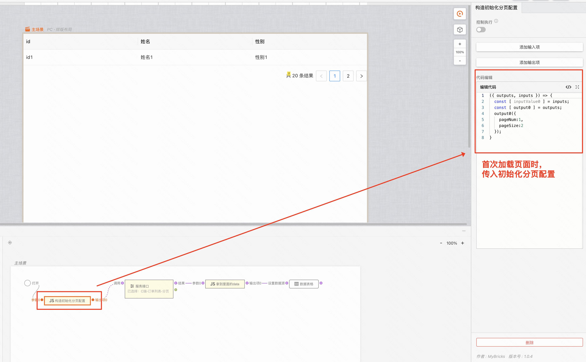

#### 效果展示

## 案例三：如何自定义表格列中的标签
#### 场景介绍
要根据枚举值，显示不同的标签或者元素
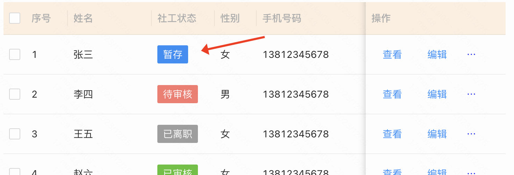
#### 操作步骤
1、选中要开启自定义插槽的列的表头，然后在右侧的编辑项中，在类型一栏选中自定义插槽，即可开启自定义插槽功能
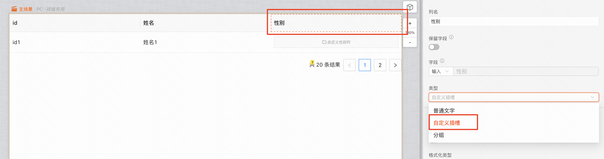
2、从组件库中，往刚刚新增的插槽拖入标签列表
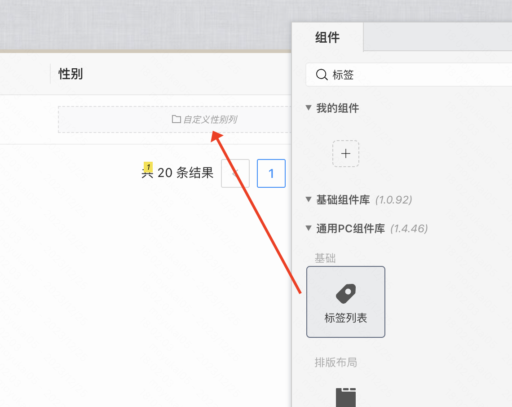
3、给标签列表打开动态数据开关
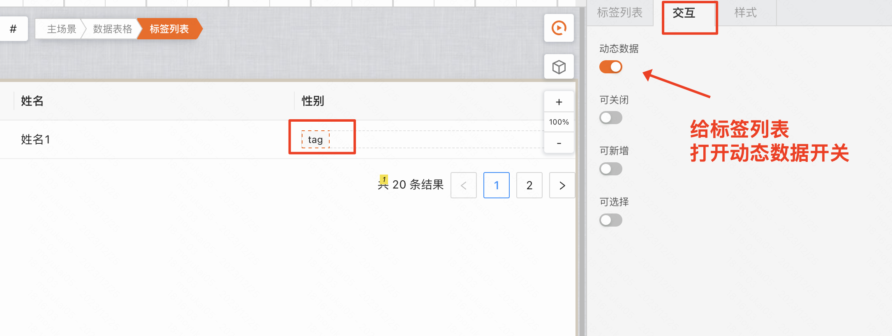
4、选中页面下方交互面板中的 数据表格 | 自定义XXX列 插槽，从当前行数据拉出一条线，连接到js计算中，然后在js计算中，根据当前行的数据，输出对应的标签列表结构数据
> 这里相当于每次渲染一行表格的时候，都会走到这个逻辑里面，然后根据当前行数据进行判断，根据js计算中的条件，输出对应的标签列表结构数据   

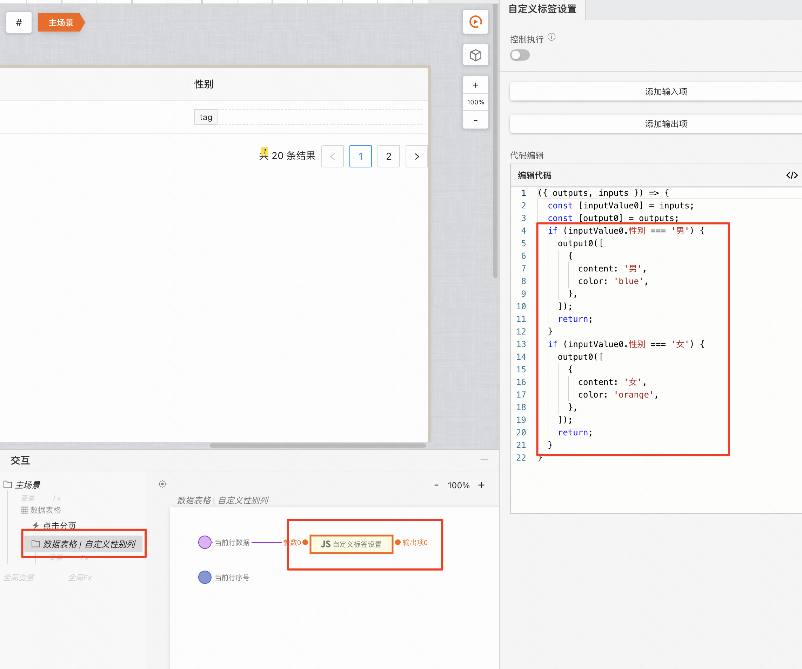
5、从js计算的输出侧，拉出一条线，放开鼠标，可以看到逻辑面板，此时选中 UI组件 中的 标签列表，然后在右侧输入项面板中，选中输入动态标签列表。

#### 效果展示
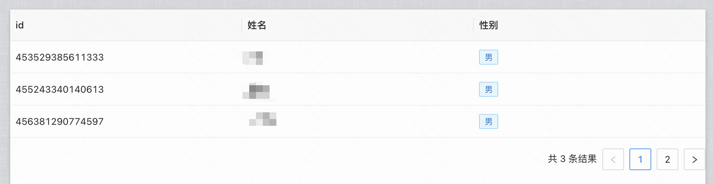
