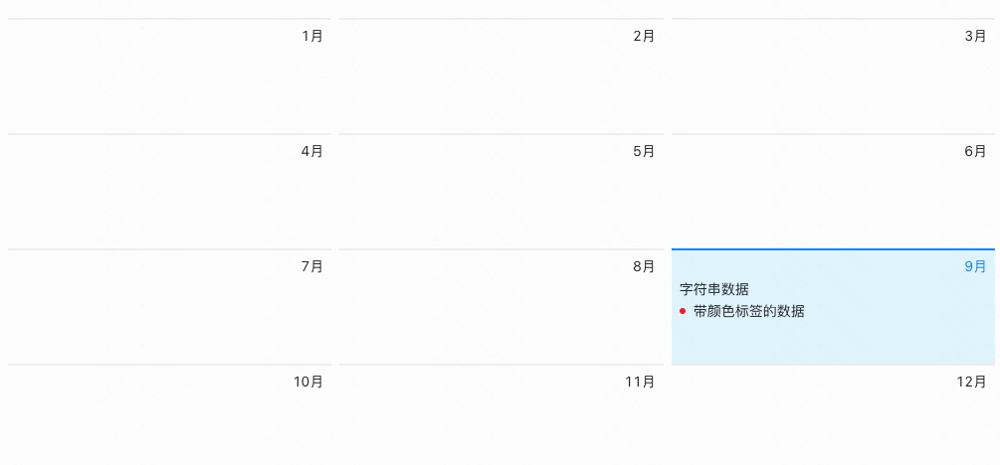

> **应用场景**\
场景1：会议室预定情况展示\
场景2：行程展示

Demo地址：[【日历】基本使用](https://my.mybricks.world/mybricks-pc-page/index.html?id=475046653620293)

----
## 基本操作
### 默认展示模式
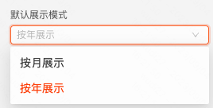

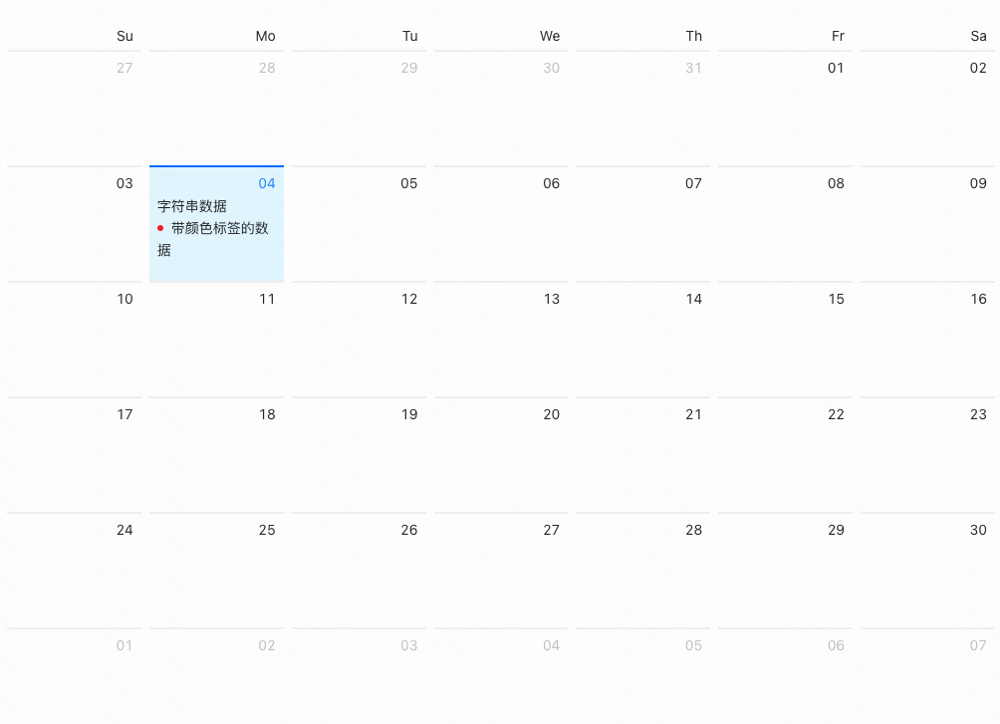

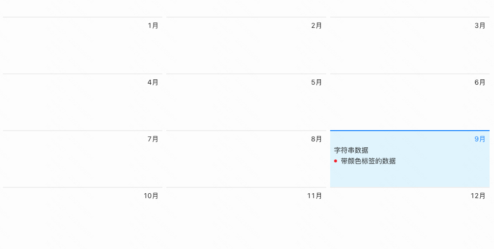

说明：有年、月这两种展示模式

### 年/月模式切换
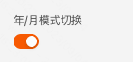

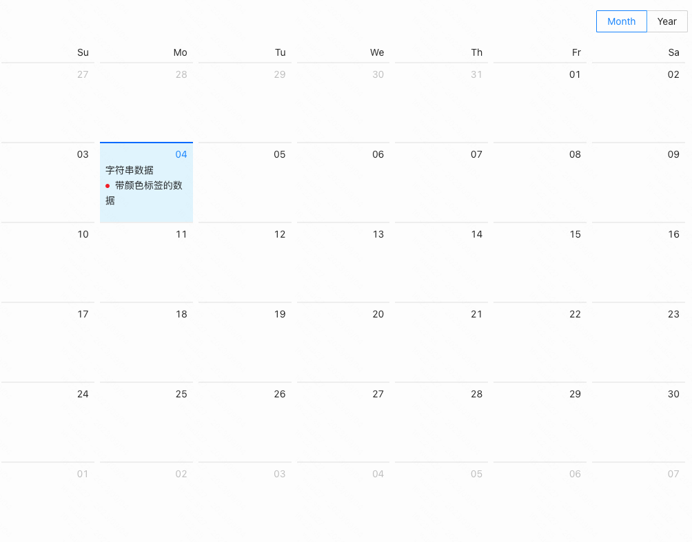

说明：打开年/月模式切换后，右上角出现了年月切换按钮

### 月份切换
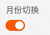

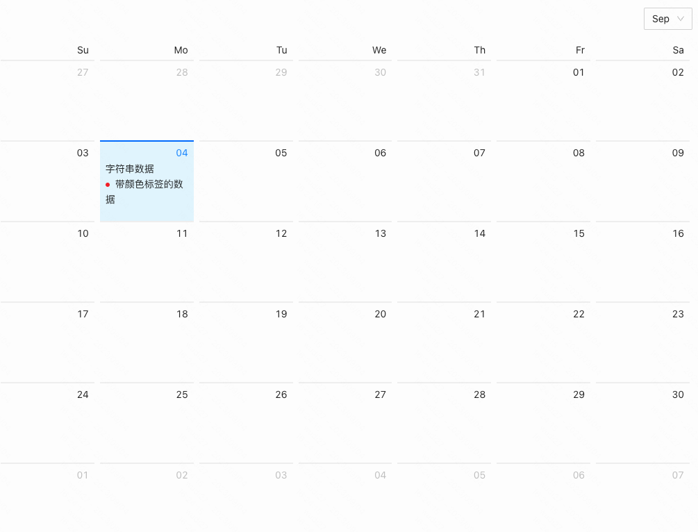

说明：在按月展示的模式下，开启月份切换能力，右上角会出现选择框，可以切换展示的月份

### 年份切换
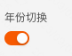

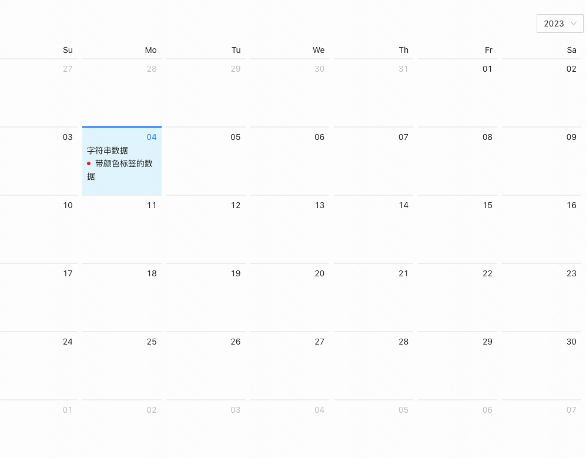

说明：开启年份切换能力，右上角会出现选择框，可以切换展示的年份

### 日期内容插槽
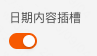


说明：只需在第一个日期格子里面配置内容，渲染时每个日期格子都会按照第一个格子配置的内容渲染

----
## 逻辑编排
### 点击日期、点击月份、日期变化、月份变化、年/月面板切换 
```
下图五种生命周期，在打开的情况下，会在对应的生命周期中触发对应的事件
```
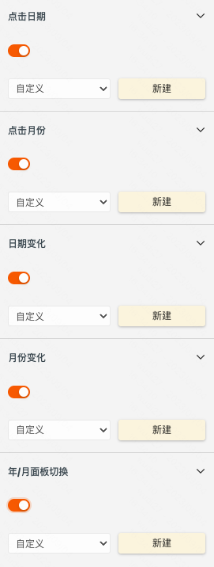

说明：对应的生命周期会有入参，每个事件的入参如下：

- 点击日期事件入参：
  - 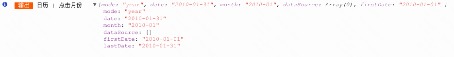

- 点击月份事件入参：
  - 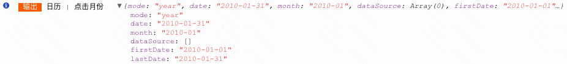

- 日期变化事件入参：
  - 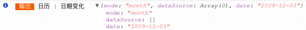

- 月份变化事件入参：
  - 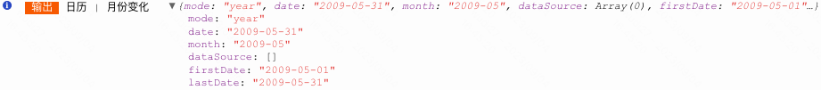

- 年/月面板切换事件入参：
  - 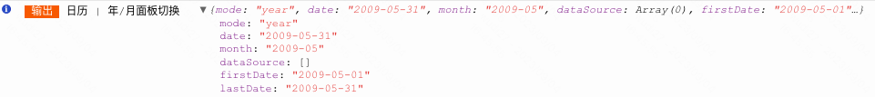

----

### 可以被设置的内容
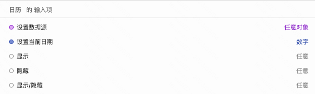

说明：
- 设置数据源：TODO
- 设置当前日期：日历组件高亮的日期

## 样式
### 通用组件样式

