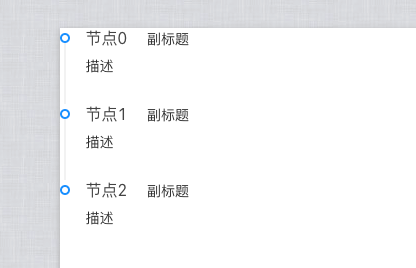
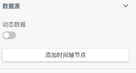
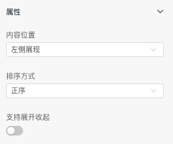
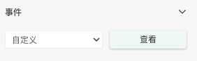
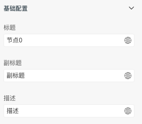
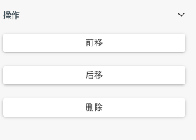
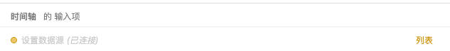
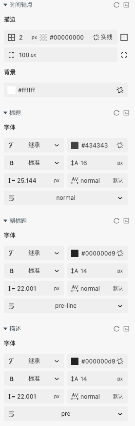
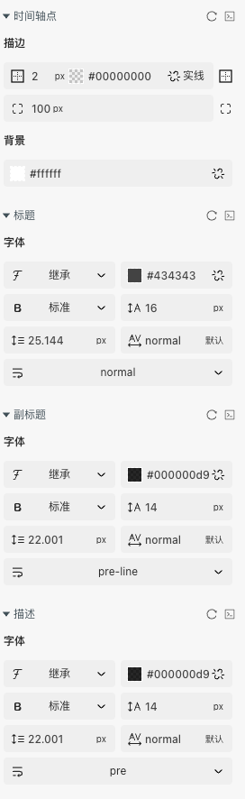

> 垂直展示的时间流信息\
> 应用场景1：当有一系列信息需按时间排列时，可正序和倒序。\
> 应用场景2：需要有一条时间轴进行视觉上的串联时。

Demo地址：[【时间轴】基本使用](https://my.mybricks.world/mybricks-app-pcspa/index.html?id=514748888363077)

## 基本操作

### 时间轴

#### 数据源

可以动态传入或者是直接静态添加节点

#### 属性

可以配置时间轴的位置和排序方式,开启支持展开收起后可以展开收起时间轴

#### 节点点击事件

开启后可监听节点的点击事件

### 时间轴节点

聚焦到需要配置的节点

#### 基础配置

配置节点的标题,副标题,描述

#### 操作

配置位置和删除

## 逻辑编排

### 动态数据

开启动态数据后可以动态输入数据

### 节点点击事件

开启点击事件后可监听节点的点击

## 样式

### 时间轴

### 时间轴节点

