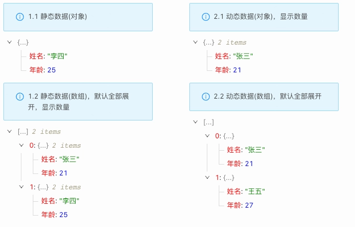
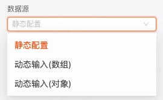
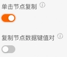
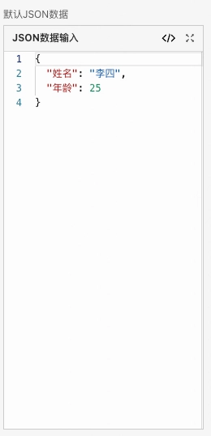
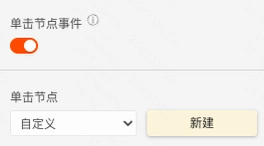
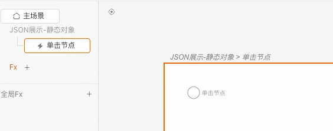
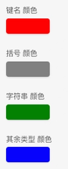
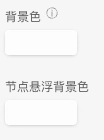

应用场景：展示数组、对象或JSON字符串格式的数据时
Demo地址：[【JSON展示】基本使用](https://my.mybricks.world/mybricks-pc-page/index.html?id=470865296592965)
# **基本操作**
## **JSON展示**
### **数据源**

说明：配置JSON数据的来源。如果为静态配置，通过“默认JSON数据”配置JSON数据；如果为动态输入，通过输入项设置JSON数据。

### **默认展开深度**

说明：JSON结构的默认展开深度。0表示全部折叠，-1表示全部展开。

### **字符串超出省略展示**

说明：为字符串类型的属性设置长度限制，超出部分以...表示，鼠标悬浮气泡展示完整内容。0表示不限制

### **大小标记/数目统计**

说明：开启时，在每一级节点后展示对象的属性数目，或者数组的长度

### **单击节点复制**

说明：开启时，单击节点，节点数据将复制到剪切板

#### **复制节点数据键值对**

说明：关闭时，单击节点仅复制属性值到剪切板；开启时，单击节点会将属性的键值对复制到剪切板

### **默认JSON数据**

说明：开启“静态配置”时，这里配置需要展示的JSON数据

# **逻辑编排**
### **单击节点**

1. 开启“单击节点事件”，点击“新建”
2. 创建该事件的逻辑卡片

说明：单击节点事件的输出数据为当前点击的节点数据

# **样式**
### **字体颜色**

### **背景色**

