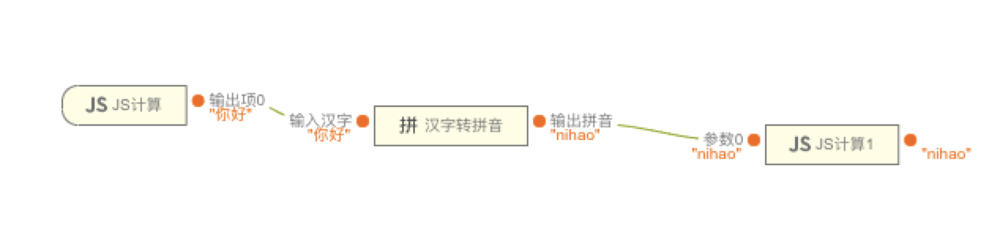
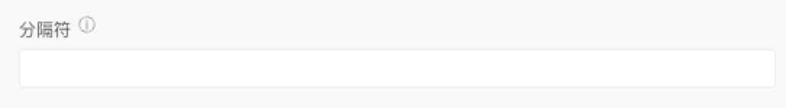
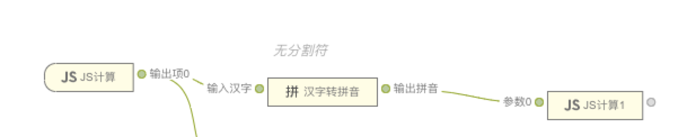

 **汉字转拼音** 

> 应用场景

> 场景1：将汉字处理后，转换为拼音

> Demo地址：[【汉字转拼音】基本使用](https://my.mybricks.world/mybricks-pc-page/index.html?id=477576401068101)

# 基本操作

## 汉字转拼音

### 分隔符

默认无分割符，添加后在汉字间插入分隔符。

# 逻辑编排

### 输入汉字

  

输入汉字后，可以转换出拼音。

# 样式

无