 **卡片** 

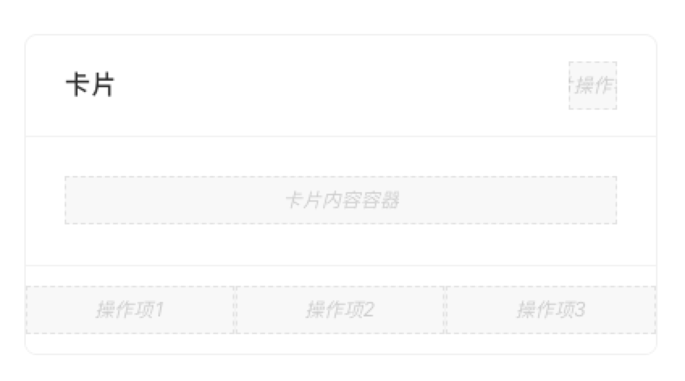

> 应用场景

> 场景1：最基础的卡片容器，可承载文字、列表、图片、段落，常用于后台概览页面。

  

# 基本操作

## 卡片

### 修改标题

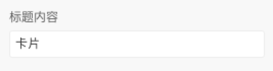

  

### 开启右上角操作

  

### 卡片操作组及操作项配置

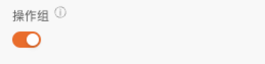

开启后，可配置操作项，点击【添加一项】后，可添加操作项

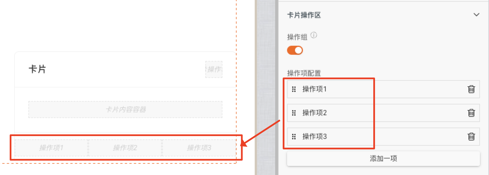

  

### 内容插槽

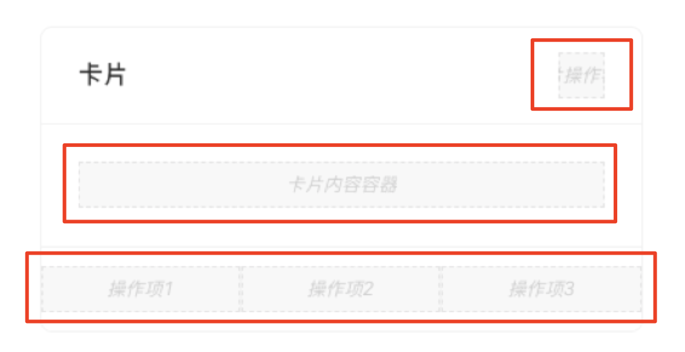

对应插槽位置可拖入内容

# 逻辑编排

### 卡片点击事件

> 开启点击开关、创建点击卡片事件进行操作

  

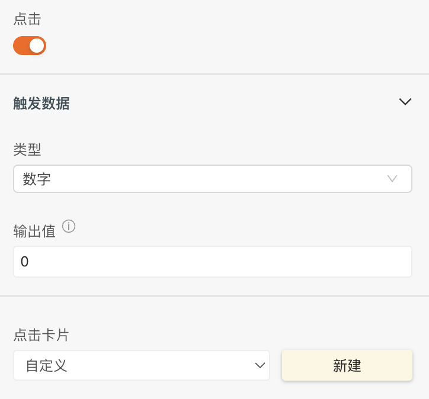

点击“新建”后，在【交互】面板

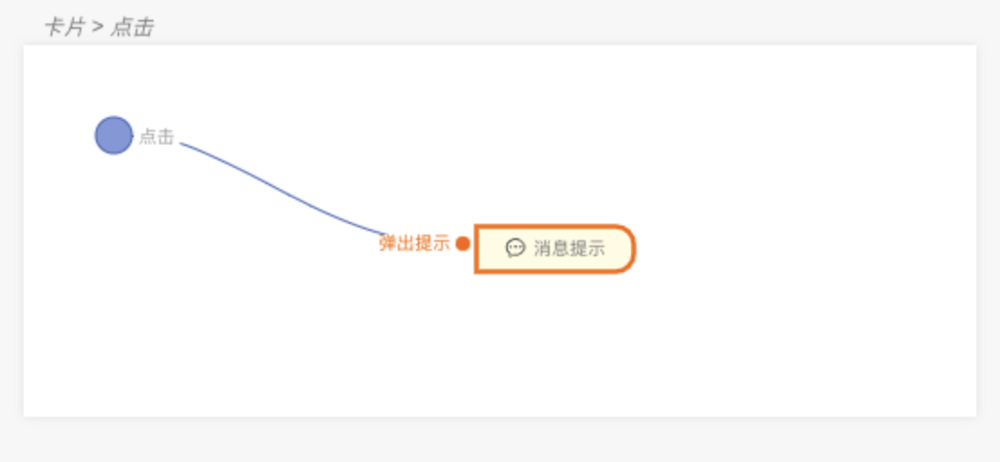

  

# 样式

### 标题的详细样式

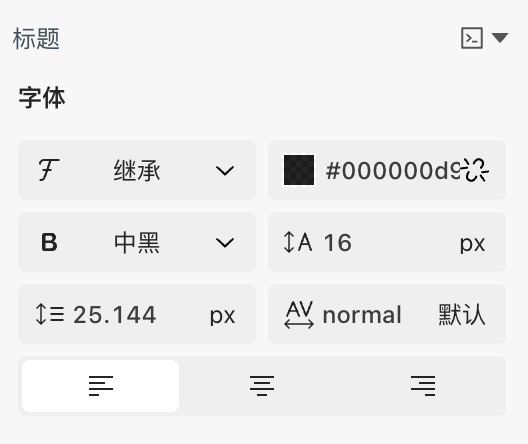

### 边框的详细样式

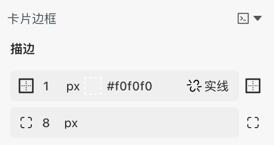

### 鼠标移动可浮起

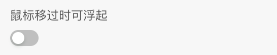

### 卡片尺寸

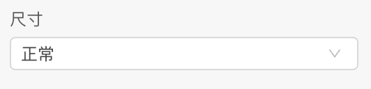

### 内边距

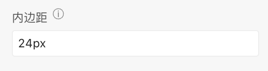