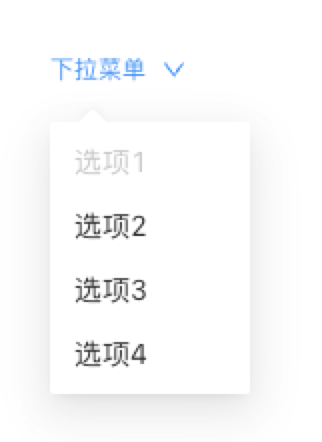

> **应用场景**\
场景1：下拉弹出的列表\
场景2：可以自定义上级元素

Demo地址：[【下拉菜单】基本使用](https://my.mybricks.world/mybricks-app-pcspa/index.html?id=477503433297989)

----

## 基本操作
### 下拉菜单
#### 提示内容

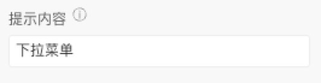

非自定义情况下，可静态配置下拉菜单提示内容。

#### 自定义

> 开始后，可往插槽拖入需要的组件

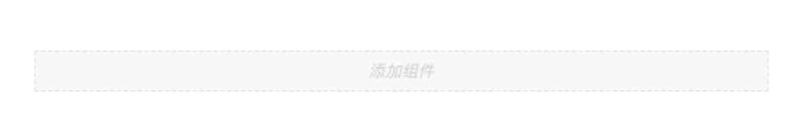
#### 子项配置

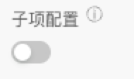

开启子项配置后，可聚焦子项单独进行内容及样式配置。

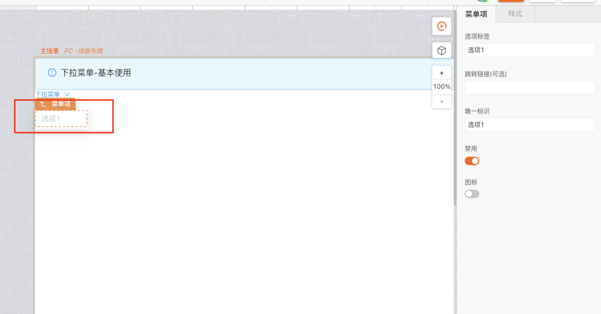
#### 触发方式

这里可供选择有两种触发方式，分别是悬浮和点击

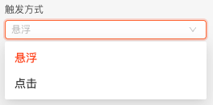
#### 弹出位置

这里勾选的是选项的弹出位置，分别是左下方、中下方、右下方、左上方、中上方、右上方

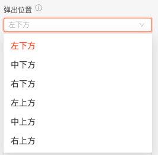
#### 宽度

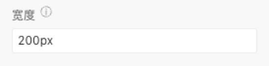

这里宽度指的是选项的宽度。
#### 选项配置

每个选项配置的处理

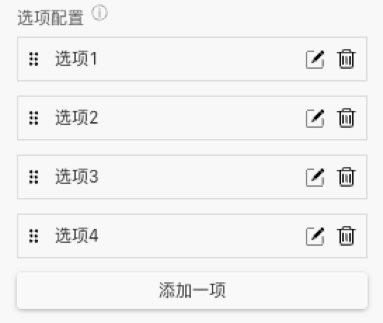

点击【添加一项】可增加选项，点击【编辑】图标可编辑选项内容，点击删除可删除对应选项

其中，可以配置选项标签、跳转链接（非必填）、唯一标识、是否禁用以及图标选择。
## 逻辑编排
#### 下拉菜单选项点击

下拉菜单选项的点击事件

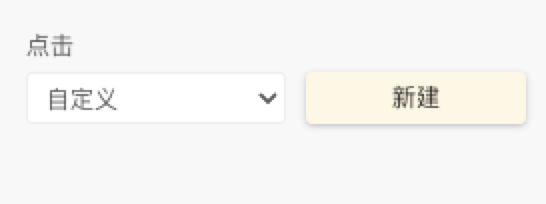

对应输出子项数据

## 样式
### 下拉菜单样式
#### 默认

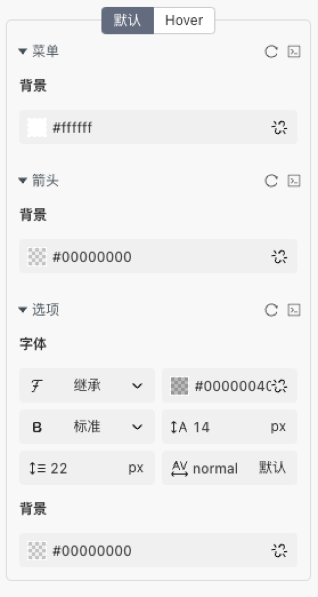
#### Hover

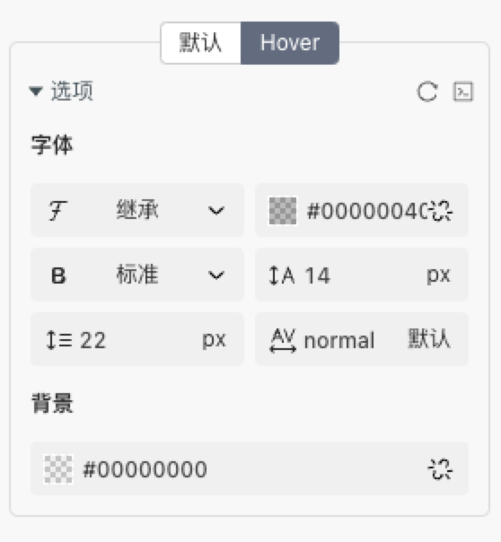
### 菜单项样式
#### 默认

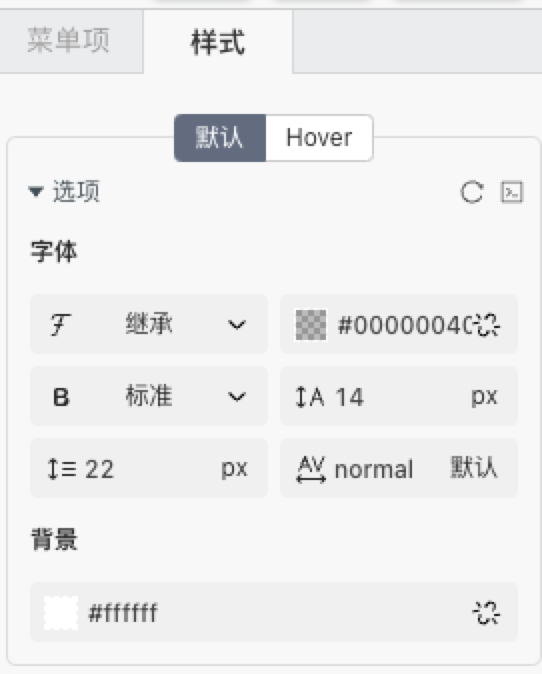
#### Hover

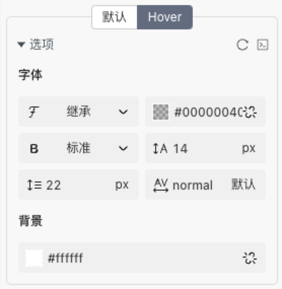