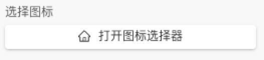
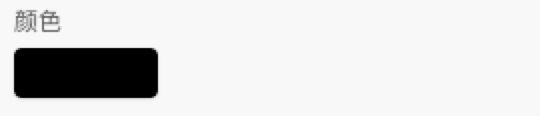
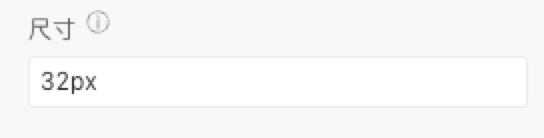
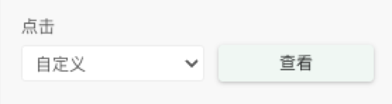
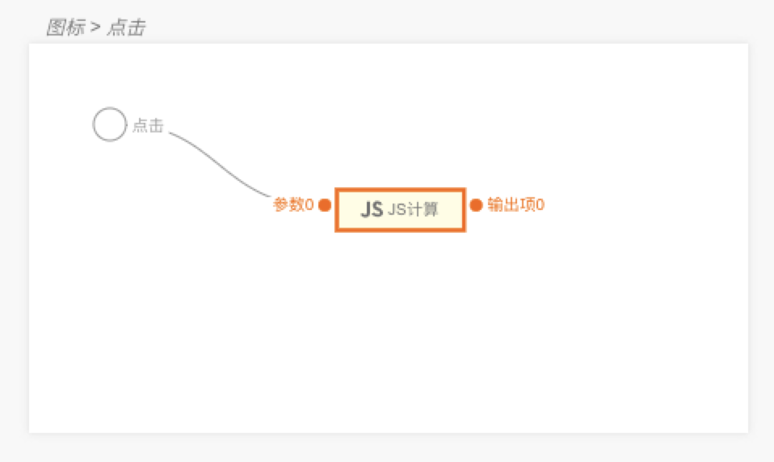

> **应用场景**\
语义化的矢量图形

Demo地址：[【图标】基本使用](https://my.mybricks.world/mybricks-app-pcspa/index.html?id=475477506859077)

----

## 基本操作
### 图标
#### 选择图标

点击打开图标选择器，选择图标

#### 颜色

配置图标的展示颜色
#### 尺寸

图标尺寸，支持百分比和定宽
## 逻辑编排
#### 点击事件

