 **列表容器** 

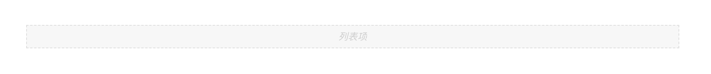

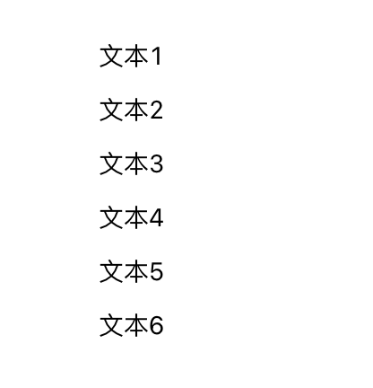

> 应用场景

> 场景1：基础的列表展示，可承载文字、列表、图片等组件。

> 场景2：可动态数据驱动渲染。

# 基本操作

## 列表容器

嵌入列表容器中的组件，可以通过相关编辑项改变子组件的布局，默认局部是【纵向 > 换行> 一行一列】

为了实现多种排列方式这里有多个编辑项

### 换行

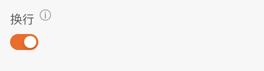

### 方向

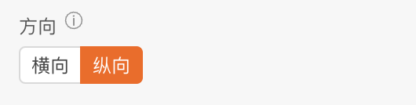

### 列数自定义

> 在打开【列数自定义】开关后，默认横向，可自定义配置列数、移动端列数

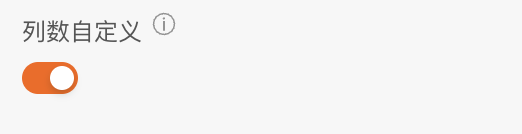

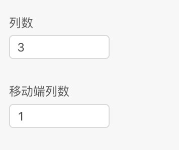

 **间隔** 

> 【间隔】可配置左右间距

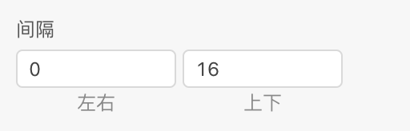

### 常见布局方式

这里提供几种常见的布局方式

#### 1、【纵向 ｜ 换行｜ 一行一列】

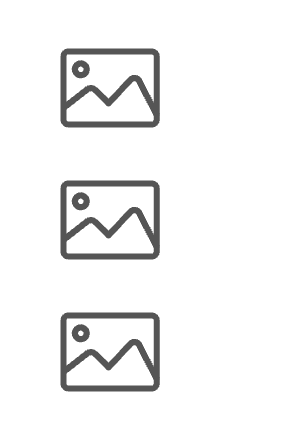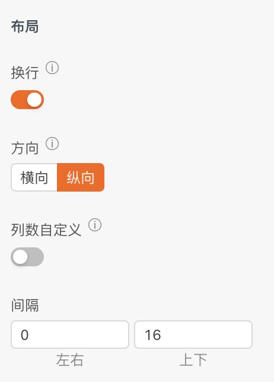

换行：true ｜ 方向：纵向 ｜ 列数自定义：false

#### 2、【横向 ｜ 换行】

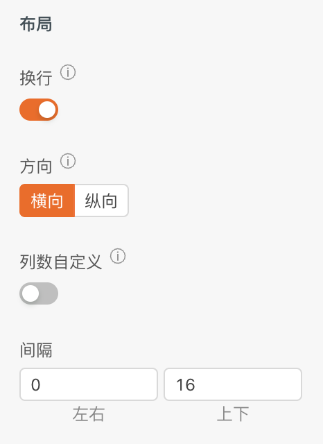

换行：true ｜ 方向：横向 ｜ 列数自定义：false

#### 3、【 列数自定义｜ 换行】

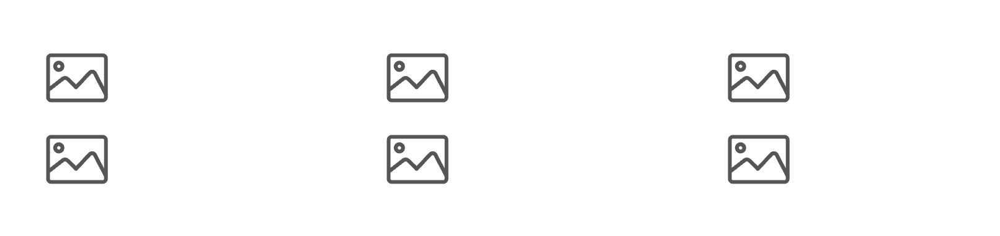

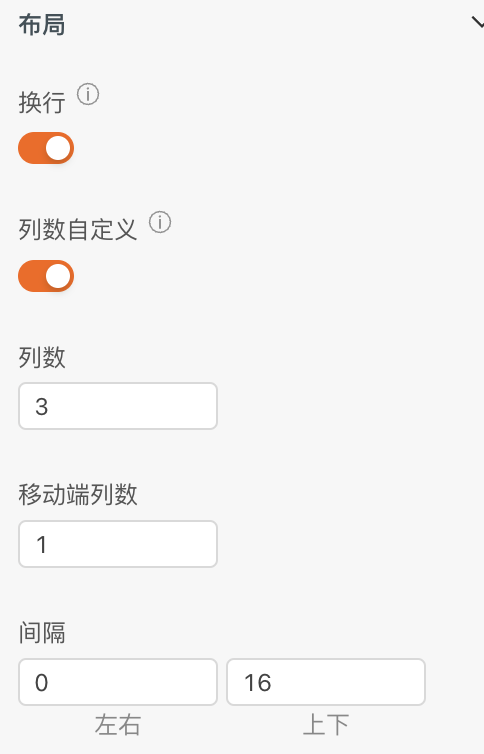

换行：true ｜ 列数自定义：false ｜列数：number

#### 4、【 可拖拽排序】

当一行一列换行时，可开启拖拽排序

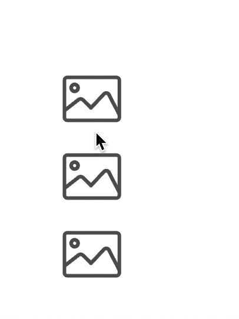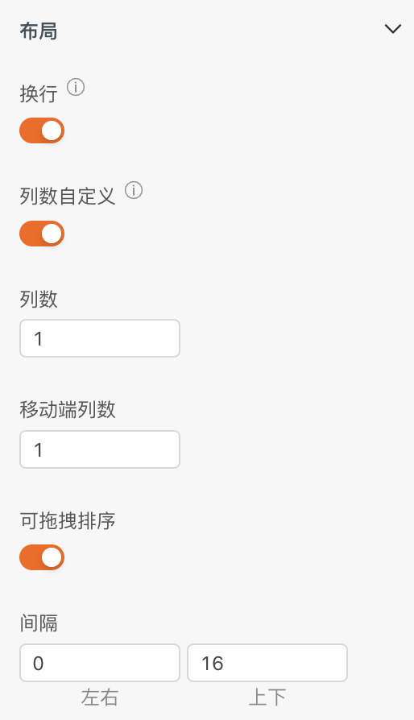

换行：true ｜ 列数自定义：true ｜列数：1 ｜ 可拖拽排序：true

### 获取列表数据

> 开启【获取列表数据】后，可进行逻辑操作，获取列表数据

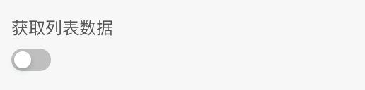

### loading

> 开启【loading】后，可进行逻辑操作，开启或者关闭列表容器loading

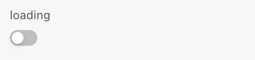

### 列表项数据唯一标识

> 填写唯一标识后，作为列表项的唯一标识，避免不必要的更新

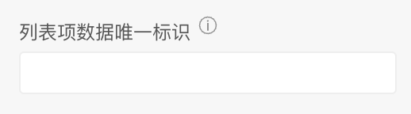

# 逻辑编排

### 设置数据源及列表项操作

列表项操作涉及到作用域和作用域卡片概念[作用域插槽](https://docs.qingque.cn/d/home/eZQD_8DoPYCNisPLuj7HxUAGn?identityId=1oCmIt0iwMt)

这里可以将数据层层穿透到列表项内的组件，实现遍历的效果。以数据驱动渲染文本为例

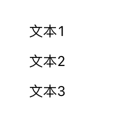

#### 1、设置数据源

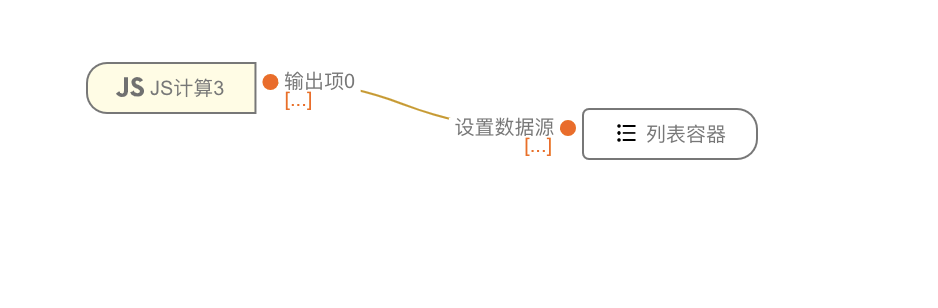

#### 2、作用域卡片连线

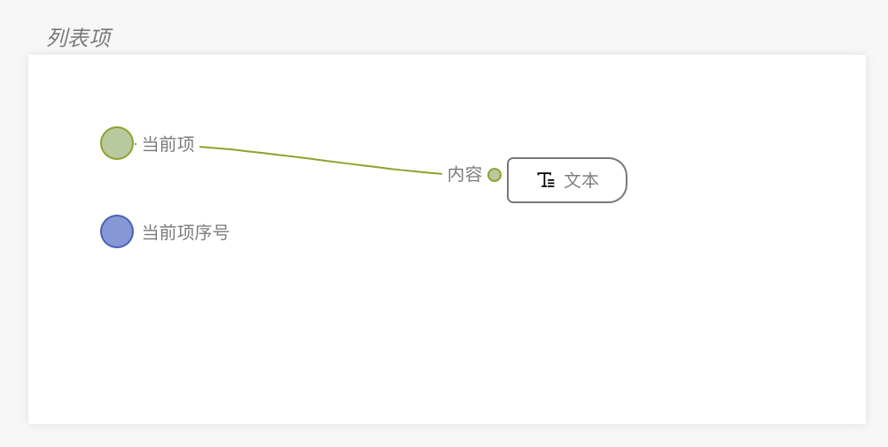

### 获取列表数据

> 开启获取列表数据后，通过其他事件，触发获得列表容器数据源

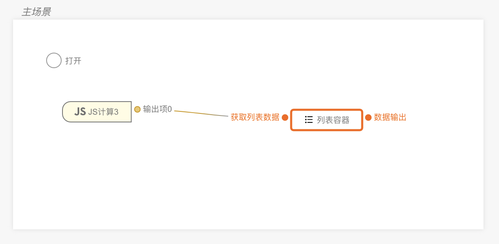

### 设置Loading

> 开启loading开关

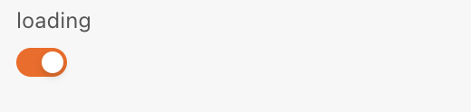

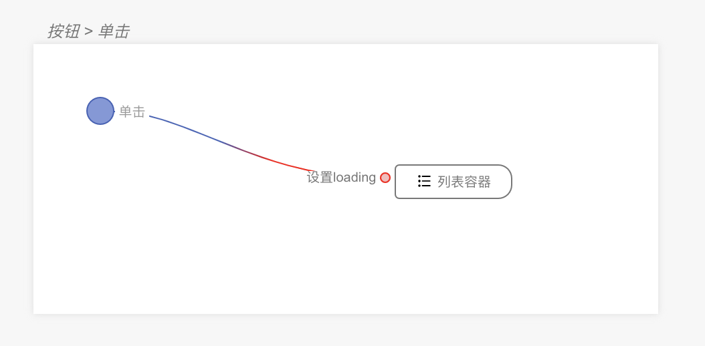