 **菜单** 

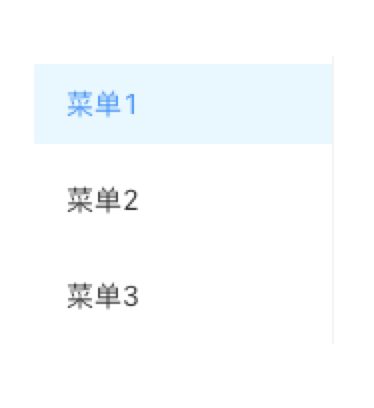

> 应用场景

> 场景1：顶部导航提供全局性的类目和功能

> 场景2：侧边导航提供多级结构来收纳和排列网站架构

> Demo地址：[【菜单】基本使用](https://my.mybricks.world/mybricks-pc-page/index.html?id=473206175535173)

# 基本操作

## 菜单

### 静态数据

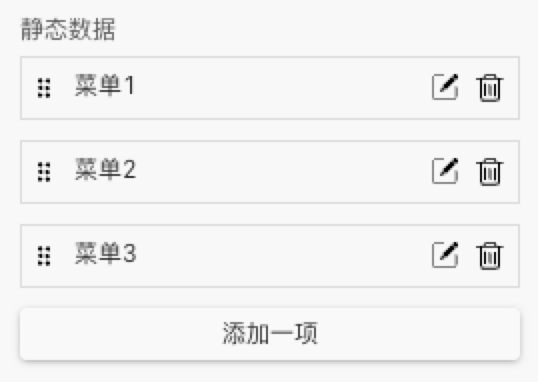

静态配置数据，点击【添加一项】可添加，点击【编辑图标】可进行具体配置，点击【删除图标】可删除对应菜单项。

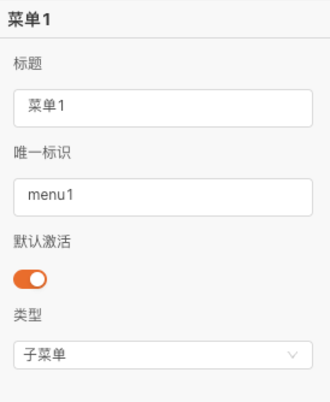

子项配置包括，【标题】【唯一标识】【默认激活】【类型】

注：类型-父菜单 和 默认激活 互斥

### 样式

> 三种样式切换，水平｜垂直｜内联

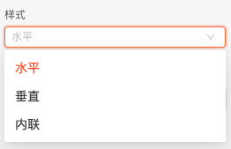

#### 1）水平

#### 2）垂直

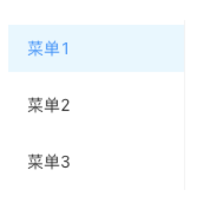

#### 3）内联

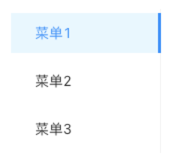

## 菜单项

### 标题

 **唯一标识** 

### 默认激活

注：类型-父菜单 和 默认激活 互斥

  

### 图标

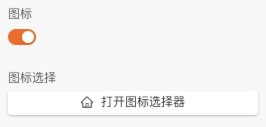

开启后可以自定义选择图标

  

### 类型

类型可以选择 子菜单｜父菜单

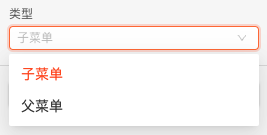

  

切换至父菜单后，可以配置子项

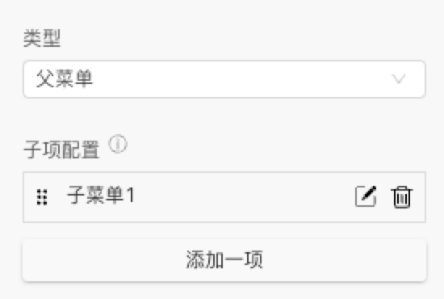

子项配置，点击【添加一项】可添加子菜单，点击【编辑图标】可进行具体子菜单配置，点击【删除图标】可删除对应菜单项。

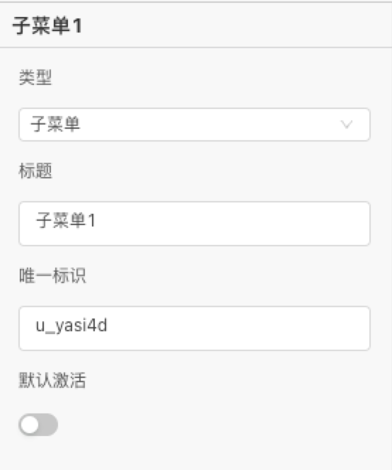

且在类型位置，可以切换类型，子菜单｜分组菜单

若子项的分组菜单类型，可以继续配置分组菜单子项，【添加一项】【编辑】【删除】

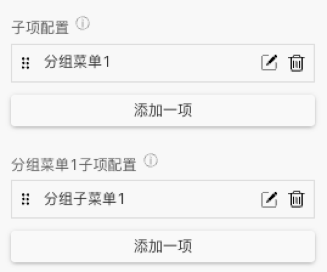

  

综上，可以总结出菜单项的结构关系：

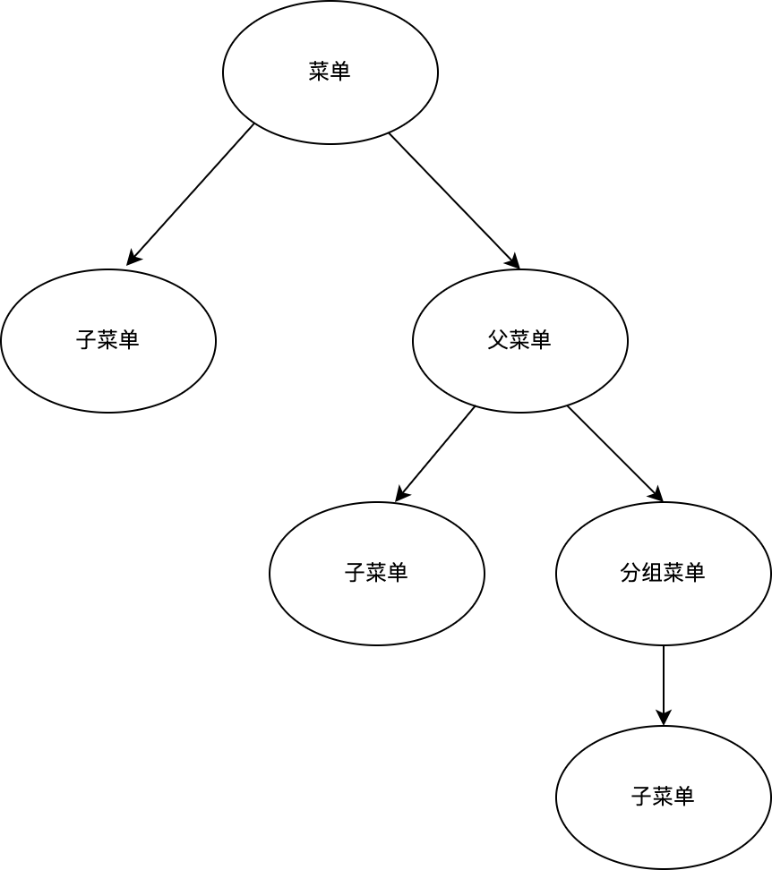

在添加每一项子菜单时，同时会添加出对应的子菜单的点击事件。

# 逻辑编排

### 菜单点击

整个菜单的点击事件

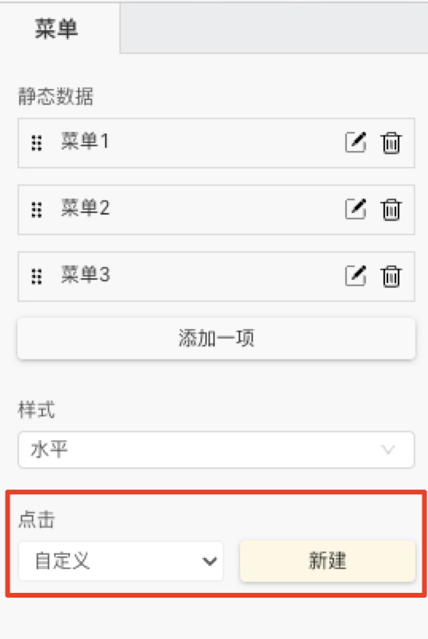

对应输出子项数据

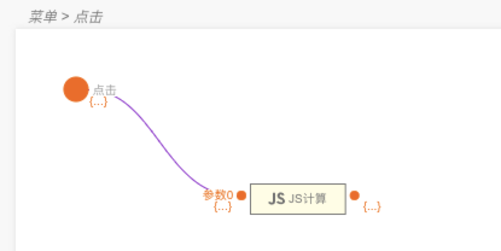

### 菜单项点击

聚焦到菜单项，可以看到不同类别的菜单项点击事件，此处提供了分类。

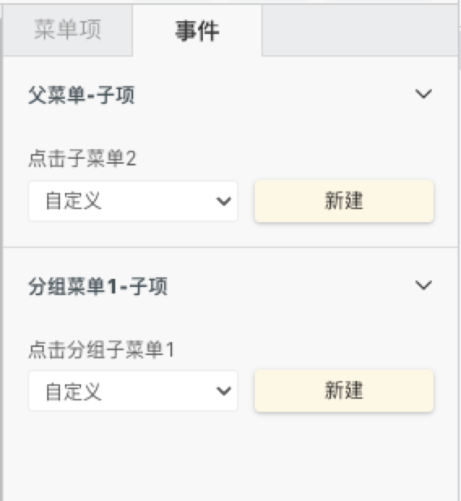

  

### 设置数据和选中项

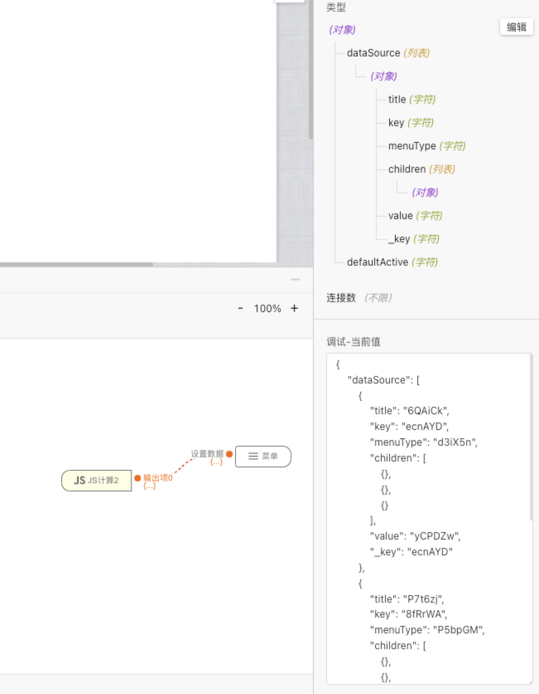

这里可以依照对应的数据结构设置数据和选中项。

### 设置选中项

  

 **获取选中项** 

可以通过创建的事件，获取选中项

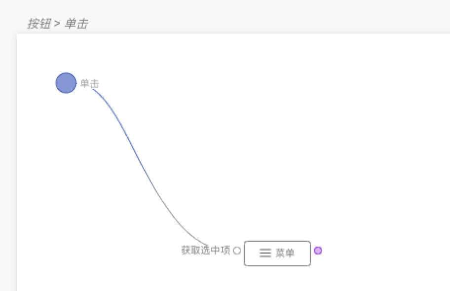

  

# 样式