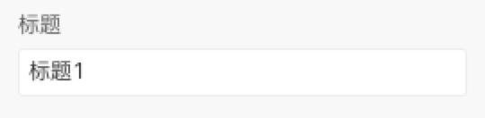
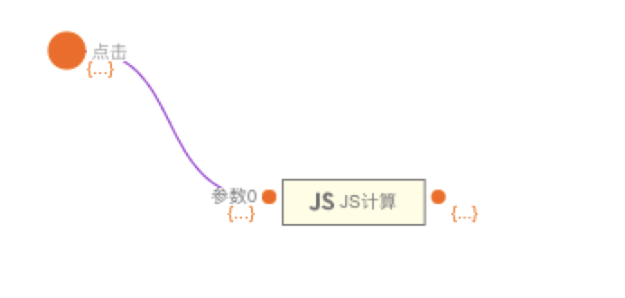

 **排序标题栏** 

> 应用场景

> 场景1：用于展示对应标题的升降序状态

> Demo地址：[【排序标题栏】基本使用](https://my.mybricks.world/mybricks-pc-page/index.html?id=477514785579077)

# 基本操作

## 排序标题栏

### 添加

点击添加可以添加一个子操作项。

## 子项操作

### 标题

更改子操作项，标题。

### 字段名

### 删除

点击删除对应子操作项。

# 逻辑编排

### 点击

开启后，不点击便会主动输出组件参数。

排序标题栏点击事件

对应输出子项数据及整体排序标题栏值

  

# 样式