```
应用场景
在需要上传图片、文件之类的内容时，可以使用上传组件
场景1：单独使用
场景2：在表单容器中，作为表单项使用
```

----

## 基本操作
### 上传文件Key
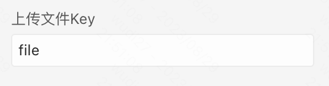

说明：发送到后台的文件参数名

### 上传按钮文案


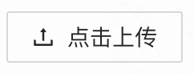

### 上传限制
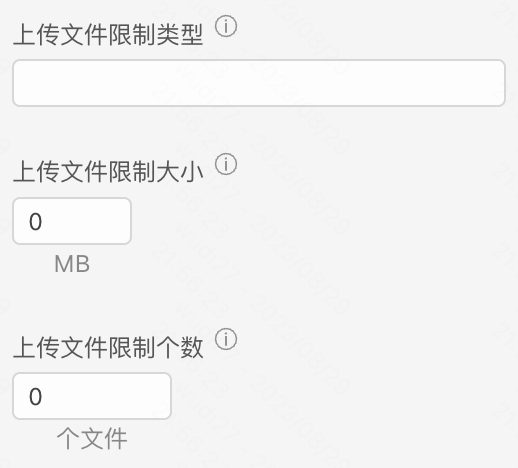

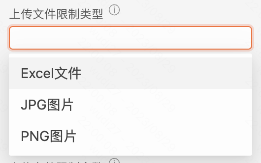

说明：对上传文件的各种限制
- 上传文件限制类型在无选择时代表无限制
- 上传文件限制在输入 0 时代表无限制
- 上传文件限制个数至少为1

### 自定义内容


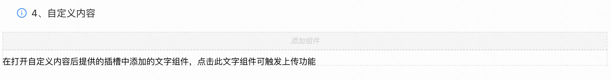

说明：打开自定义内容后，原本的上传组件会变成一个插槽位，可以往里面拖拽想要展示的组件，如文字或者图片。在运行时，拖入插槽位里的组件被点击会触发上传功能。

### 展示文件列表


### 开启自定义删除


### 开启多选


说明：开启多选后，点击上传按钮，可以同时选择多个符合要求的文件上传

### 开启预览


### 尺寸校验
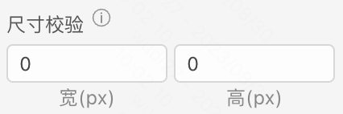

说明：当上传的文件是图片时，可以配置尺寸校验对图片的尺寸进行限制，不符合要求的图片无法进行上传

### 校验规则
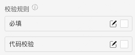

说明：
- 配置的校验规则，需要在表单容器中使用才能生效
- 点击右侧的勾选框，启用该项校验规则
- 点击右侧的“编辑”按钮，弹出校验规则的配置项

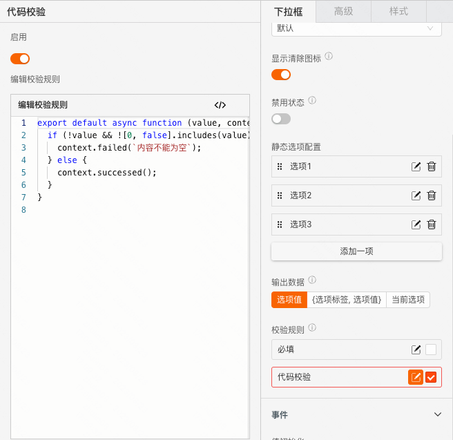

----

## 逻辑编排
### 值初始化
```
在上传组件初始化渲染时触发，并将初始化的值作为入参
```


### 文件删除
```
当文件被删除时触发，并将被删除的文件作为入参
```


### 自定义上传
```
当上传的文件需要通过调用自定义的接口上传时，可以通过开启自定义实现。
自定义上传事件会在上传文件时触发，并将上传的文件作为入参
```
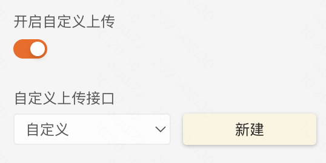

以文件删除为例，点击“新建”后，在 交互 面板


如此就实现了一个「删除文件时，提示"文件xxx被删除"」的效果

----

## 样式
### 通用组件样式
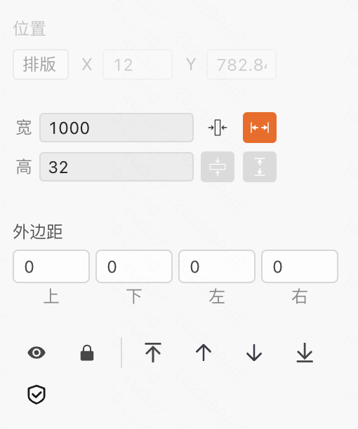

### 风格样式
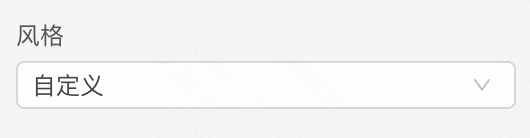

说明：默认为自定义，可以选择提前预制好的风格样式作为组件的兜底样式

### 上传列表类型
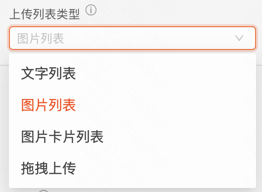

### 上传按钮尺寸
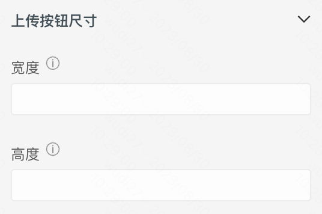

说明：用于配置上传按钮的尺寸

## 文件上传
demo [文件上传](https://my.mybricks.world/mybricks-pc-page/index.html?id=486655959879749)

## FAQ
[Antd上传组件FAQ](https://4x-ant-design.antgroup.com/components/upload-cn/#FAQ)