 **单选框** 

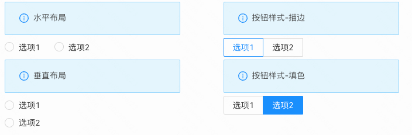

> **应用场景**\
场景1：单独使用\
场景2：在表单容器中，作为表单项使用

Demo地址：[【单选框】基本使用](https://my.mybricks.world/mybricks-pc-page/index.html?id=470776189657157)

----

## 基本操作
### 单选框
#### 默认是否禁用

#### 是否默认选中

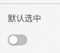
#### 静态选项配置

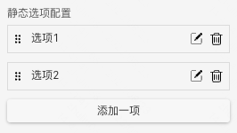

说明：

1.  点击“添加一项”，单选框增加一个选项
2.  选项右侧的两个按钮分别为“编辑”和“删除”，点击“编辑”按钮，弹出选项的配置项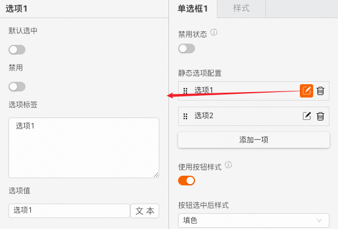
3.  选项左侧的图标为拖拽手柄，可以点击拖拽修改选项的相对位置
#### 选项配置按钮样式

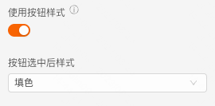
#### 数据校验

说明：

1.  配置的校验规则，需要在表单容器中使用才能生效
2.  点击右侧的勾选框，启用该项校验规则
3.  点击右侧的“编辑”按钮，弹出校验规则的配置项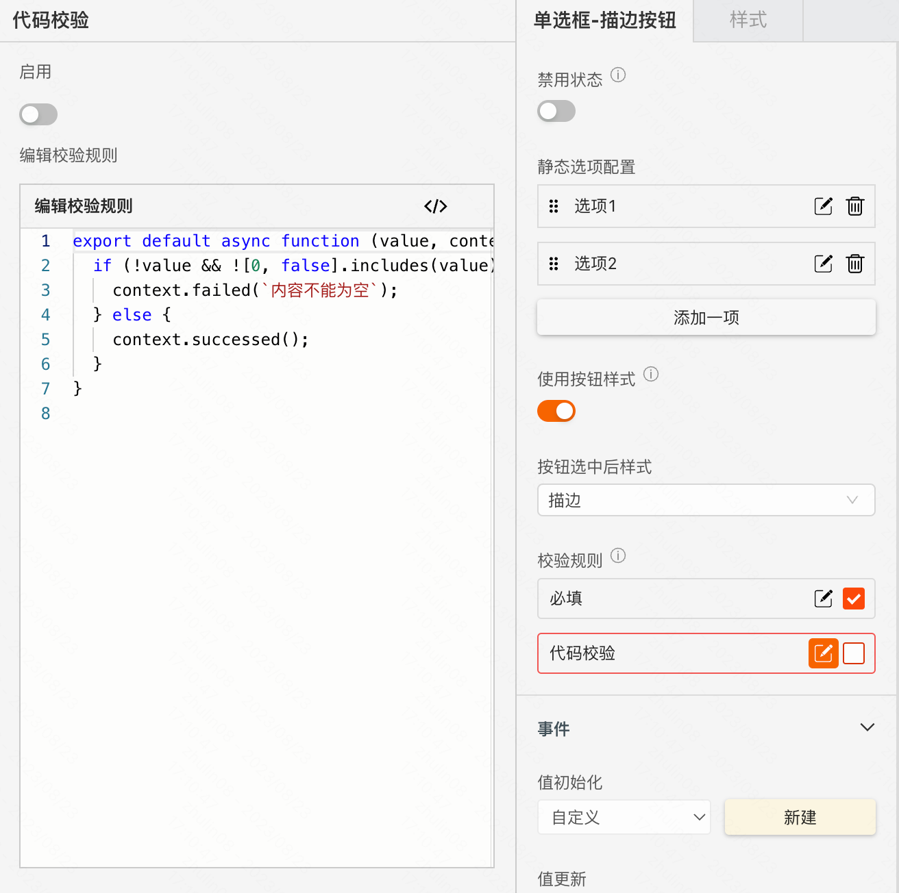
## 逻辑编排
#### 值初始化事件

输出时机：

1.  给单选框的“ **设置初始值** ”输入项设置数据
2.  给单选框所在表单容器的“ **设置表单数据** ”输入项设置数据

输出内容：

单选框的当前值
#### 值更新事件

输出时机：

1.  给单选框的“ **设置值** ”输入项设置数据
2.  给单选框所在表单容器的“ **设置表单数据(触发值变化)** ”输入项设置数据
3.  用户操作单选框的增删改操作时

输出内容：

单选框的当前值

说明：

可以用于实现监听联动
#### 调用接口设置选项数据源

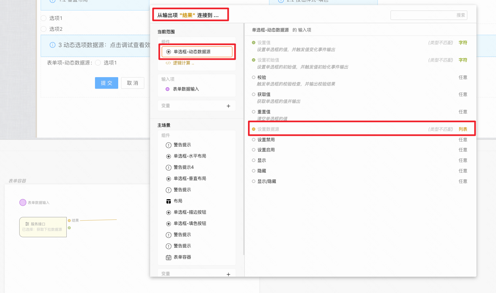

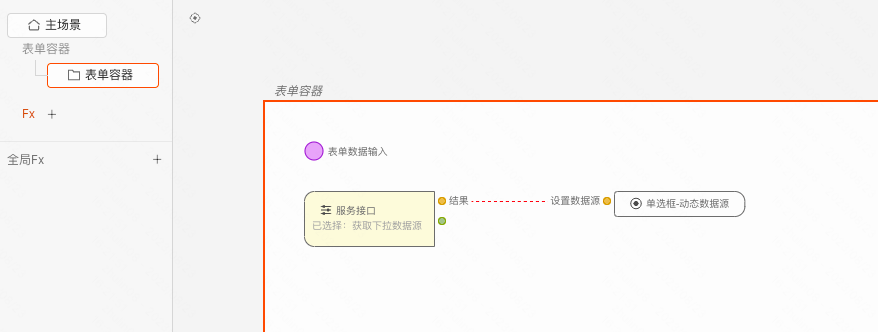
## 样式
#### 基础样式
##### 默认样式

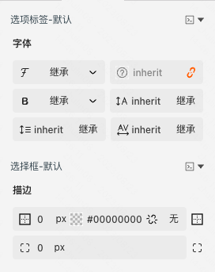
##### hover悬浮态样式

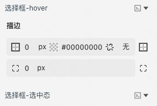
##### checked选中态样式

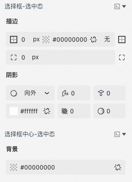
##### disabled禁用态样式

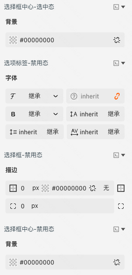
#### 作为表单项的样式

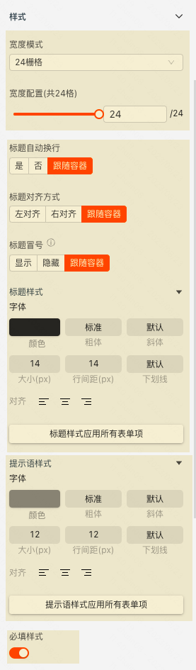