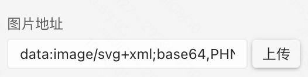
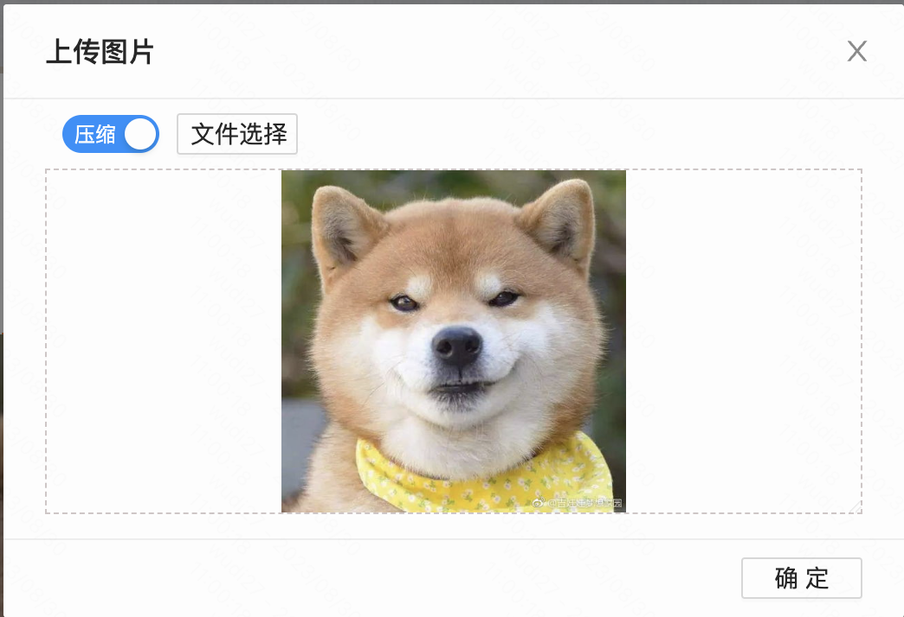
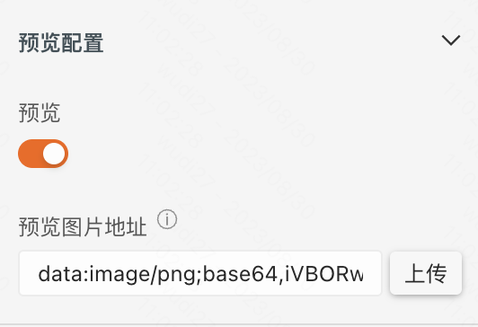
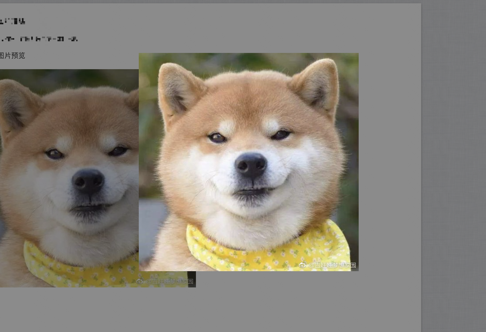
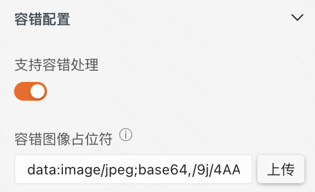
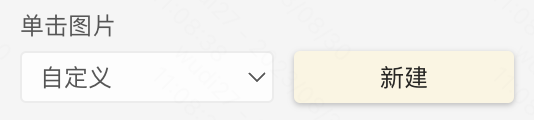
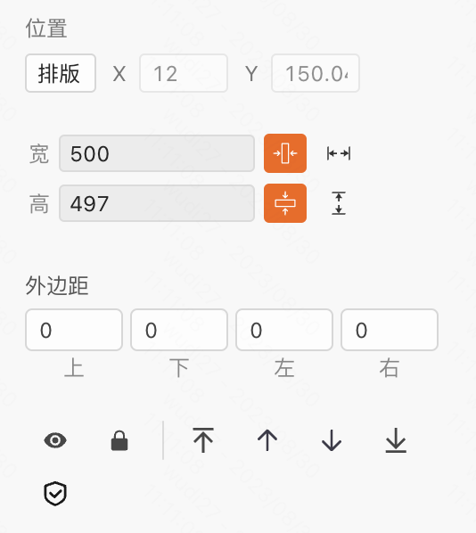

> **应用场景**\
场景1：搭建活动页中各种图片的展示\
场景2：商品列表页中商品图片展示

Demo地址：[【图片】基础使用](https://my.mybricks.world/mybricks-app-pcspa/index.html?id=473197160566853)

----

## 基本操作
### 图片描述


说明：配置图片描述，用于图片展示不出来时描述此图片是什么

### 图片地址



说明：用于配置图片地址，可以直接输入一个图片的URL地址，也可以选择上传本地图片。上传的本地图片会转成 base64 格式。

### 图片描述


说明：配置图片描述，用于图片展示不出来时描述此图片是什么

### 图片预览




说明：开启预览时，点击图片会出现预览弹层。预览图片的地址可以单独配置。

### 图片描述


说明：配置图片展示不出来时，兜底展示的图片

## 逻辑编排
### 单击图片
```
点击图片时会触发
```


以单击图片为例，点击“新建”后，在 交互 面板


## 样式
### 通用组件样式

### 风格样式


说明：默认为自定义，可以选择提前预制好的风格样式作为组件的兜底样式

