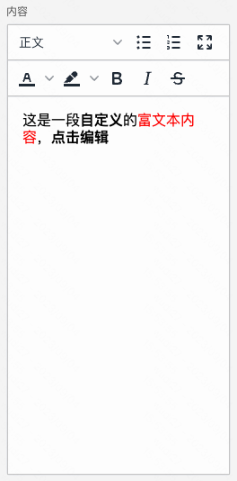
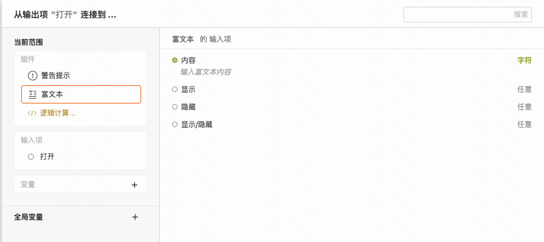
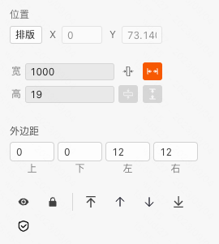

> **应用场景**\
场景1：搭建活动页中各种文案展示\
场景2：样式比较复杂的标题展示\

Demo地址：[【富文本】基础使用](https://my.mybricks.world/mybricks-app-pcspa/index.html?id=475041883820101)

----

## 基本操作
### 内容

说明：配置成什么样，展示成什么样，所见即所得

----

## 逻辑编排
### 动态设置富文本内容

说明：上图 demo 中，JS计算的结果会塞到富文本的内容中，动态改变展示内容

----

## 样式
### 通用组件样式
