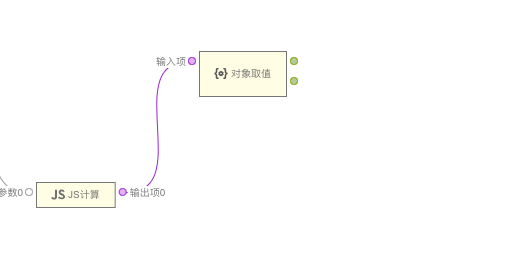
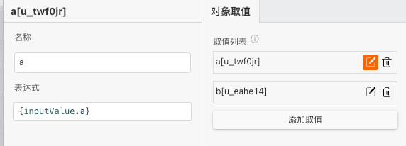
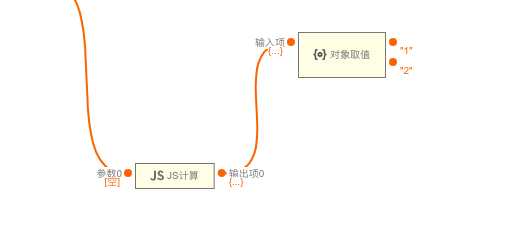

> 应用场景 1：获取对象中某个值\
> 注：逻辑组件，可以在连线中的逻辑组件中找到

Demo 地址：[【对象取值】基本使用](https://my.mybricks.world/mybricks-app-pcspa/index.html?id=514605899202629)

## 基本操作

### 添加取值

可以添加或删除取值项,表达式是获取输入对象的某个键值,如下是获取键名为 a 的值

## 逻辑编排

### 取值

输入到达时,会按照配置的取值列表取值并输出

## 样式

### 默认样式

无
