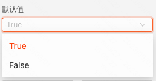
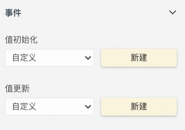
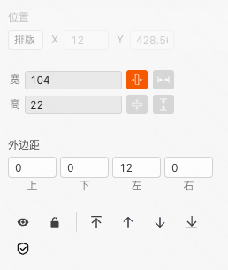
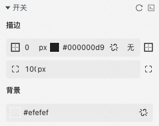
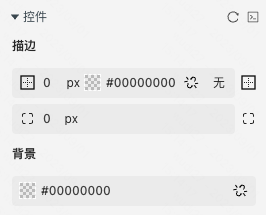
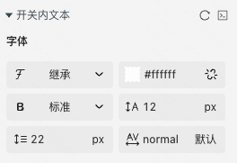

```
应用场景
场景1：作为表单项使用，提供 True/False 两种状态值的输入
场景2：单独使用，如博客的白天/黑夜状态切换功能
```
Demo地址：[【开关】基础使用](https://my.mybricks.world/mybricks-pc-page/index.html?id=473966448095301)

----

## 基本操作
### 禁用状态


说明：禁用状态下，点击开关无法触发状态切换

### 默认值


说明：用于控制开关的默认值

### 文案


说明：用于配置开关在两种状态下展示的文案

----

## 逻辑编排
### 值初始化、值更新

```
在开关组件初始化渲染或者切换状态时触发，并将当前的值作为入参
```


----

## 样式
### 通用组件样式


### 风格


说明：默认为自定义，可以选择提前预制好的风格样式作为组件的兜底样式

### 开关的描边和背景配置


说明：默认状态下开关的样式配置

### 控件的描边和背景配置


说明：默认状态下控件的描边和背景配置

### 开关内文本的字体配置


说明：配置了开关的文案后，内部字体样式可以在这里配置