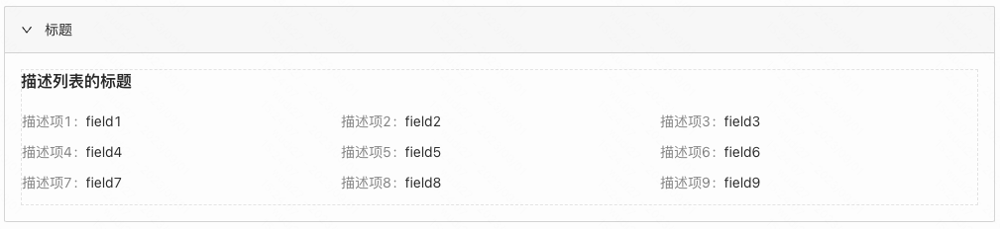
```
应用场景
存在大量信息描述的页面，可以用折叠面板把信息折叠起来，让用户通过折叠面板的标题快速定位信息
```
Demo地址：[【折叠面板】基础使用](https://my.mybricks.world/mybricks-pc-page/index.html?id=473972905254981)

## 基本操作
### 标题


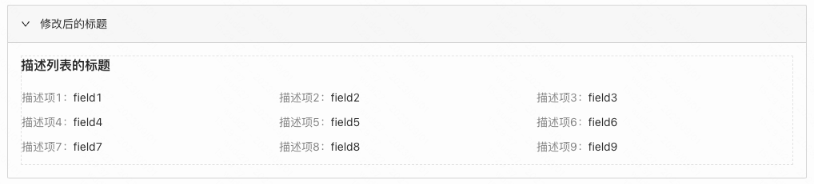

### 自定义标题


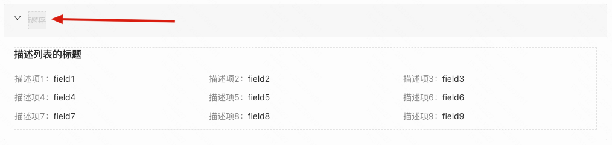

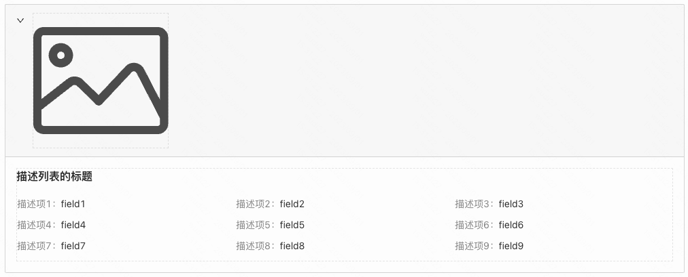

说明：自定义标题会将原本的标题替换成插槽，可以拖入任意组件

### 默认展开


说明：用于配置折叠按钮默认是折叠状态还是展开状态

### 额外操作


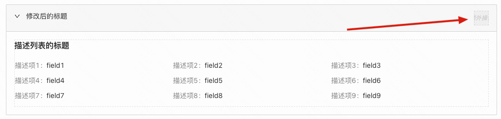

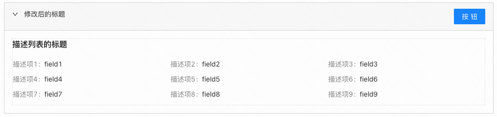

说明：额外操作会提供一个插槽，可以拖入任意组件

----

## 逻辑编排
### 动态标题


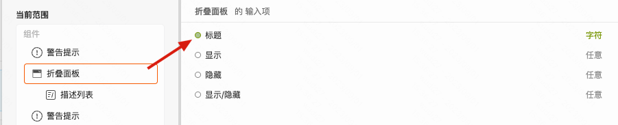

说明：开启动态标题后，逻辑搭建中折叠面板组件会多出一个标题的输入项，可以动态控制标题内容

### 动态展开收起
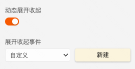

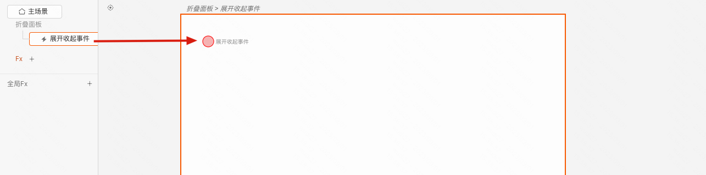

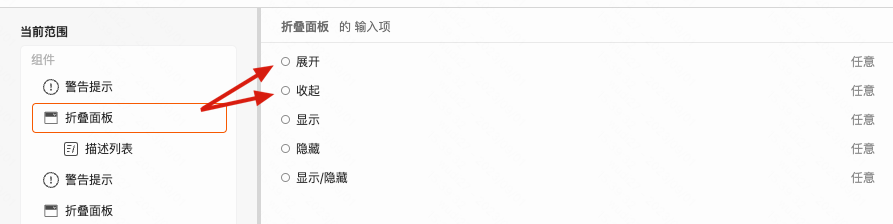

说明：开启动态展开收起后，可以配置展开收起事件，并且折叠面板组件会多出展开、收起这两个输入项

------
## 样式
### 通用组件样式
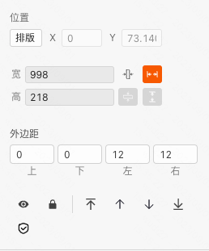


