```
应用场景
场景1：给自定义布局的表单添加提交按钮
场景2：给数据表格的操作列添加操作按钮
```
Demo地址：[【按钮】基础使用](https://my.mybricks.world/mybricks-pc-page/index.html?id=473204636033093)

-----
## 基本操作
### 文字标题
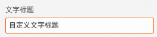


说明：就是展示在按钮上的文案

### 作为热区使用
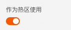

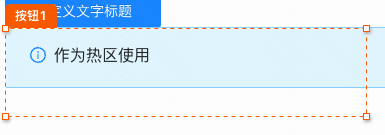

说明：一般用于自由布局，给活动页图片上的部分区域添加点击事件

### 图标配置
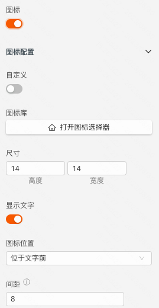


### 图标选择
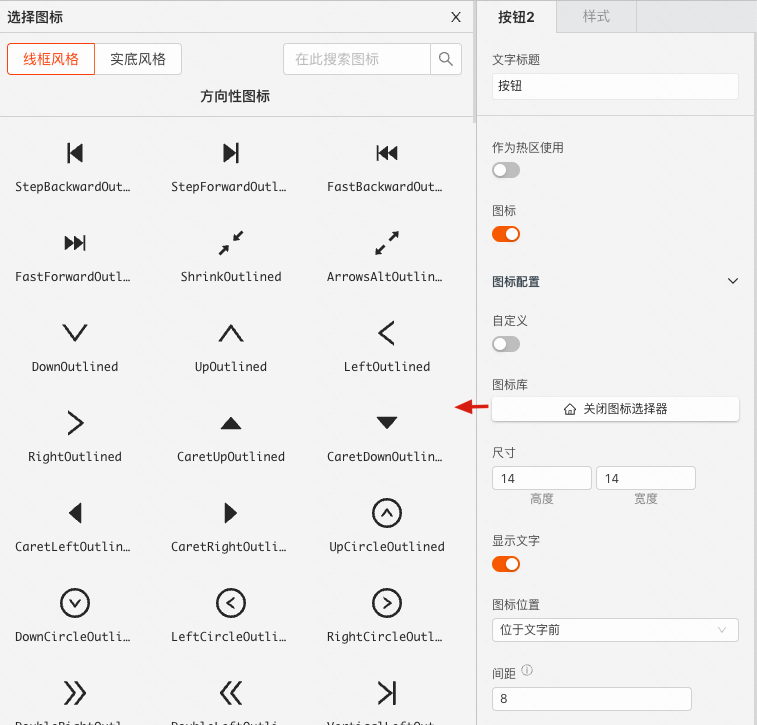

### 自定义图标
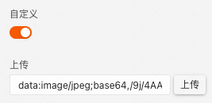

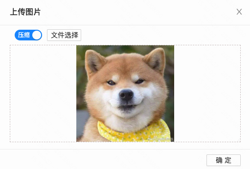

说明：选择的图片会转成 base64 在页面中使用

### 图标尺寸
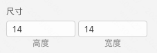

说明：配置图标的尺寸大小

### 显示文字
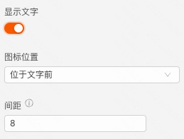

说明：文字指按钮上的文案，相对于文字有三个配置
- 文字是否显示
- 图标相对于文字的位置
- 图标和文字之间的间距

----
## 逻辑编排
### 单击、双击按钮
```
单击或者双击按钮会触发
```
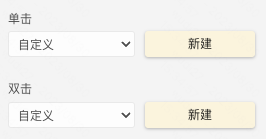

以单击按钮为例，点击“新建”后，在 交互 面板


### 触发数据
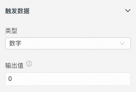

说明：触发在按钮上的逻辑时，配置的触发数据会作为入参

-----

## 样式
### 通用组件样式
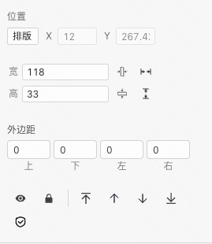

### 风格样式
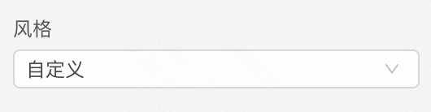

说明：默认为自定义，可以选择提前预制好的风格样式作为组件的兜底样式

### 尺寸
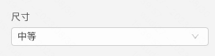

说明：按钮的尺寸，会调整按钮上文案的字体大小、按钮的内边距之类的

### 类型
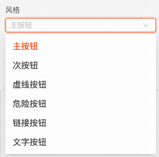

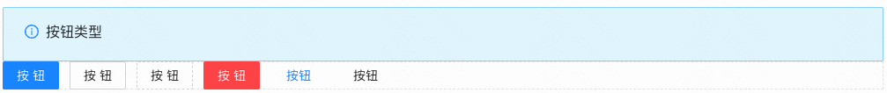

说明：按钮的类型配置

### 形状
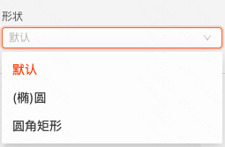

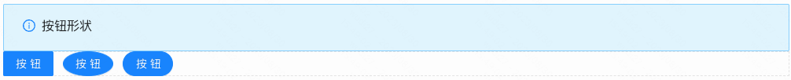

说明：按钮的形状配置

### 默认状态的可配样式
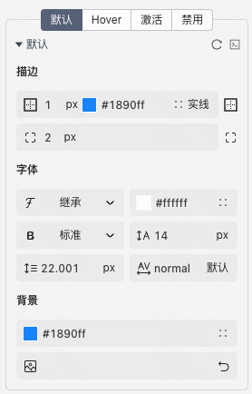

### Hover状态的可配样式
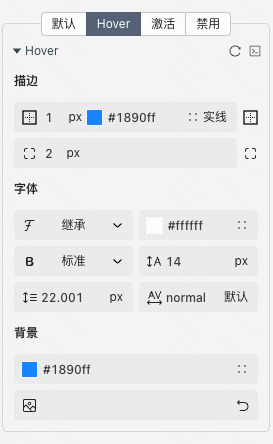

### 激活状态的可配样式
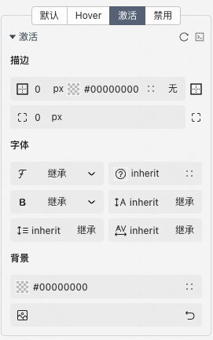

### 禁用状态的可配样式
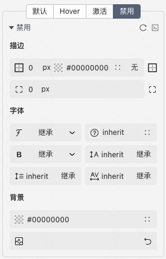