 **数据表格** 

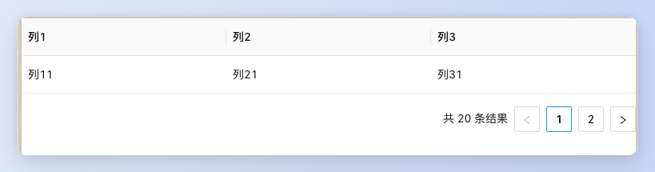
  

> 应用场景

> 1、展示和组织数据，有大量结构化数据需要展示

> 2、 当需要对数据进行排序、搜索、过滤、分页展示等复杂操作

# 基本操作

## 表格基本功能

1.  ### 展示列表数据
    

1.  添加表格组件，拖放到画布中
2.  设置表格列的名称和对应字段

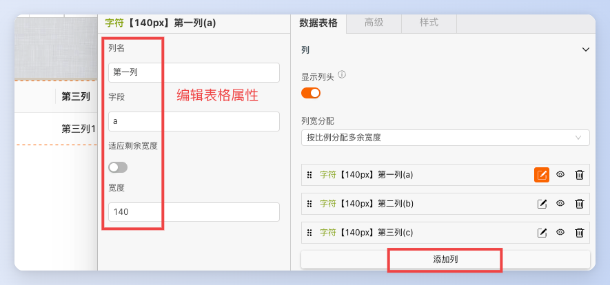

添加列

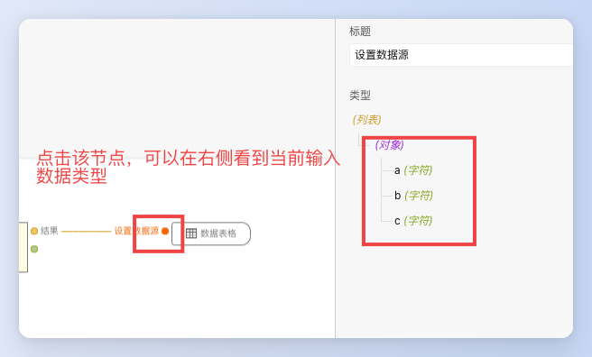

查看表格接收的数据格式

3.  设置表格数据源，在逻辑交互面板，通过js计算或者服务接口将数据输出到表格的设置数据源上

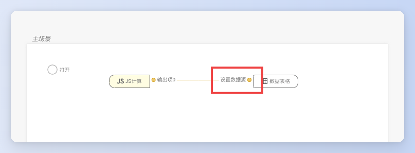

通过js计算导入静态数据

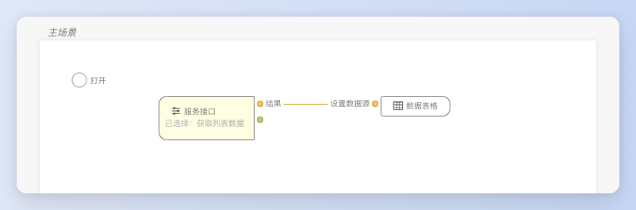

通过接口导入动态数据

4.  点击调试，查看数据显示效果

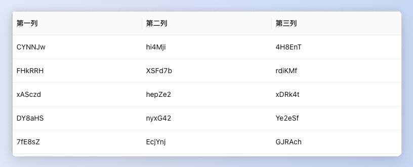

2.  ### 分页功能
    

#### 操作步骤

1.  开启表格分页

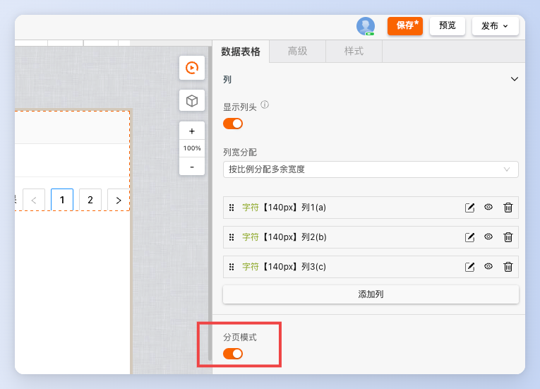

2.  分页文案/样式调整

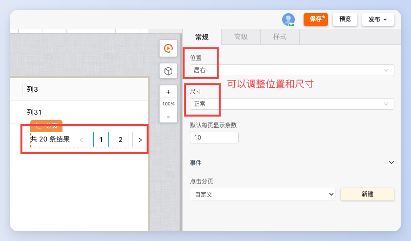

调整尺寸位置

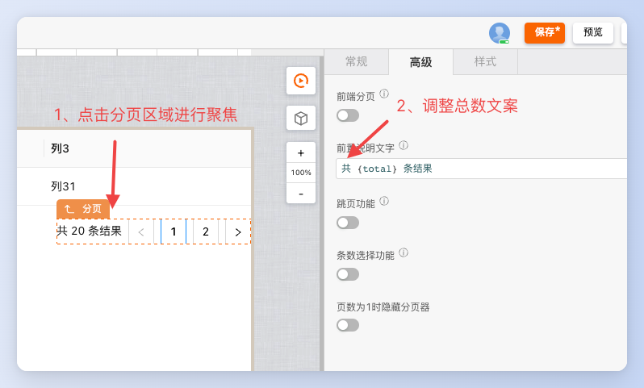

修改总数文案

3.  添加分页事件和获取逻辑

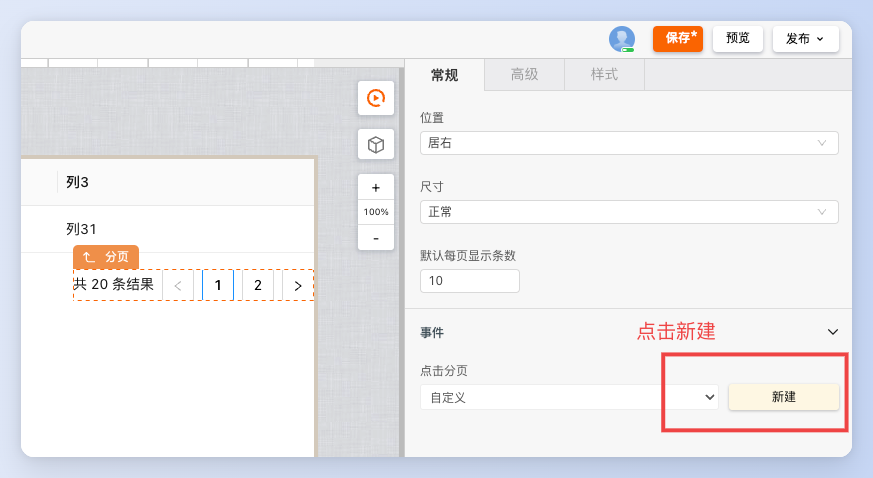

4.  逻辑编排获取接口数据并赋值到表格中

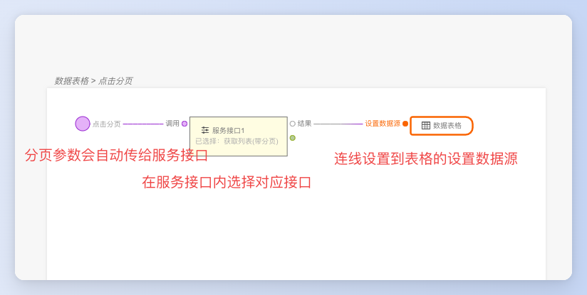

5.  开始分页后，传给数据表格的数据类型不是数组，是一个带分页信息的对对象

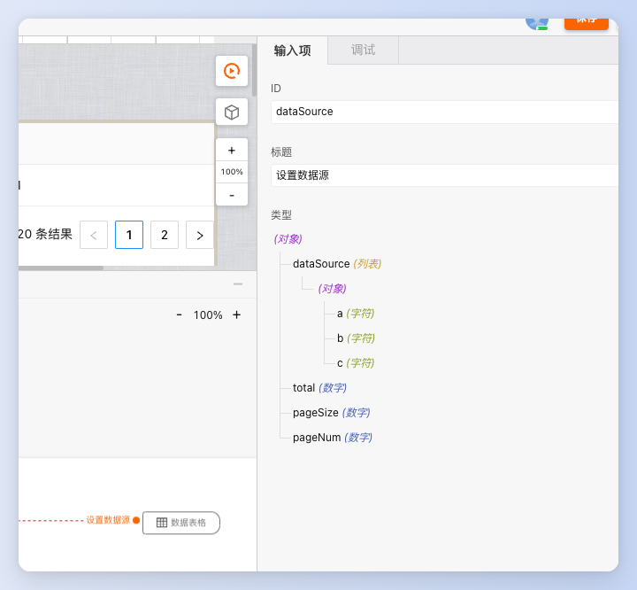

3.  ### 格式化表格数据
    

> 编辑态，选中某一列后，可以对当前列数据进行格式化设置，比如枚举映射、时间戳转化等

1.  将 0 、1枚举成对应的文本

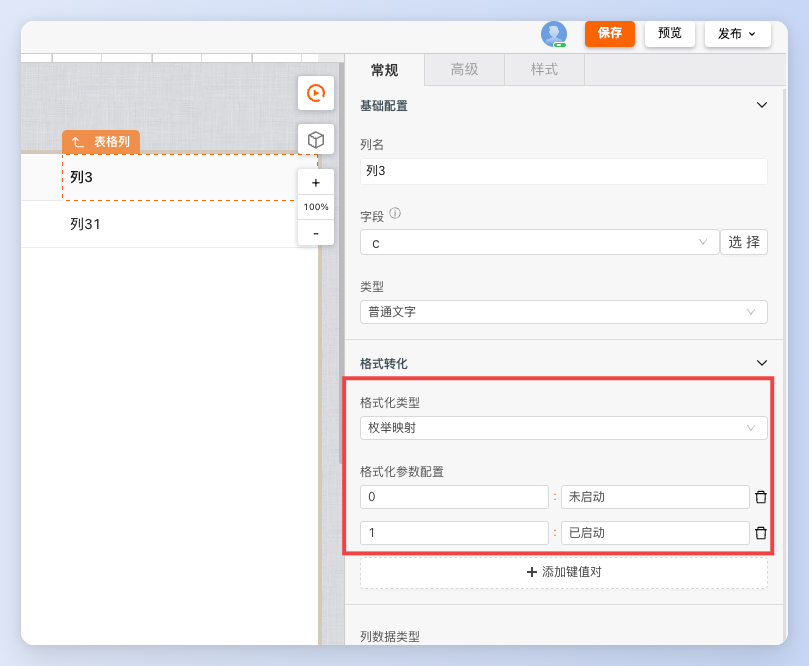

2.  将时间戳格式化显示

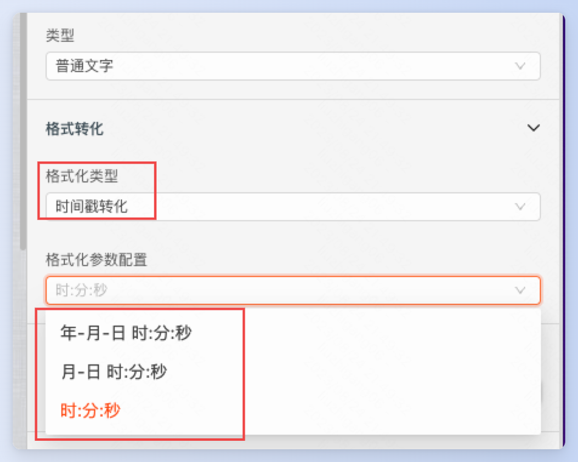

4.  ### 作用域插槽功能
    

｜ 作用域插槽可以实现自定义表格单元格内的元素，比如按钮、工具条、带样式的文本等等

1.  开启指定列插槽

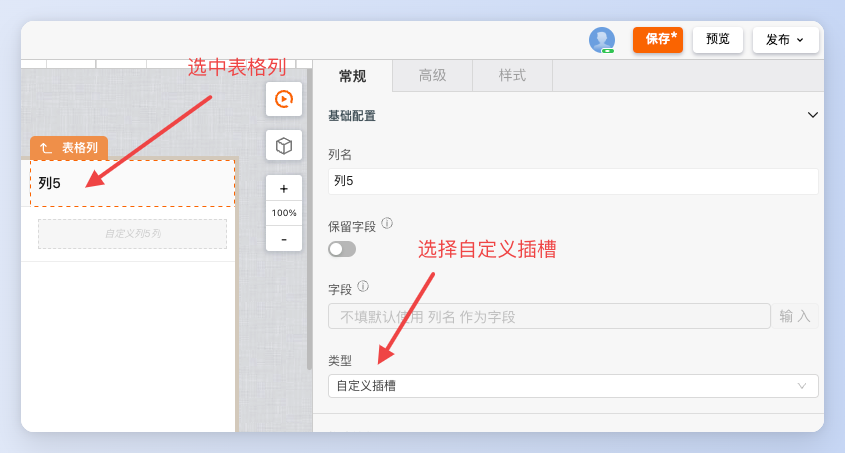

2.  拖动工具条放入插槽中

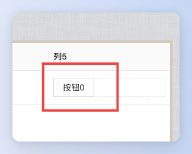

3.设置按钮的点击事件，获取当前行数据，传递给对话框进行编辑

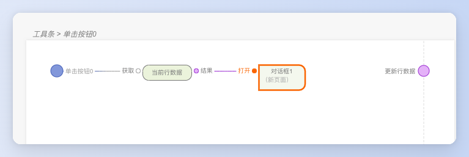

# 逻辑编排

## 排序

1.  使用内置的排序

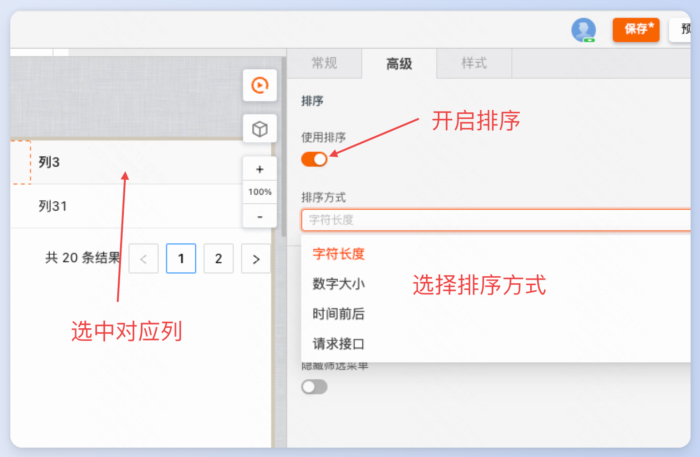

2.通过接口进行排序

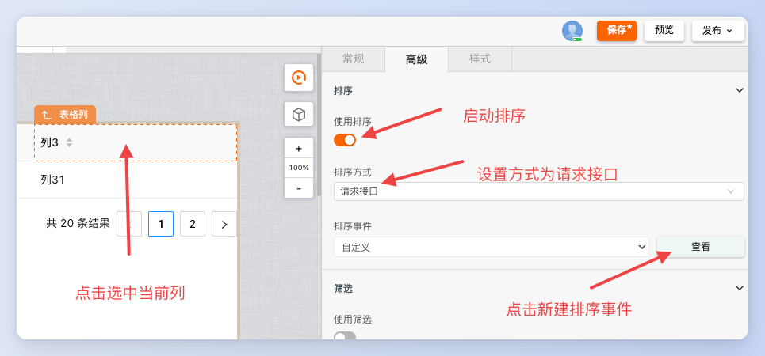

设置使用接口进行排序

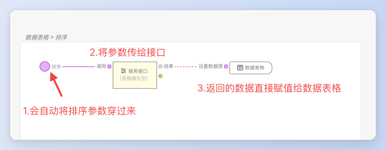

接口排序逻辑连线

## 勾选

## 显示树结构

# 样式

### 控制表头和内容的样式

1.  表格整体样式控制：修改表头、内容和行hover样式

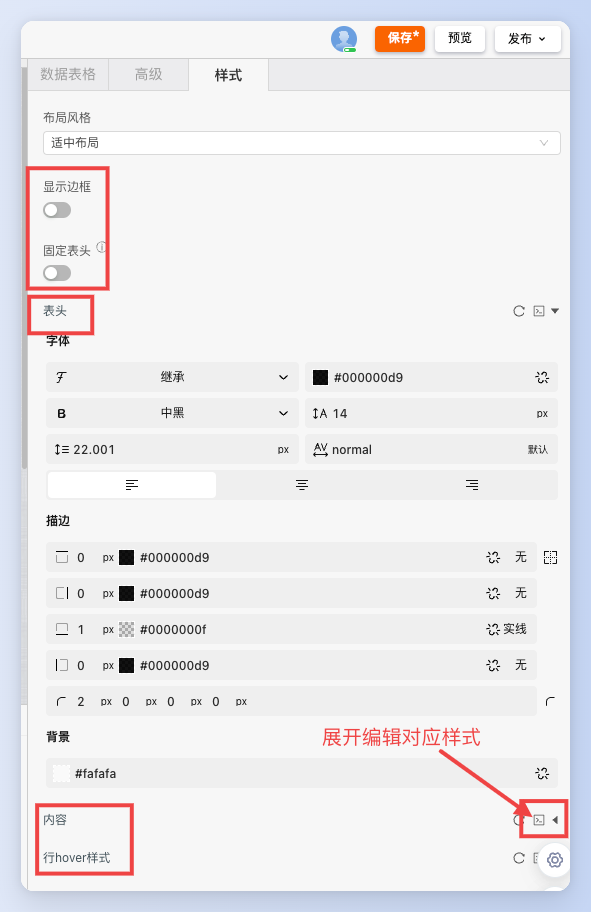

2.  表格单列样式控制：修改某一列的表头和内容

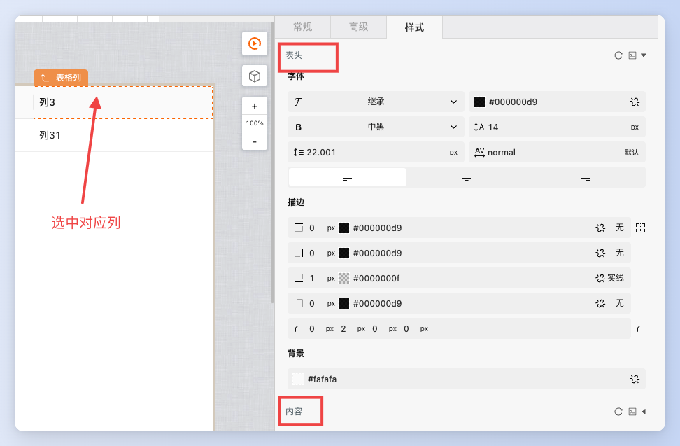

3.  设置表格列宽度和左右固定

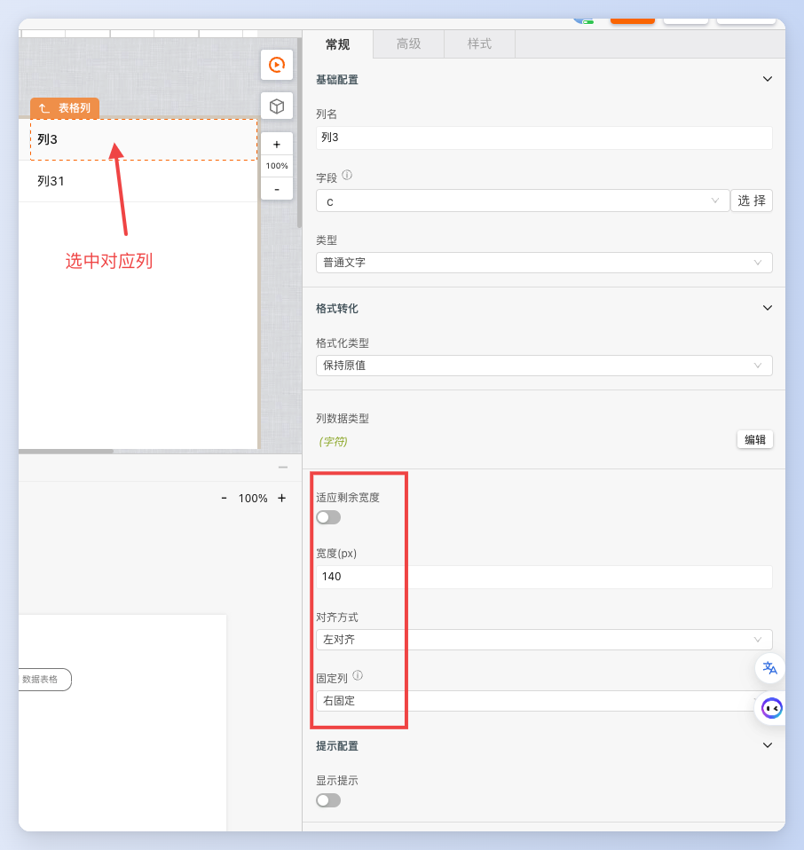