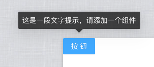
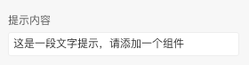
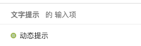
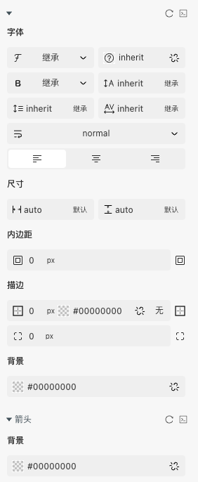

> 应用场景 1：简单的文字提示气泡框,适用于一些需要文字提示的情形

Demo 地址：[【文字提示】基本使用](https://my.mybricks.world/mybricks-app-pcspa/index.html?id=514698151084101)

## 基本操作

### 提示

提示内容可以静态配置或者动态传入

### 触发方式和出现位置

## 逻辑编排

### 动态提示

## 样式

### 默认样式

