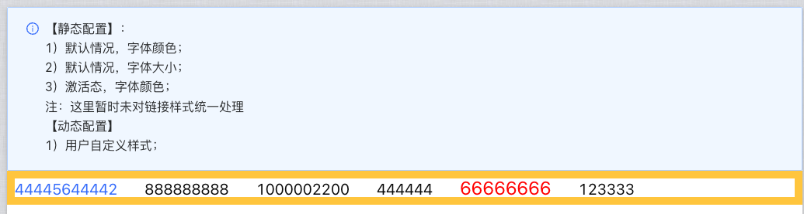
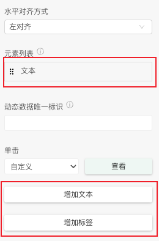
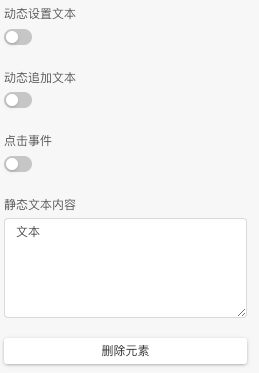
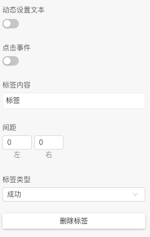
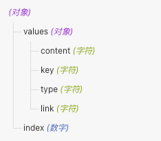
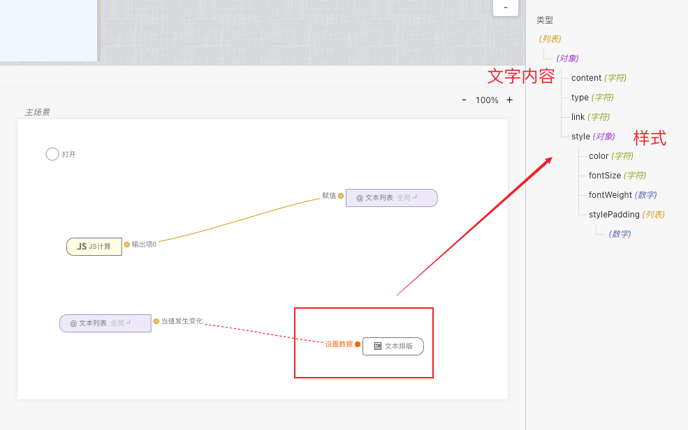
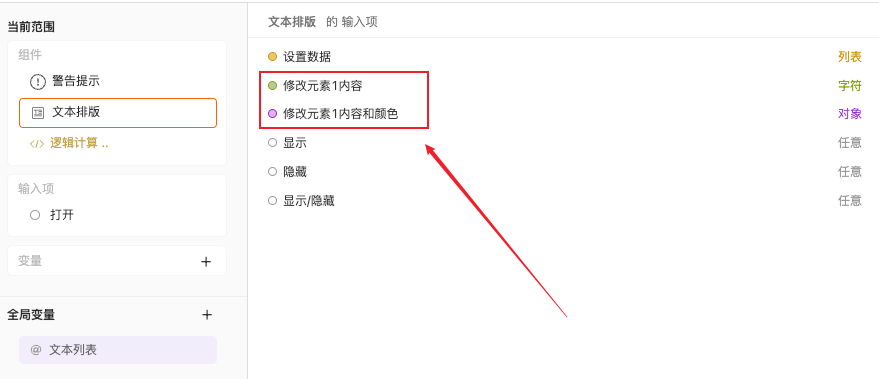
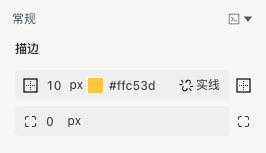
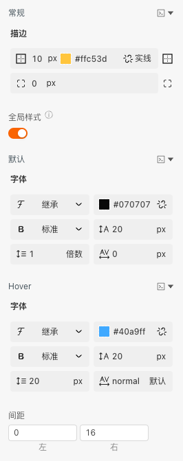
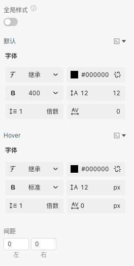

```
应用场景：展示一大段不同文字
注：子项元素配置需要聚焦对应元素进行配置
```
Demo地址：[【文本排版】基本使用](https://my.mybricks.world/mybricks-pc-page/index.html?id=470786050703429)

----

## 基本操作
### 文字排版（整个组件）
#### 新增、删减元素，或者对元素进行排序


说明：支持动态传入，每一个元素都是单独的组件、可以进行配置
可以为动态数据添加一个唯一标识、便于动态传入

### 单个文本配置（子项元素）
#### 设置文本
可以动态、静态设置文本的内容和动态追加文本



### 单个标签配置（子项元素）
标签也可以动态、静态设置文本的内容、并且配置标签的类型、左右间距



----

## 逻辑编排
### 点击事件
开启后可以配置整个组件的点击事件，这时输出"values"和"index"，分别是点击元素的配置、下标



也可以单独配置每一个元素的点击事件，每一个元素的点击事件可以设置输出的内容

### 动态设置文本（整个组件）
动态设置所有文本、列表数组的每一项可设置文字内容、类型、链接和样式



### 动态设置文本（子项元素）
可以动态配置文本的内容和样式，打开开关后可以连线配置



### 动态追加内容（子项元素）
可以动态追加文本的内容和样式，打开开关后可以连线配置


----

## 样式
### 文本排版样式（整个组件）


开启全局样式，统一配置所有子项文本的默认、Hover样式


### 文本样式（子项元素）
开启全局样式，到整个组件统一配置所有子项文本的默认、Hover样式
关闭，可自行配置每一个文本的默认、Hover样式、间距


