 **日期选择框** 

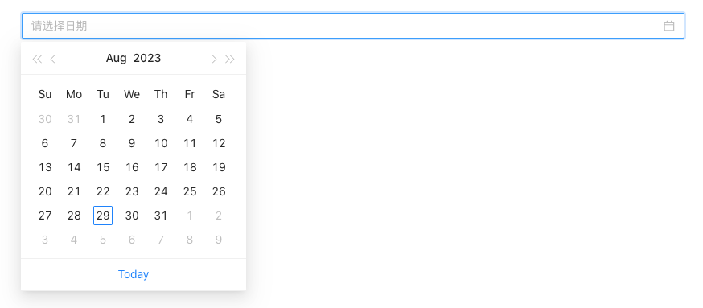

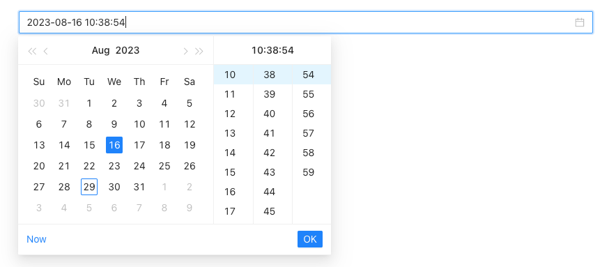

> 应用场景

> 选择日期，或者日期-时间

> 场景1：单独使用

> 场景2：在表单容器中，作为表单项使用

> Demo地址：[【日期选择框】基本使用](https://my.mybricks.world/mybricks-pc-page/index.html?id=472841177563205)

# 基本操作

## 日期选择

### 提示内容

说明：值为空时的提示文字

  

### 禁用状态

### 日期选择类型

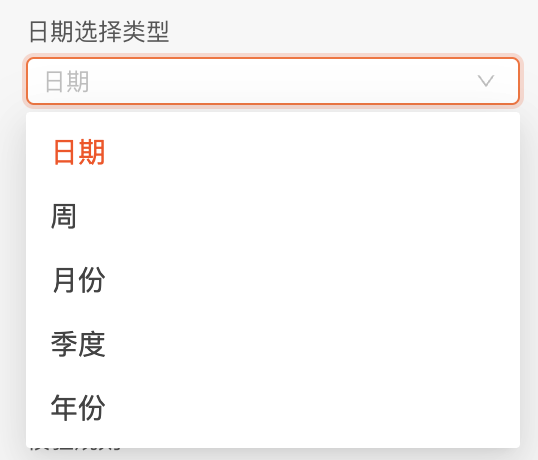

默认是日期类型，可以切换选择周、月份、季度和年份

1）日期（日期，日期-时间）

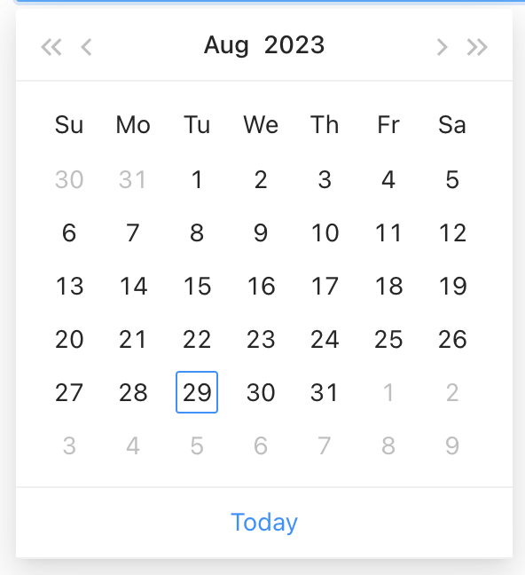

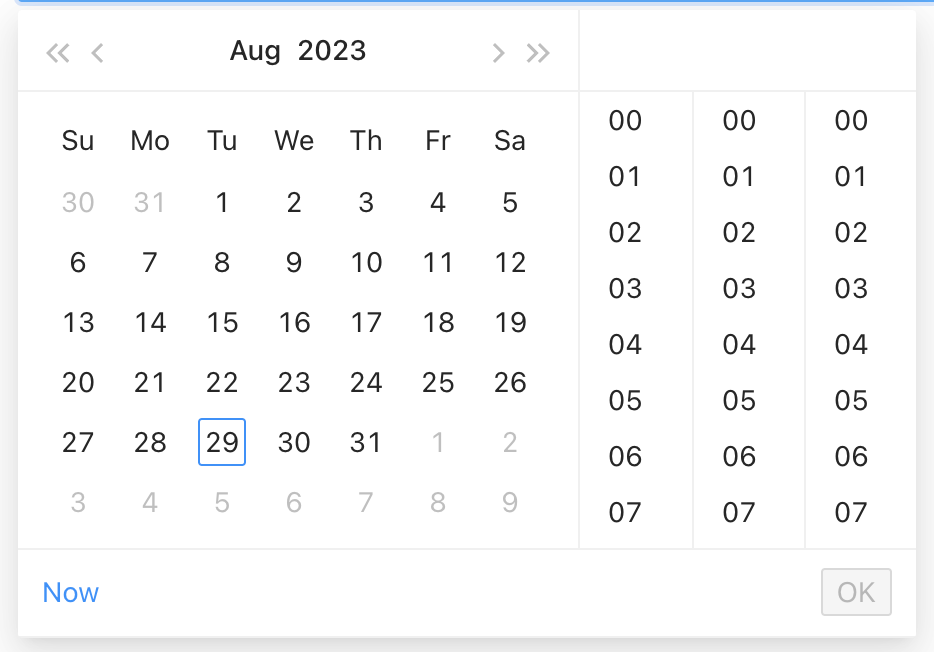

2）周

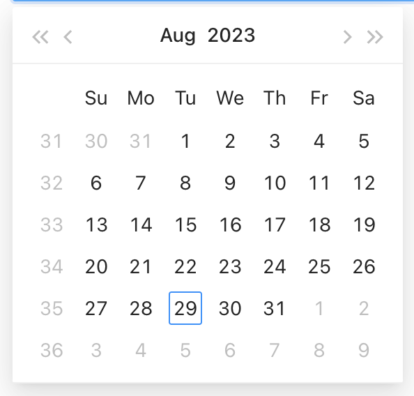

3）月份

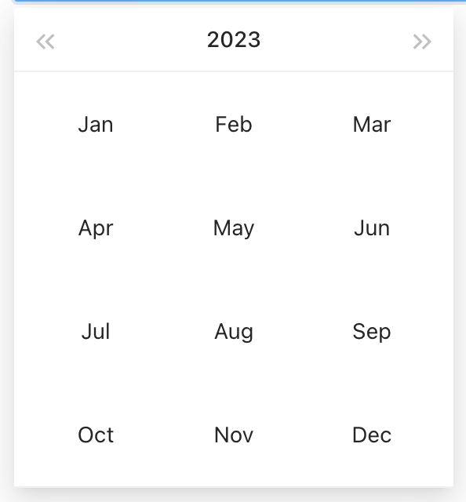

4）季度

5）年份

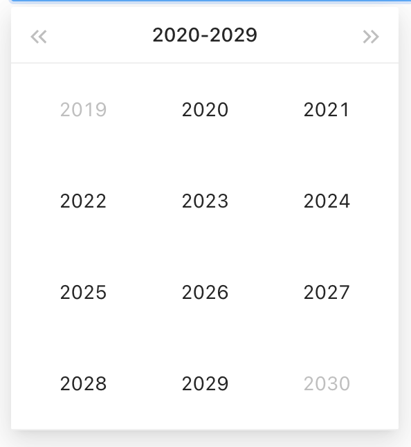

### 时间选择

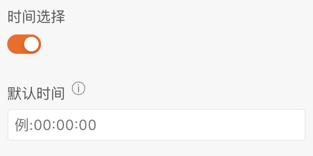

说明：开启后，可以设置默认时间，不填写为当前默认时间

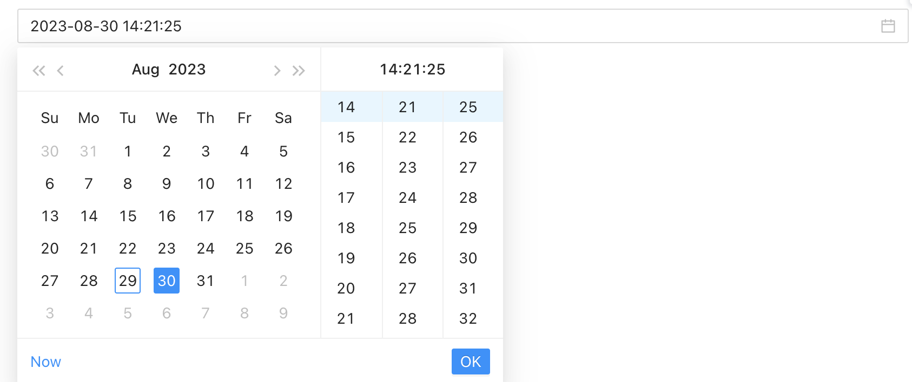

### 数据校验

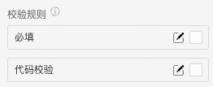

说明：

1.  配置的校验规则，需要在表单容器中使用才能生效
2.  点击右侧的勾选框，启用该项校验规则
3.  点击右侧的“编辑”按钮，弹出校验规则的配置项

### 输出数据处理

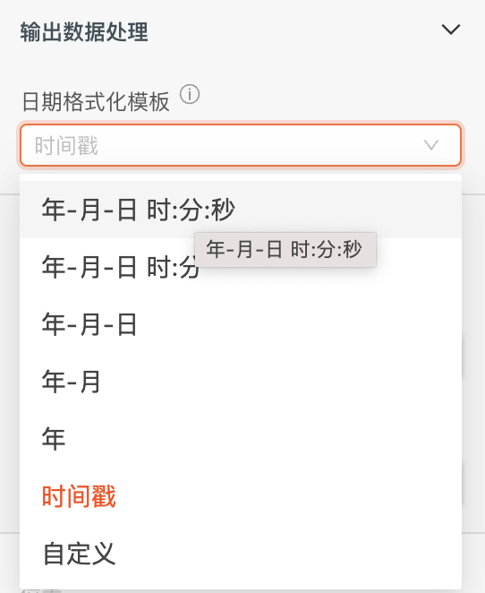

说明：将输出（值变化事件和表单提交）的数据设置成所需要的格式

# 逻辑编排

### 值初始化事件

输出时机：

1.  给日期选择框“ **设置初始值** ”输入项设置数据
2.  给日期选择框所在表单容器的“ **设置表单数据** ”输入项设置数据

输出内容：

日期选择框的当前值

### 值更新事件

输出时机：

1.  给日期选择框的“ **设置值** ”输入项设置数据
2.  给日期选择框所在表单容器的“ **设置表单数据(触发值变化)** ”输入项设置数据
3.  用户操作日期选择框的增删改操作时

输出内容：

日期选择框的当前值

说明：

可以用于实现监听联动

# 样式

### 边框

### 日期样式

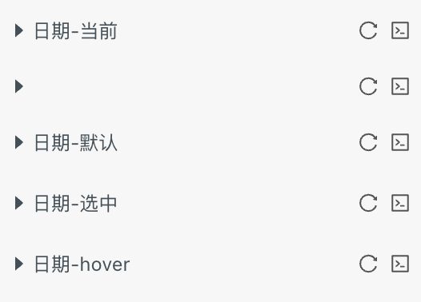

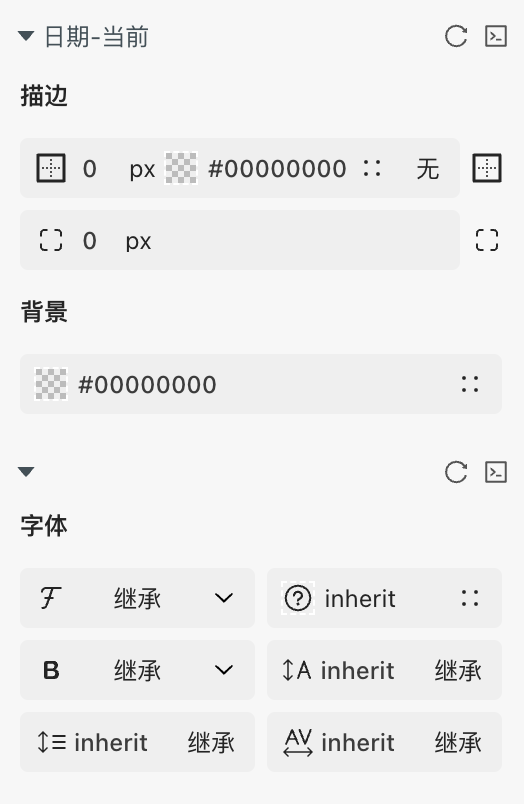

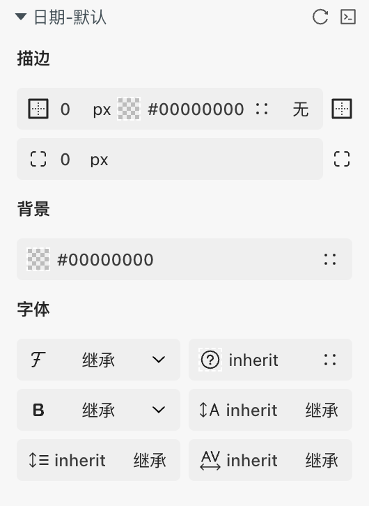

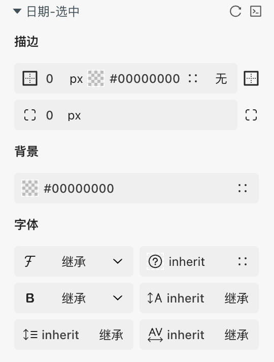

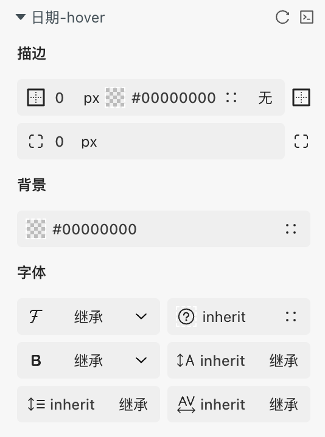

### 时间样式

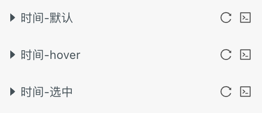

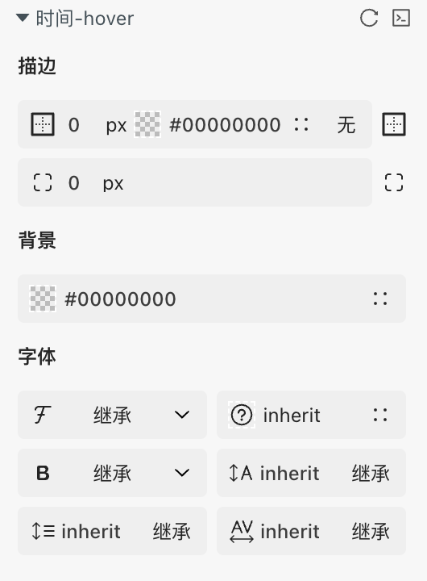

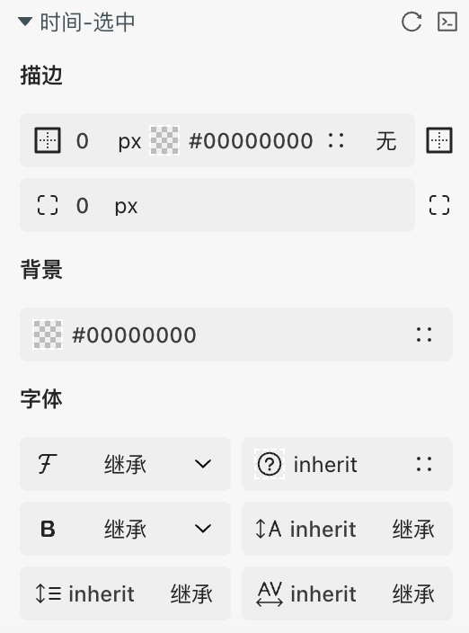