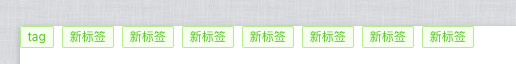
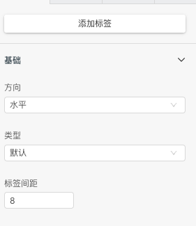
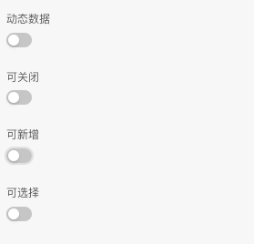
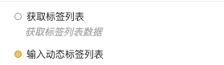
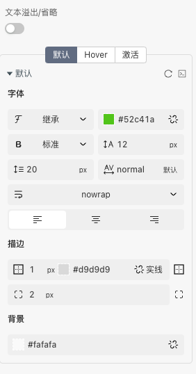
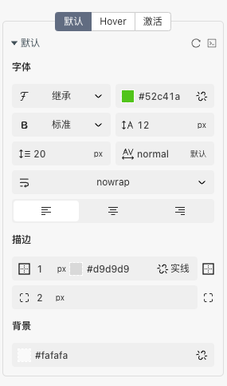

> 应用场景 1：进行标记和分类的小标签\
> 应用场景 2:   用于标记事物的属性和维度\
> 应用场景 3:   进行分类

Demo 地址：[【标签列表】基本使用](https://my.mybricks.world/mybricks-pc-page/index.html?id=514701430378565)

## 基本操作

### 列表配置

#### 基本配置

添加标签和标签类型与间距配置

#### 交互

可以配置动态数据,是否可关闭,是否可以新增与可选择

### 标签配置

聚焦到需要配置的标签

#### 基本配置

可以配置标签的内容,类型,图标与删除,位置移动

## 逻辑编排

### 标签

可以获取列表数据,开启动态数据后可通过输入动态配置标签

## 样式

### 列表样式

### 标签配置

聚焦到需要配置的标签,样式 Tab 页

