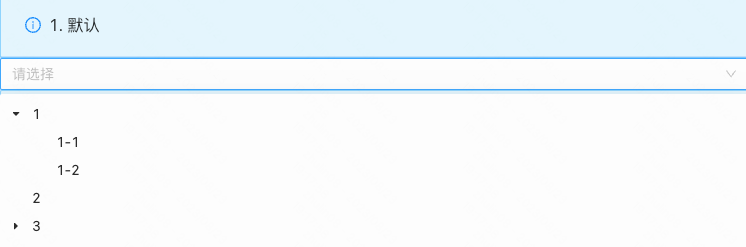
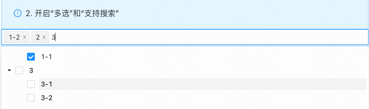
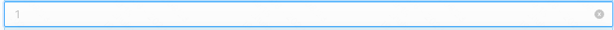
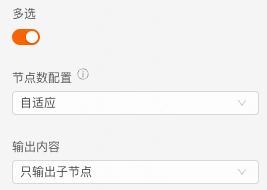
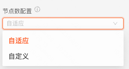
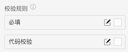
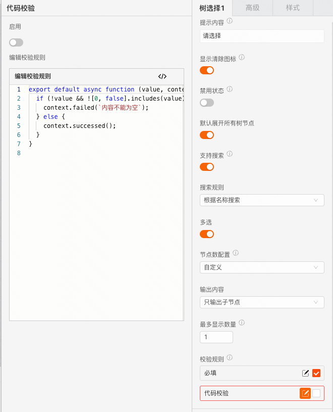
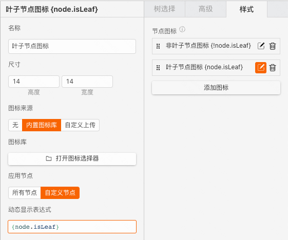
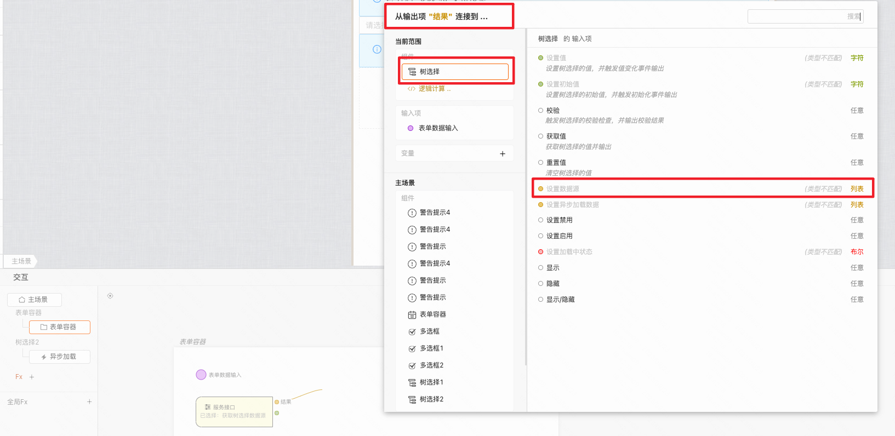
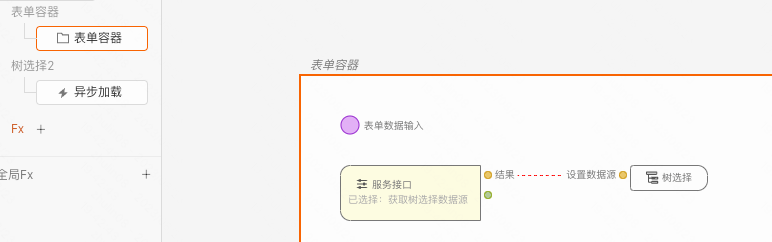

 **树选择** 

  

> 概述

> 树形结构的下拉选择框，支持单选或多选。类似 下拉框，但可选择的数据结构是一个树形结构，例如公司层级、学科系统、分类目录等等。

> 应用场景

> 场景1：单独使用

> 场景2：在表单容器中，作为表单项使用

> Demo地址：[【树选择】基本使用](https://my.mybricks.world/mybricks-pc-page/index.html?id=470824239308869) [【树选择】异步加载](https://my.mybricks.world/mybricks-pc-page/index.html?id=468407616671813)

# 基本操作

## 树选择

### 提示内容

说明：值为空时的提示文字

  

### 显示清除图标

说明：开启后，树选择有选中项后，右侧显示清除图标

  

### 默认是否禁用

  

### 默认展开

说明：开启时，树选择的所有层级默认展开

  

### 支持搜索

说明：开启时，支持输入字符搜索选项

  

### 多选

说明：开启时，可以配置

  

#### 节点数配置

说明：选中节点后，展示在输入框的节点数目。设置“自定义”后，可以配置具体的数目

  

##### 最多展示数量

说明：当选中个数大于设置的值时，超出的部分只显示选中数量

  

#### 输出内容

说明：选中节点后，树选择的值的数据范围

  

### 数据校验

说明：

1.  配置的校验规则，需要在表单容器中使用才能生效
2.  点击右侧的勾选框，启用该项校验规则
3.  点击右侧的“编辑”按钮，弹出校验规则的配置项

## 高级

### 标题字段

说明：当输入数据源的标题字段与默认的标题字段label不一致时，可以在此处进行配置

  

### 值字段

说明：当输入数据源的值字段与默认的值字段value不一致时，可以在此处进行配置

  

### 叶子节点字段

说明：当输入数据源的子项字段与默认的子项字段children不一致时，可以在此处进行配置

  

### 异步加载

说明：开启“异步加载”时，当树选择中的非叶子节点展开时，会触发“异步加载输出”事件

  

#### 仅首次加载

说明：关闭时，每次展开非叶子节点，都会重新触发异步加载

  

#### 节点图标

说明：可以配置一个或多个图标，每个图标支持配置动态显示的表达式，从而根据节点数据的不同，应用不同的图标。

  
  

# 逻辑编排

### 值初始化事件

输出时机：

1.  给树选择的“ **设置初始值** ”输入项设置数据
2.  给树选择所在表单容器的“ **设置表单数据** ”输入项设置数据

输出内容：

树选择的当前值

  

### 值更新事件

输出时机：

1.  给树选择的“ **设置值** ”输入项设置数据
2.  给树选择所在表单容器的“ **设置表单数据(触发值变化)** ”输入项设置数据
3.  用户操作树选择的增删改操作时

输出内容：

树选择的当前值

说明：

可以用于实现监听联动

  

### 异步加载输出

输出时机：

树选择开启“高级-异步加载”配置项，点击展开非叶子节点时

输出内容：

当前展开节点的数据
  

### 调用接口设置选项数据源

  

# 样式

### 基础样式

  
  

### 作为表单项的样式

