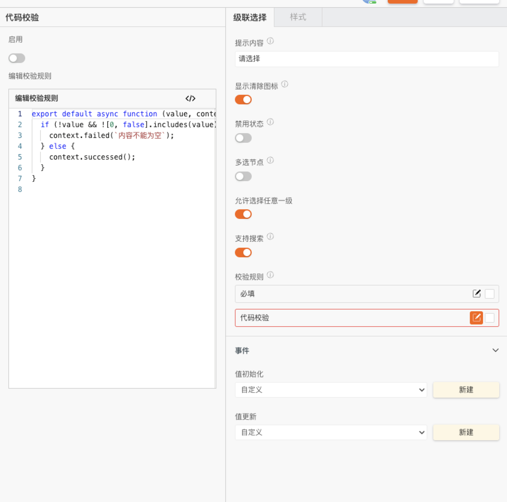

 **级联选择** 

> 应用场景

> 需要动态输入数据源

> 场景1：单独使用

> 场景2：在表单容器中，作为表单项使用

> Demo地址：[【级联选择】基本使用](https://my.mybricks.world/mybricks-pc-page/index.html?id=471443142033477)

# 基本操作

## 级联选择

### 提示内容

说明：值为空时的提示文字

### 显示清除图标

说明：开启后，级联选择框有选中项后，右侧显示清除图标

### 禁用状态

### 多选节点

说明：默认关闭，为单选；开启后可多选，并且配置多选节点数（自适应或者自定义节点数）

### 允许选择任意一级

说明：

1.  默认关闭，必须选择至最后一级

2.  开启后，可以选择选项的任意一级

### 支持搜索

开启搜索后，可以向输入框输入内容，自动出现对应选项

### 数据校验

说明：

1.  配置的校验规则，需要在表单容器中使用才能生效
2.  点击右侧的勾选框，启用该项校验规则
3.  点击右侧的“编辑”按钮，弹出校验规则的配置项

# 逻辑编排

### 值初始化事件

输出时机：

1.  给级联选择的“ **设置初始值** ”输入项设置数据
2.  给级联选择所在表单容器的“ **设置表单数据** ”输入项设置数据

输出内容：

级联选择的当前值

### 值更新事件

输出时机：

1.  给级联选择的“ **设置值** ”输入项设置数据
2.  给级联选择所在表单容器的“ **设置表单数据(触发值变化)** ”输入项设置数据
3.  用户操作级联选择的增删改操作时

输出内容：

级联选择的当前值

说明：

可以用于实现监听联动

### 失焦事件

输出时机：

级联选择失去焦点时

输出内容：

级联选择的当前值

### 设置选项数据源

# 样式

### 边框

### 选项

