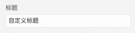
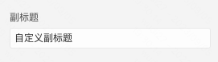
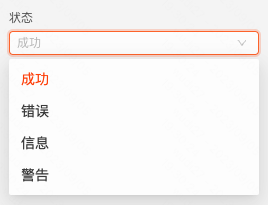
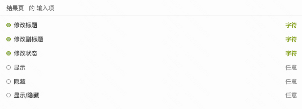
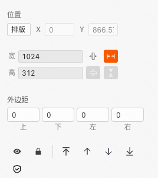

```
应用场景
场景：购买商品支付成功后，展示结果页，告知用户支付结果
```
Demo地址：[【结果页】基本使用](https://my.mybricks.world/mybricks-pc-page/index.html?id=475422436962373)

----

## 基本操作
### 标题



### 副标题



### 状态



说明：四种状态，在组件展示上的区别主要在于图标

----

## 逻辑编排
### 动态配置结果页的标题、副标题、状态



说明：直接将目标字符串数据连接到结果页对应的输入项即可

## 样式
### 通用组件样式


