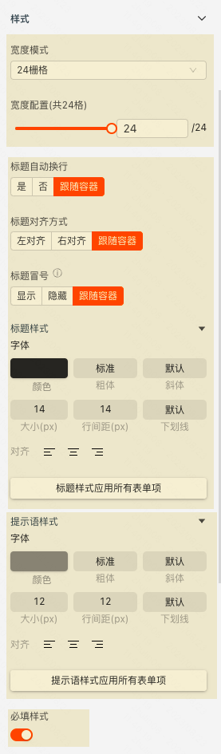

**自定义表单项**

> **概述**\
> 自定义表单项的容器

> **应用场景**\
> 场景1：基于现有表单项实现组合表单项\
> 场景2：在表单容器中使用第三方组件

Demo地址：[【自定义表单项】基本使用](https://my.mybricks.world/mybricks-pc-page/index.html?id=470735099908165)

----

## 基本操作

### 自定义表单项

#### 数据校验

说明：配置自定义表单项的校验规则，需要在表单容器/动态表单项中使用才能生效

  

## 逻辑编排

#### 值初始化事件

输出时机：

1.  给自定义表单项的“ **设置初始值** ”输入项设置数据
2.  给自定义表单项所在表单容器的“ **设置表单数据** ”输入项设置数据

输出内容：

自定义表单项的当前值

  

#### 值更新事件

输出时机：

1.  给自定义表单项的“ **设置值** ”输入项设置数据
2.  给自定义表单项所在表单容器的“ **设置表单数据(触发值变化)** ”输入项设置数据
3.  用户操作，修改自定义表单项的值时

输出内容：

自定义表单项的当前值

说明：

可以用于实现监听联动

  

## 样式

#### 作为表单项的样式

