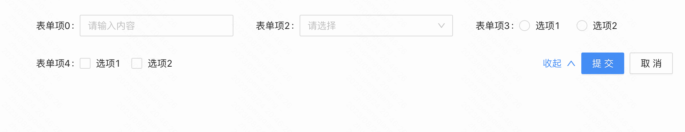
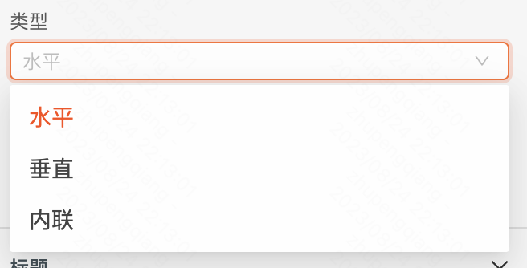
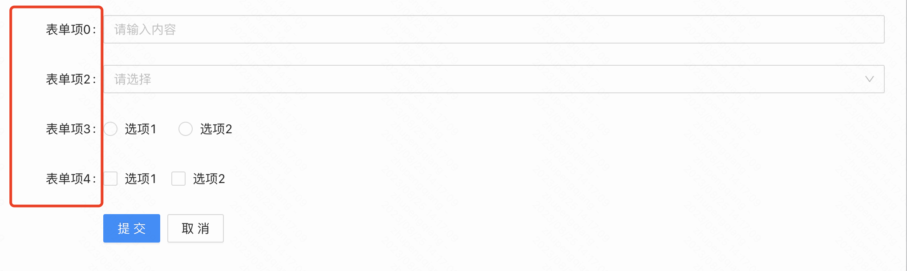
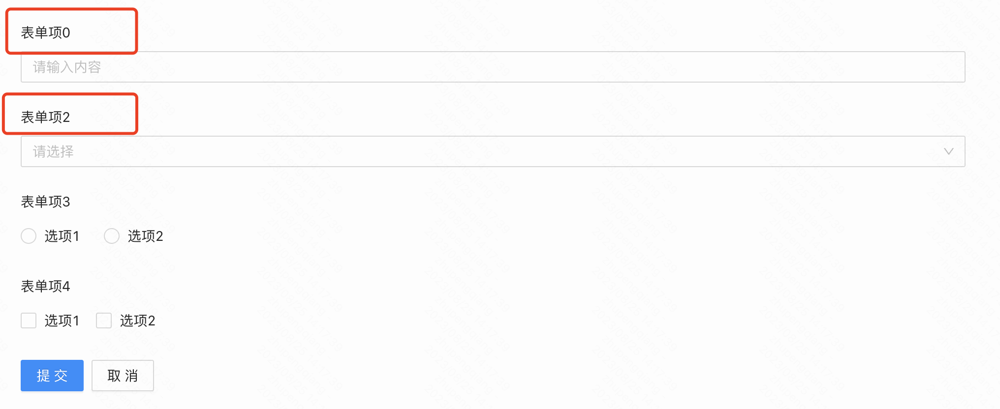
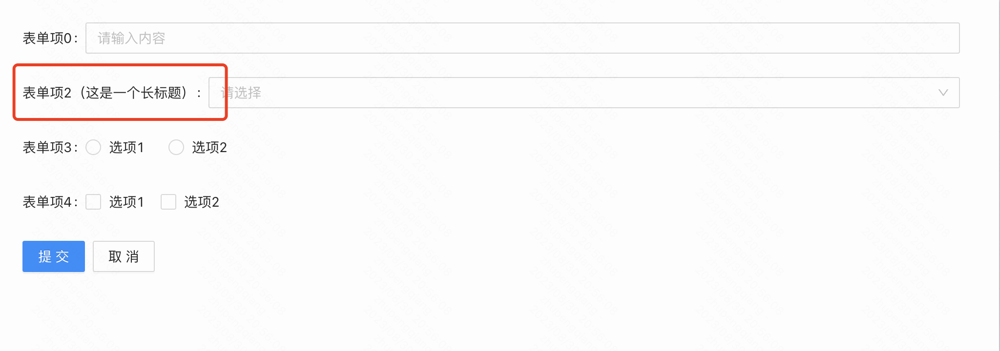

**表单容器** 

# 一、基本操作

## 1.1 表单容器

### 1.1.1 类型

默认为普通表单，类型为普通表单时，支持表单项宽度定制调整；类型为查询表单，通常配合表格、列表等组件组合使用，内置了默认的布局，避免了复杂繁琐的样式布局配置，同时支持展开/收起

  

### 1.1.2 默认折叠表单项

默认折叠收起超出的表单项，被折叠的表单项会继续参与表单提交

  

  

### 1.1.3 提交隐藏表单项

默认不提交被隐藏的表单项字段，开启后提交被隐藏的表单项字段

  

### 1.1.4 添加表单项

点击后打开添加表单项面板，可快捷添加可拖入表单容器的组件

### 1.1.5 表单项布局

#### a. 类型

 **水平（**  **Horizontal**  **）** ：

表单项标题与内容区呈水平布局，且标题每一项完全对齐

  

 **垂直（**  **Vertical**  **）** ：

表单项标题与内容区呈垂直布局布局

  

 **内联（**  **Inline**  **）** ：

表单项标题宽度由文字内容撑开，表单项之间不一定能强对齐

#### b. 表单项宽度

  

#### c. 每行列数

  

## 1.2 操作区

# 二、逻辑编排

# 三、样式