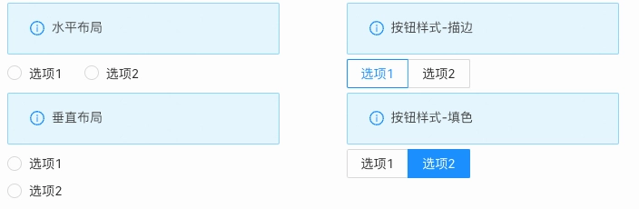

_应用场景_

场景1：单独使用
场景2：在表单容器中，作为表单项使用
Demo地址：[【单选框】基本使用](https://my.mybricks.world/mybricks-pc-page/index.html?id=470776189657157)
# **基本操作**
## **单选框**
### **默认是否禁用**

### **是否默认选中**
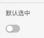

### **静态选项配置**
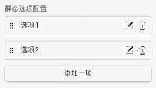

说明：

1. 点击“添加一项”，单选框增加一个选项
2. 选项右侧的两个按钮分别为“编辑”和“删除”，点击“编辑”按钮，弹出选项的配置项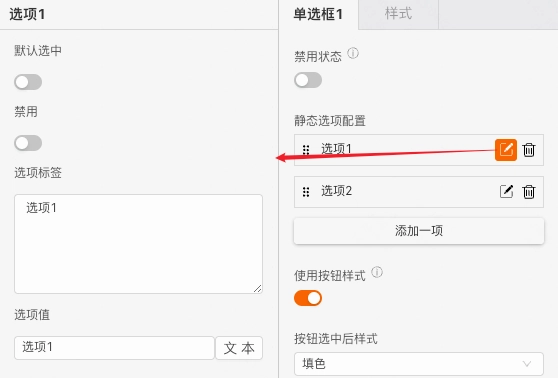

3. 选项左侧的图标为拖拽手柄，可以点击拖拽修改选项的相对位置

### **选项配置按钮样式**
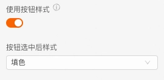

### **数据校验**

说明：

1. 配置的校验规则，需要在表单容器中使用才能生效
2. 点击右侧的勾选框，启用该项校验规则
3. 点击右侧的“编辑”按钮，弹出校验规则的配置项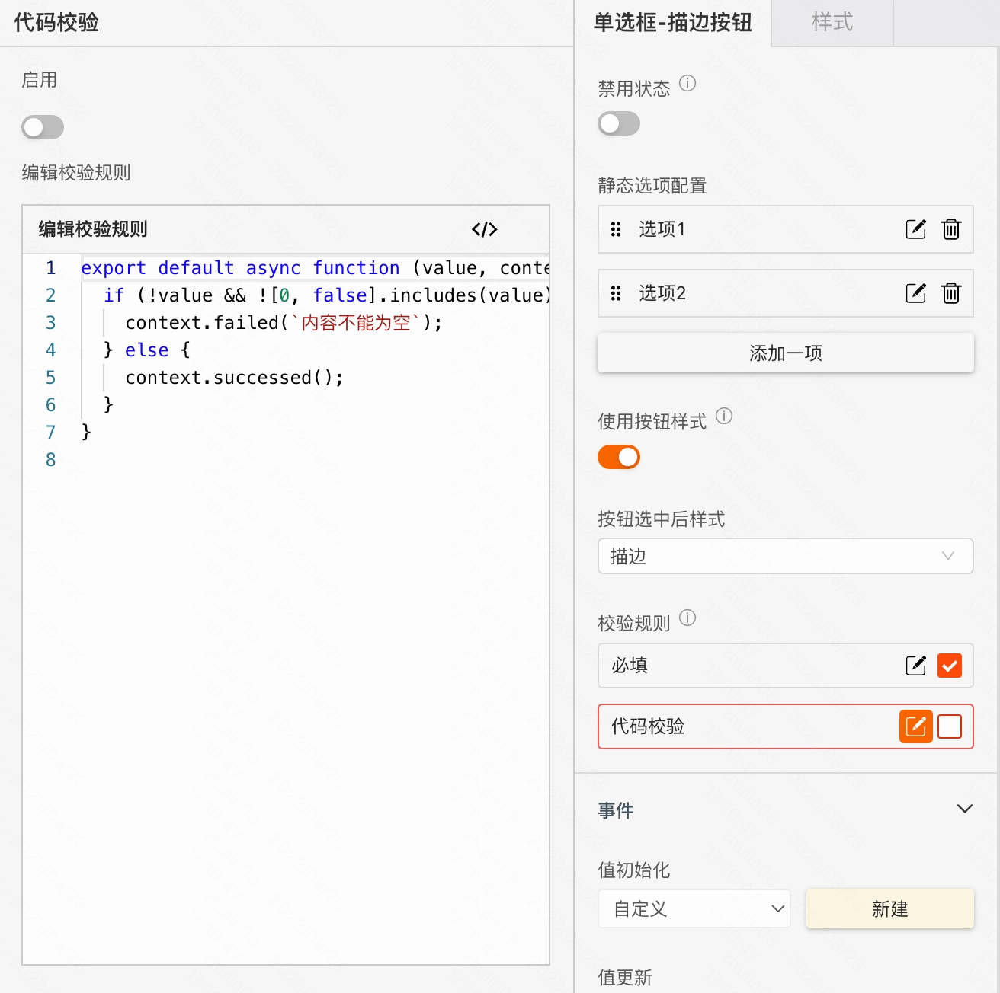

# **逻辑编排**
### **值初始化事件**

输出时机：

1. 给单选框的“**设置初始值**”输入项设置数据
2. 给单选框所在表单容器的“**设置表单数据**”输入项设置数据

输出内容：
单选框的当前值

### **值更新事件**

输出时机：

1. 给单选框的“**设置值**”输入项设置数据
2. 给单选框所在表单容器的“**设置表单数据(触发值变化)**”输入项设置数据
3. 用户操作单选框的增删改操作时

输出内容：
单选框的当前值
说明：
可以用于实现监听联动

### **调用接口设置选项数据源**
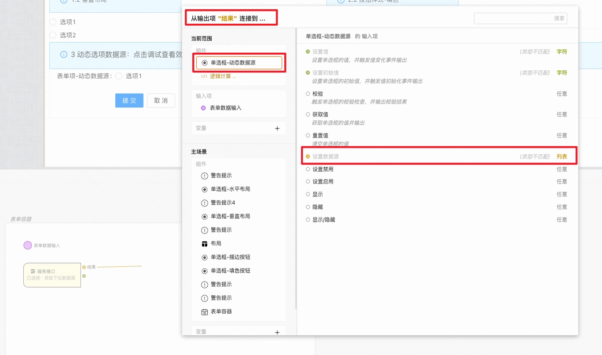

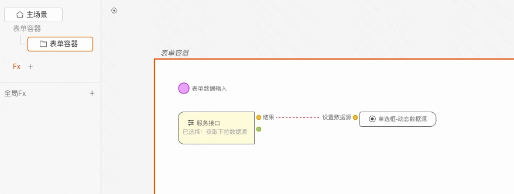

# **样式**
### **基础样式**
#### **默认样式**
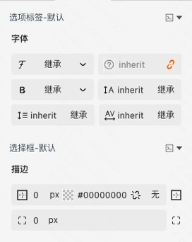

#### **hover悬浮态样式**
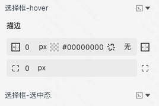

#### **checked选中态样式**
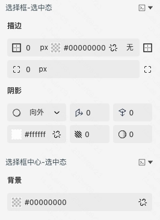

#### **disabled禁用态样式**
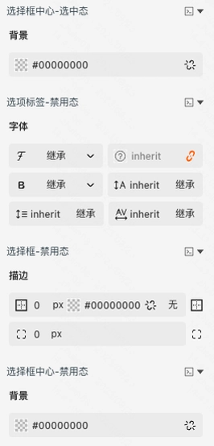

### **作为表单项的样式**
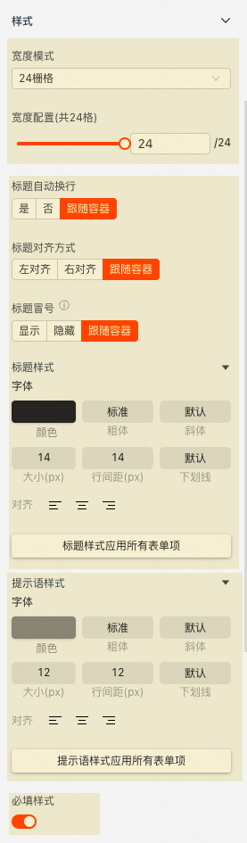

