 **数字输入框** 

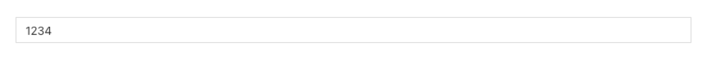

> 应用场景

> 场景1：单独使用

> 场景2：在表单容器中，作为表单项使用

> Demo地址：[【数字输入框】基本使用](number-imgs/out-1.png)

# 基本操作

## 数字输入框

### 提示内容

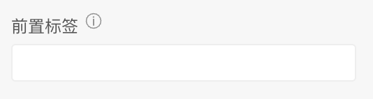

说明：值为空时的提示文字

### 前置标签

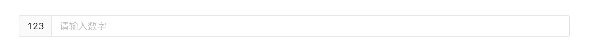

说明：输入内容后，可设置自定义内容的前置标签

### 后置标签

说明：输入内容后，可设置自定义内容的后置标签

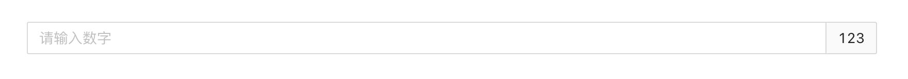

### 禁用状态

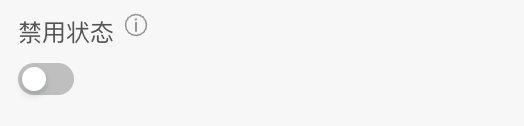

  

### 数值精度

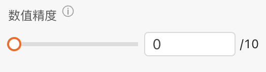

说明：控制小数点后精度，默认是0，小数点后位数从0-10

  

### 步长

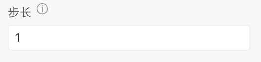

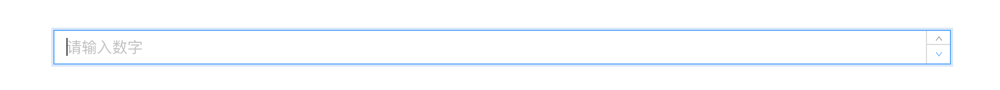

说明：点击数字输入框右侧的上下调动按钮时，数字变化的浮动。默认是1，只允许设置大于0的整数。

  

### 格式化展示

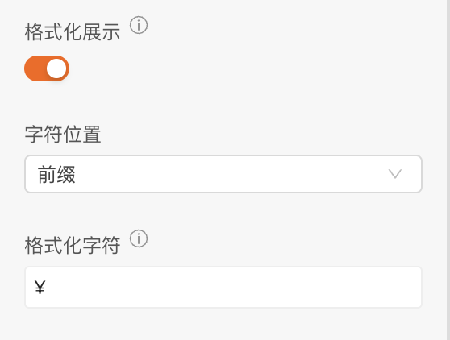

说明：开启后，格式化数字，展示具有具体含义的数字。可以调整字符位置，以及格式化字符。

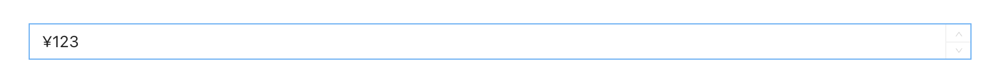

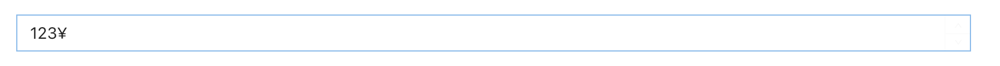

  

### 数据校验

说明：配置数字输入框的校验规则，需要在表单容器中使用才能生效

# 逻辑编排

### 值初始化事件

输出时机：

1.  给数字输入框的“ **设置初始值** ”输入项设置数据
2.  给数字输入框所在表单容器的“ **设置表单数据** ”输入项设置数据

输出内容：

数字输入框的当前值

  

### 值更新事件

输出时机：

1.  给数字输入框的“ **设置值** ”输入项设置数据
2.  给数字输入框所在表单容器的“ **设置表单数据(触发值变化)** ”输入项设置数据
3.  用户操作数字输入框进行输入或者删除操作时

输出内容：

数字输入框的当前值

说明：

可以用于实现监听联动

  

### 失去焦点事件

输出时机：

1.  用户操作数字输入框失去焦点操作时

输出内容：

数字输入框失去焦点时的当前值

说明：

可以用于实现监听联动

  

### 按下回车事件

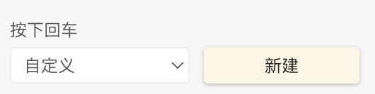

输出时机：

1.  用户操作数字输入框按下回车操作时

输出内容：

数字输入框按下回车操作时的当前值

说明：

可以用于实现监听联动

  

# 样式

### 基础样式

#### 默认样式

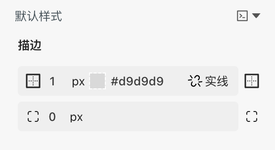