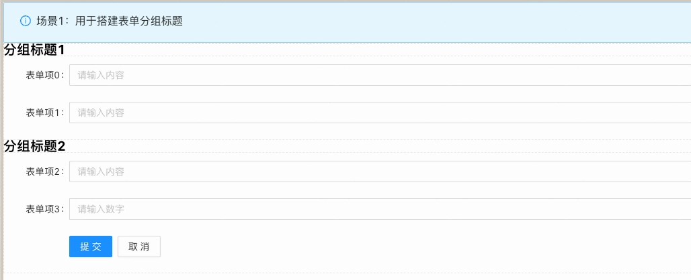

_概述_
表单容器中，放置**非表单项内容**的容器。支持拖入任意组件，不参与表单提交。
_应用场景_
场景1：作为表单分组标题的容器

Demo地址：[【自定义内容项】基本使用](https://my.mybricks.world/mybricks-pc-page/index.html?id=470716390289477)
# **基本操作**
## **自定义内容项**
仅作为容器使用，无更多功能配置
# **逻辑编排**
仅作为容器使用，不需要逻辑编排
# **样式**
仅作为容器使用，无样式相关配置

