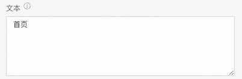
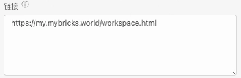
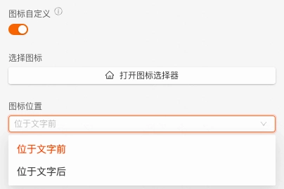
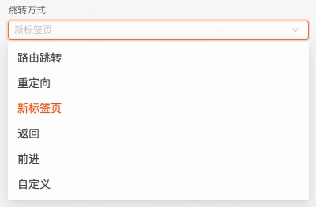
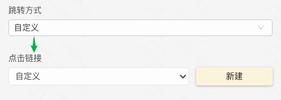
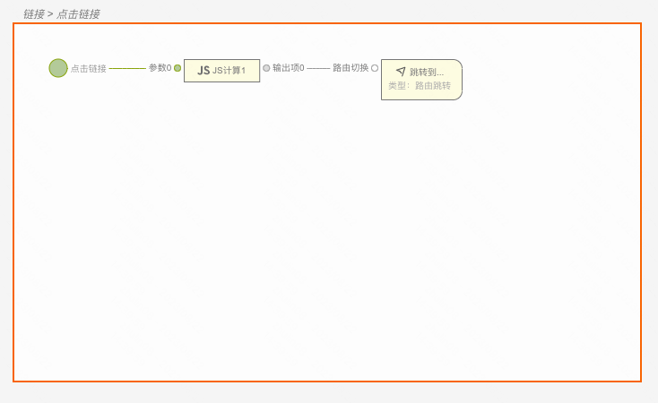
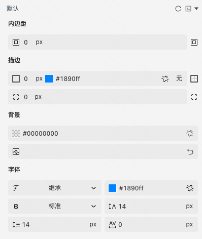
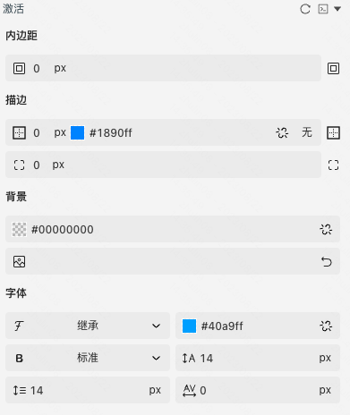

应用场景：导航到新页面
Demo地址：[【链接】基本使用](https://my.mybricks.world/mybricks-pc-page/index.html?id=470421031596101)
# **基本操作**
## **链接**
### **配置链接文案**

说明：支持动态传入，为空时展示链接

### **配置链接地址**

说明：支持动态传入

### **配置图标**

### **配置跳转方式**

# **逻辑编排**
### **点击链接事件**

1. 当一般的跳转方式不满足需求时，可以配置”自定义“跳转，如下图

1. 点击“新建”后，在 交互面板 创建一张事件卡片，如下图

说明：点击链接事件的输出数据为链接地址

# **样式**
### **默认样式**

### **激活样式**

